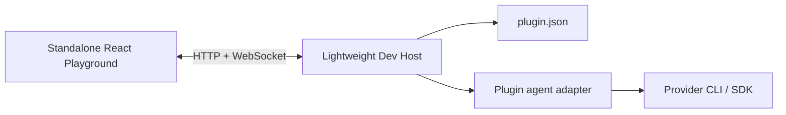

# Agent Playground

Agent Playground is a lightweight development surface for running one agent-runtime plugin
without starting the full ZClaudia desktop application. It uses the real plugin entrypoint and
adapter, while replacing the rest of the application with a small loopback-only Dev Host.

## Quick start

From the ZClaudia repository:

```bash
pnpm agent:playground \
  --plugin ../zclaudia-plugins/agents/codex \
  --runtime codex \
  --cwd ../zclaudia-plugins
```

From the sibling `zclaudia-plugins` repository, the same command can be launched without changing
directories:

```bash
pnpm --dir ../zclaudia agent:playground \
  --plugin "$PWD/agents/codex" \
  --runtime codex \
  --cwd "$PWD"
```

The command:

1. builds the shared Playground protocol and selected plugin;
2. starts a TypeScript watcher for that plugin;
3. loads its `plugin.json` and activates its agent runtime in the Dev Host;
4. starts the standalone React Playground; and
5. opens `http://127.0.0.1:4311/agent-playground.html`.

Use `Ctrl+C` in the launching terminal to stop the UI, watcher, and Dev Host.

Other official agents work the same way:

```bash
pnpm agent:playground \
  --plugin ../zclaudia-plugins/agents/claude \
  --runtime claude
```

Run `pnpm agent:playground --help` for all port, build, watch, browser, and working-directory
options.

## What can be tested

- Real adapter activation from the plugin package
- Streaming assistant and thinking events
- Tool start, result, and failure events
- Interactive permission allow/deny decisions, plus auto-allow and auto-deny policies
- Provider session continuation and new-session behavior
- Runtime permission-mode switching
- Abort behavior
- Plugin logs and raw protocol events
- Runtime descriptor and PCP capability inspection
- Automatic reload after TypeScript emits files into `dist`

Reloads import a fresh temporary snapshot of the plugin package. This avoids Node ESM's
transitive module cache, so changes in files such as `adapter.ts` and `runner.ts` are picked up,
not only changes in the plugin entrypoint.

## Architecture



The Playground reuses ZClaudia's design tokens and small UI primitives, but it does not import the
full conversation application. The shared boundary is the agent-runtime contract and Playground
protocol. This keeps the development surface fast and prevents the production app shell, stores,
router, and persistence services from becoming dependencies of plugin debugging.

The Dev Host provides the subset of `PluginContext` needed by agent-runtime plugins:

- `agentRuntimes.register()` and `unregister()`
- plugin logging
- in-memory storage and events
- manifest-declared permission checks
- no-op registration surfaces for commands, tools, UI extensions, and workflow steps

## Security and limitations

- The server binds only to `127.0.0.1` and uses a random per-launch token for its API and
  WebSocket.
- Only run trusted local plugins. Activating a plugin imports Node.js code with the permissions of
  the current user.
- Sending a prompt invokes the real provider and may use provider quota. The Playground does not
  mock credentials or provider billing.
- The ZClaudia MCP tool bridge is intentionally unavailable in lightweight mode. Provider-native
  tools still work and appear in the event stream. Use the full ZClaudia application when testing
  application-owned tools and end-to-end MCP integration.
- Playground storage is in memory and is discarded when the process exits.

## Troubleshooting

- If the provider CLI is not on `PATH`, set **CLI path** in the left panel.
- If a default port is occupied, pass `--host-port` and `--ui-port`.
- If the plugin has already been built and another process is compiling it, use
  `--no-build --no-watch`.
- If activation fails, confirm that `plugin.json` points to an emitted JavaScript `main` file and
  that the selected runtime type exists in `contributes.agentRuntimes`.
