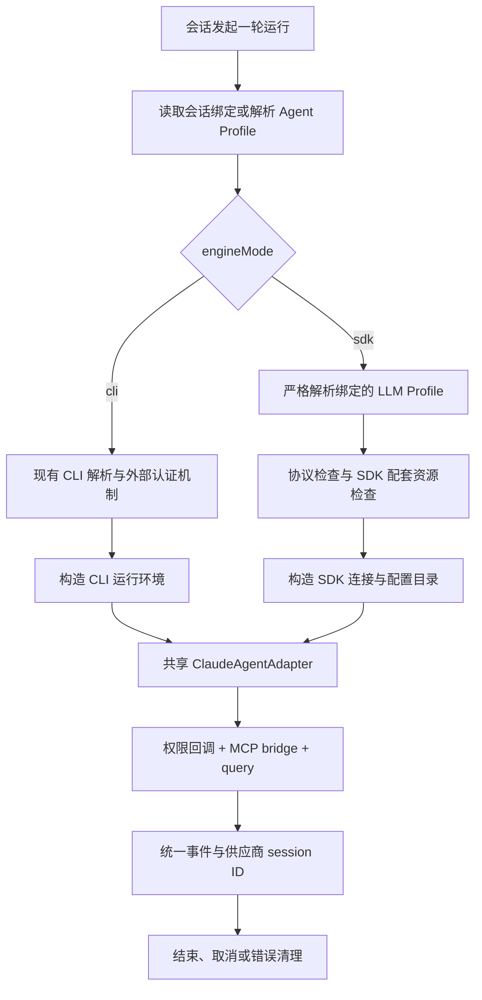

# Claude Runtime 双模式设计

状态：设计提案。

实现状态（2026-09-12）：P1 契约/迁移、P2 宿主运行链路与插件执行分支、P3 编辑器与会话运行标记（GET /api/sessions 经 JOIN 暴露 runtimeEngine，聊天头部渲染 CLI / SDK·Profile·模型 徽章）的代码已落地（plugin-sdk 0.2.0 契约经 pnpm `file:` override 链接，正式发布后改回 `^0.2.0`）。P0 本地引擎探针已执行并通过（随包引擎 2.1.141 + 本地 Anthropic Messages fixture，见文末执行记录）；剩余为需真实凭据的供应商验收与 §10 P4 多平台产物验收。日期：2026-09-11。

评审补充：2026-09-12。与 Codex 方案统一明确 CLI 模型覆盖的输入及候选来源，见 §3.3；本次仍仅修订设计文档。

初稿代码基线：`c61c5242`；本次评审修订核对至 `56dcd6f6`。当前 Claude 插件声明 SDK `^0.2.104`，lockfile 和本地安装解析为 `0.2.141`；本文的 SDK 行为依据后者，不代表 package.json 已精确锁定。P1 必须收敛版本声明，后续 SDK 升级须重新验证适配。本次仅修订设计文档，不修改运行代码。

## 1. 决策与范围

保留一个 `runtimeType: 'claude'`，在 Agent Profile 上提供两种运行模式：

| 项目 | CLI 模式 | SDK + LLM Profile 模式 |
| --- | --- | --- |
| 配置值 | `engineMode: 'cli'` | `engineMode: 'sdk'` |
| 执行引擎 | 外部 Claude Code 执行文件 | 应用随 SDK 配套交付的 Claude Code 执行文件 |
| 文件来源 | 现有显式路径、系统 PATH、Managed Agent CLI 解析机制 | 当前应用版本验证过的平台资源 |
| 模型连接 | 沿用外部 Claude 环境与认证 | 显式绑定系统 LLM Profile |
| 模型 | 外部默认；可选覆盖 | 必须明确选择 |
| 用户额外安装 CLI | 按现有机制处理 | 不需要 |
| 底层执行 API | `query()` | `query()` |
| 会话、权限、事件、MCP bridge | 复用 Claude adapter | 复用 Claude adapter |

评审后决定使用 `engineMode`，同时将新 descriptor 字段命名为 `defaultEngineMode`、`engineModes`，数据库列命名为 `engine_mode`。初稿的 `runtimeMode` 与前端 `sessionConfigStore.runtimeModes` 及 `setRuntimeMode/getRuntimeMode/clearRuntimeMode` 撞义，后者暂存会话权限模式；本次保留旧 store 命名，不混入引擎模式，也不借机重构权限状态。插件 manifest 的 `executionMode: 'main'` 表达插件执行位置，`mode` 继续表示权限/Plan 模式。新字段必须在 Agent、会话绑定、运行契约和前端中统一使用 `engineMode`。

SDK 模式仍使用 Claude Code 引擎。它提供应用控制的模型连接和执行环境，不承诺脱离该引擎，也不等于 SDK V2 session API。官方已移除 V2，推荐继续用 `query()`。[官方迁移说明](https://code.claude.com/docs/en/agent-sdk/typescript-v2-preview)

首期交付：双模式配置、显式 Anthropic Messages 连接、SDK 平台资源、配置来源控制、会话绑定、迁移和端到端验收。保留 `com.zclaudia.claude`、`claude`、`claude-default` 身份。

首期不实现通用 OpenAI→Anthropic 协议网关、任意非 Claude 模型认证、Bedrock/Vertex 等云身份链、跨模式无损续聊、运行中切换连接、多轮常驻进程重构。图片、steer、后台任务等能力不因选择 SDK 模式自动开启。

首期也不实施 LLM 凭据静态加密迁移。当前 `llm_profiles.api_key` 为 SQLite 明文列（`001_initial_schema.ts` 的 llm_profiles 定义及 `domains/llm-profiles/repository.ts` 直接读写可证），不是已加密的统一凭据库。SDK 模式首期仅使用 Profile API key 认证，继续依赖这一存储现状；运行时隔离和下文的 HMAC 都不加密该 key。相关加密迁移需独立设计，不能在界面或文档中宣称现有 key 已加密落盘。

## 2. 当前实现与必须补齐的位置

| 位置 | 当前行为 | 设计影响 |
| --- | --- | --- |
| `plugins/agents/claude/src/runner.ts` | 强制解析 CLI 路径；合并 `process.env`；调用 `query()`；传 `resume` | 分离 CLI 环境继承与 SDK 完整环境构造 |
| `plugins/agents/claude/src/adapter.ts` | 配置加载、权限回调、MCP bridge、会话取消 | 保留共享逻辑，新增模式预处理 |
| `plugins/agents/claude/plugin.json` | `model.kind: none`、`capabilities.providers: external` | 增加模式描述，按模式解析编辑器和 readiness |
| `server/src/infra/providers/external-agent-shim.ts` | 不传 LLM Profile | 增加明确、最小化的模型连接运行契约 |
| `server/src/domains/agent-profiles/agent-resolver.ts` | 未绑定或丢失的 LLM 可回退全局默认 | Claude SDK 必须使用明确绑定；CLI 不将默认 LLM 当成引擎连接 |
| `server/src/application/conversation/runtime/run-managed-runtime.ts` | 所有适用 runtime 走统一 CLI resolver | SDK 模式分支选择配套资源，跳过外部登录链 |
| `server/src/domains/agent-readiness/check.ts` | 需要 LLM 的 runtime 跳过 CLI inspector | SDK 需要同时检查连接结构和配套引擎 |
| `scripts/plugins/portable-dependencies.mjs` | 明确排除 SDK optional 平台执行文件 | 必须增加目标平台资源交付，不能只删除 runner 的路径检查 |
| `sessions.sdk_session_id` | 只存供应商会话 ID | 增加会话运行绑定，避免 Profile 修改后错误 resume |

现有 Managed Agent CLI 服务已经能安装/选择执行文件，但继承外部身份。它属于 CLI 模式。SDK 模式可以复用其文件校验、资源信息和引用管理思想，不复用其“已登录外部 CLI 才可用”的认证判断。现有机制详见 [Managed Agent CLI 文档](../managed-runtimes.md)。

## 3. 用户体验

### 3.1 创建与编辑 Agent

选择 Claude 后显示运行模式：

- **CLI**：使用已有 Claude 环境。显示可执行文件来源、可选路径、外部认证状态，以及可选模型覆盖。
- **SDK + LLM Profile**：显示 LLM Profile 和模型选择器，说明连接由当前后端管理。执行文件来源只读显示为“应用内置”，不提供 CLI 登录按钮。

现有默认 Claude Agent 保持 CLI 模式。新建时模式明确可见，初始选择 CLI，用户可以选择 SDK；不因缺 CLI 自动切换模式，不自动创建第二个默认 Agent。缺少可用 Profile 时，允许进入创建 LLM Profile 的现有流程。

模式、LLM 绑定、模型构成一个完整配置更新。切换时先保留在编辑器草稿中，满足目标模式要求后原子提交；不得由 autosave 先保存 `sdk`、再保存连接，产生临时不可运行状态。CLI 与 SDK 各自未提交的输入可在本次编辑器中保留；不新增第二套持久化模型字段。

已有会话显示自己的“CLI”或“SDK · Profile 名称 · 模型”标记。编辑 Agent 连接设置旁提示“用于新会话；已开始的会话保留原连接绑定”。已有会话若与 Agent 当前配置不同，显示差异和“使用当前 Agent 配置新建会话”操作。

选择 SDK 模式时固定披露：“本模式不自动读取 CLAUDE.md；仅使用 ZClaudia 已注入的项目指令。”运行详情区分“引擎自动加载：关闭”和“宿主注入：实际文件路径/未注入”。注入状态来自最终 systemPrompt 的来源记录，而非仅根据磁盘上存在文件推断；被裁剪或加载失败的文件不能标为已完整注入。

### 3.2 运行状态与故障

区分“配置可运行”和“连接已验证”。打开设置只做结构与本地资源检查；不会自动发出模型请求。用户主动点击连接测试时执行有上限的探针，并显示测试的 Profile、模型和时间。

SDK 模式的错误指向相应配置：缺 Profile、缺凭据、协议不支持、模型不可用、配套资源缺失、连接已变更、供应商拒绝认证。认证失败不引导用户登录外部 CLI。

远程及 Gateway 场景，Profile、凭据、执行文件和状态全部属于实际执行的后端。客户端的 CLI 与登录状态不能决定远端可用性。

### 3.3 CLI 模型覆盖的输入与候选来源

与 [Codex 方案 §3.1](2026-09-11-codex-dual-mode-runtime-design.md#31-cli-模型覆盖的输入与候选来源) 采用同一首期交互：`model.kind: native` 仅表示模型由外部引擎解释，不表示宿主已经具备模型枚举能力。编辑器提供可清空的组合输入框，候选只有“使用外部 CLI 默认模型”和当前已保存的非空覆盖值，并允许手动输入模型 ID 或 CLI 支持的别名。首期不自动发现模型，也不把 LLM Profile、pi registry 或另一后端的模型列表当作当前外部 Claude 的可用模型。

“使用默认”保存为空模型，调用 query 时省略 model 覆盖，不把 UI 标签发给引擎；非空值经长度和控制字符等结构校验后按值传入，由实际 CLI/外部连接判断可用性。已有值不因不在候选列表中被清空，UI 标注“由外部 CLI 验证”。保存不触发推理或付费模型探测；运行时无效模型明确报错，不自动换成其他模型。SDK 模型继续来自 §4.3 的 Profile/registry 规则，不套用 CLI 的自由覆盖规则。

后续若增加自动发现，可评估已安装 SDK 0.2.141 类型提供的 `Query.supportedModels()`，但必须验证它使用的是用户实际选中的外部 CLI、初始化是否产生副作用及版本兼容性，不能把类型存在当成已完成编辑器接入。届时新增宿主/插件发现契约，并处理超时、配置/认证身份及缓存失效；发现失败仍保留默认和手动输入。Codex 对应使用其 app-server model/list，两者不共享候选数据。

## 4. 配置与契约

### 4.1 Agent Profile

扩展 `AgentProfileConfig` 与数据库字段：

```ts
interface AgentProfileConfig {
  // 原有字段继续复用
  runtimeType?: AgentRuntimeType;
  engineMode?: string; // 新增；由对应 runtime descriptor 校验
  llmProfileId?: string | null;
  model: string;
  cliPath?: string;
}
```

数据库新增 nullable `agent_profiles.engine_mode`。Claude 缺值规范化为 `cli`；其他 runtime 没有声明模式时仅接受缺值，未知模式返回校验错误。公开类型保持插件可扩展，不把所有 runtime 限制为 Claude 的枚举。

这里的 nullable TS 类型是目标改动：当前 shared 类型仍为 `llmProfileId: string`，repository 将 DB NULL 映射为空串；迁移 036 已允许 DB NULL。本次需同步收敛 shared/wire、repository、CRUD、删除引用检查和前端，而不是假定 TS 已与 DB 一致。新响应和 DB 统一用 null 表示无绑定；旧输入空串在兼容边界规范化为 null。PATCH 省略字段表示保留原值，显式 null 表示清空，SDK 模式清空失败；创建时省略字段按 null 处理。

| 条件 | 校验规则 |
| --- | --- |
| Claude CLI | 不要求 LLM；模型允许为空；显式无效 CLI 路径报错 |
| Claude SDK | LLM ID、凭据、模型必须有效；不得自动绑定默认 LLM |
| Claude SDK 提交 CLI 路径 | 返回字段不适用错误；编辑器切换时原子清空 |
| 旧 CLI 记录含 LLM ID | 保留旧数据但不用于 Claude 引擎，不据此推断 SDK 模式 |
| 新建/显式切换到 CLI | 清空 LLM 绑定；模型可保留为用户确认的 CLI 覆盖 |
| 修改运行中 Agent | 当前 run 使用已解析的不可变配置；后续按会话绑定解析 |

CRUD、插件默认 Profile 创建、导入导出和 WS 类型统一支持此字段。只改 HTTP routes 不够。

### 4.2 Runtime descriptor

在公共插件 SDK 的 `AgentRuntimeDescriptor` 中增加可选 `defaultEngineMode`、`engineModes`。模式的连接和执行来源是规范配置，旧 UI 字段统一派生；不在同一个模式里再次声明 `model.kind`、`capabilities.providers` 或 `hasCliPath`。示意：

```ts
interface EngineModeDescriptor {
  id: string;
  label: string;
  connection:
    | { kind: 'external'; modelSelection: 'hidden' | 'optional' }
    | { kind: 'llm-profile'; acceptedModelProtocols: string[] };
  executable: 'external-cli' | 'bundled-sdk';
  modelOptions: Omit<AgentRuntimeDescriptor['model'], 'kind'>;
  capabilities: Omit<AgentRuntimeDescriptor['capabilities'], 'providers'>;
  authNote?: string;
}
```

唯一的 UI 派生规则如下：

| 规范字段 | 派生 UI 字段 |
| --- | --- |
| `connection.kind: external`，`modelSelection: hidden` | `model.kind: none`、`capabilities.providers: external` |
| `connection.kind: external`，`modelSelection: optional` | `model.kind: native`、`capabilities.providers: external` |
| `connection.kind: llm-profile` | `model.kind: llm-profile`、`capabilities.providers: profile` |
| `executable: external-cli` / `bundled-sdk` | `hasCliPath: true` / `false` |

`connection` 和 `executable` 分别说明模型连接与执行资源，不互相推导：使用 LLM Profile 并不能一般性地推出需要哪种执行文件。Claude 在本方案里仅声明 `cli = external + external-cli`、`sdk = llm-profile + bundled-sdk` 两种组合；宿主按声明执行，插件拒绝不符合自身模式的运行契约。无需同时校验四份重复的连接状态。

现有公共类型的 provider 能力字段是 `capabilities.providers`，没有单独的 `provider` 字段。新模式仅在投影结果中生成该字段；`modelOptions` 保留与来源无关的 multimodalFallback/thinkingLevel，`capabilities` 仅声明 tools/skills。mode schema 拒绝重复提交 `model.kind`、`capabilities.providers`、`hasCliPath`，不会接受后再选择性覆盖。

Claude 的 `cli` 使用 `modelSelection: optional`；`sdk` 明确声明 Anthropic Messages 协议，两者工具仍为 native-readonly。首期 thinking UI 维持 Auto；已有显式 thinking 配置必须按受测模型校验，不借此次改动扩展 xhigh 等支持范围。

顶层原有 descriptor 字段保留 CLI 兼容视图，由构建工具从默认模式生成并校验，不能继续手写第二份真相源；CLI 的可选模型覆盖会生成 `model.kind: native`，这是相对当前 `none` 的明确 UI 改动。新增 `resolveProfileConfigDescriptor(descriptor, engineMode)`，宿主和前端共享上述纯投影规则；不再仅凭 `runtimeType` 判断是否需要 LLM。旧插件没有 `engineModes` 时原有顶层字段仍为规范来源。

必须更新 `/api/agent-runtimes` 的投影：当前 route 手动挑字段，不会自动透传新增属性。能力缺失时 SDK 模式不显示；旧第三方插件未声明模式时维持原行为。实际协议/模型的能力只能收窄 runtime 声明，不能因 Profile 声称支持图片就把 Claude adapter 的图片能力打开。

公共定义实际来自独立的 `@zclaudia/plugin-sdk` 包，本机源码位于相邻 `zclaudia-plugin-sdk/src/providers.ts`。应先发布兼容的可选字段，再升级宿主与内置插件；不能只修改 shared 的 re-export 或本地 node_modules。当前迁移后的内置实现以本仓库 `plugins/agents/claude` 为修改入口。

### 4.3 LLM Profile 与协议

首期支持 `providerType: 'anthropic'`、API key 认证、可选自定义 baseUrl 和已有 `requestHeaders`。这里的 providerType 表达当前已有的 Anthropic 连接路径，不足以证明任意第三方模型兼容。

不为这一个模式立即重构全部 LLM schema。宿主增加 `resolveRuntimeModelConnection()`，将已有 Profile 规范化为明确的协议连接。未来确有多个 runtime 使用显式协议时，再把 protocol 升级为全局可配置字段。

| 输入配置 | 首期处理 |
| --- | --- |
| Anthropic 官方端点 + Claude 模型 | 支持，需真实验收 |
| 自定义 Anthropic Messages 端点 + Claude 模型 | 支持连接配置；按受测端点验证工具/流式等能力 |
| 非 Claude 模型的 Messages 兼容端点 | 单独实验验证，不进入默认支持承诺 |
| OpenAI Completions/Responses、Codex OAuth | 明确拒绝；不尝试只替换 baseUrl |
| 仅支持 Bearer 的网关 | 首期不自动猜测；后续显式增加认证方式 |
| Bedrock/Vertex/其他云身份 | 后续独立连接适配 |

模型可从 Profile 声明列表选择；列表为空时允许经过现有 registry 校验的 Claude 模型，也可先在 Profile 中登记自定义模型 ID。不根据模型名字自动选择另一 Profile。主模型、默认子 agent 模型别名及辅助模型路由都必须保持在该连接内；首期将可配置的模型别名映射到所选模型。若受测引擎仍会请求其他模型，必须显式披露依赖并阻止未满足条件的启动，不能静默调用外部默认模型。

Claude Code 网关支持的协议及能力透传要求由其引擎决定；普通 OpenAI 接口不是可直接替换的 endpoint。[官方协议说明](https://code.claude.com/docs/en/llm-gateway-protocol)

字段转换必须可解释：

- `baseUrl` 默认固定到 Anthropic 官方根地址，不使用进程全局 baseUrl。通过专用转换器处理已有 Profile 中末尾 `/v1` 与 SDK 拼接路径的差异，保留代理路径前缀；测试实际请求路径，禁止通用猜测或任意裁剪 URL。
- `apiKey` 映射为 API key 认证；额外 headers 经过现有校验和 CR/LF 检查后传入。连接相关的宿主环境不能覆盖这些值。
- `compat`、`dialect`、缓存策略等 pi-ai 专用选项不能直接传给 SDK。对影响请求语义且暂不支持的显式配置返回不兼容字段，不能静默声称已应用。
- `contextWindow`、`maxTokens` 等模型元数据与引擎实际控制参数分别报告；未实现映射时仅作说明或拒绝对应覆盖，不用于虚构精确上下文/费用数据。

### 4.4 宿主到插件的运行参数

扩展 `ExternalAgentRunContext` 的可选契约，保留 `mode` 的权限语义：

```ts
interface EngineExecutionContext {
  engineMode: string;
  executableSource: 'explicit' | 'system' | 'managed-cli' | 'bundled-sdk';
  configDirectory?: string;
}

interface RuntimeModelConnection {
  protocol: 'anthropic-messages'; // 后续通过版本化契约扩展
  baseUrl: string;
  apiKey: string;               // 仅本次运行内存使用
  requestHeaders?: Record<string, string>;
}

// ExternalAgentRunContext 新增：
// engineExecution?: EngineExecutionContext
// modelConnection?: RuntimeModelConnection
// model 与 cliPath 继续沿用现有字段
```

宿主只把被选中的连接交给目标 adapter，不传整个 LLM 仓库、OAuth 刷新凭据或其他 Profile。SDK 类型及环境变量映射留在 Claude 插件内。`modelConnection` 不进入通用 trace 对象、前端事件、持久化 run 参数或工具输入。

SDK 模式缺少新契约时插件直接报错。旧 host/旧插件组合不可把未知 SDK 模式按 CLI 执行。通过宿主能力版本和插件最低版本门禁拒绝不兼容组合；共享新字段可选只保证旧 CLI 调用兼容，不意味着 SDK 功能可降级执行。

## 5. 执行流程与职责



职责划分：

- **宿主**：Profile/会话绑定、凭据读取、协议预检、资源来源与版本校验、readiness、错误投影、运行元数据。
- **Claude 插件**：把明确连接转换成 SDK options/env、加载明确的工具扩展、调用 query、转换事件、关闭流和取消进程。
- **SDK/Claude 引擎**：模型推理循环、原生工具、引擎侧上下文管理和会话 transcript。

运行顺序调整为：绑定解析 → 结构校验 → 引擎可用性 → 配置目录准备 → 绑定持久化 → 启动 adapter。不要先依照 Agent 最新值构建上下文或 multimodal fallback，再覆盖成旧会话绑定。创建/绑定过程在现有单会话运行互斥下执行，防止并发第一轮各自绑定不同配置。

主会话、workflow、委派任务和其他后台入口复用同一解析函数。Claude 原生子 agent 使用相同连接环境；ZClaudia 委派出来的新 Agent 会话按被选 Agent 的 Profile 创建自己的绑定，不继承父任务凭据。

## 6. SDK 模式的环境和扩展配置

### 6.1 环境构造

CLI 模式保留当前环境行为。SDK 模式由 `buildClaudeSdkEnvironment()` 构造最终环境，runner 不再二次 `{ ...process.env, ...env }`，否则已移除的外部认证会被重新引入。

环境构造保留运行 shell 所需的 PATH、HOME、临时目录、地区设置及明确允许的代理/证书变量；基于固定 SDK 版本整理 Claude 认证、路由、模型、会话、远程传输相关变量的清理清单。移除继承的 API key、auth token、OAuth token、baseUrl、自定义 headers、云 provider 开关和模型别名，再注入当前连接。最终环境逐 run 独立创建，禁止修改 `process.env`。

设置 `ANTHROPIC_API_KEY`、明确的 `ANTHROPIC_BASE_URL`、经验证的 `ANTHROPIC_CUSTOM_HEADERS` 和模型路由。`options.model` 与绑定模型一致。没有 headers 时也必须清除继承 headers。中止后下一轮重新读取同一 Profile 的当前凭据，支持密钥轮换。

SDK 使用宿主计算的持久目录，例如：

```text
<data-dir>/agent-runtime-state/claude/sdk/<zclaudia-session-id>/
```

目录路径不接受客户端任意传入；用经受测 SDK 支持的 `CLAUDE_CONFIG_DIR` 等配置定位机制，且固定于会话。保留真实工作目录和 HOME，避免破坏 Git、SSH 和开发工具。SDK 引擎是否仍读取共享配置、Keychain、自动记忆等必须实测；独立配置目录不是多租户安全沙箱。

### 6.2 配置继承

SDK 模式显式指定 `settingSources: []`，避免用户/项目 settings 中的认证和 env 隐式改写连接。官方说明该选项并不屏蔽所有全局配置和管理策略，因此还必须验证全局配置与认证优先级；组织管理策略继续生效，冲突时报告不能启动，不能绕过。[官方配置边界](https://code.claude.com/docs/en/agent-sdk/claude-code-features)

这同时关闭引擎侧的 CLAUDE.md 自动加载。已安装 SDK `0.2.141` 的 `sdk.d.ts` 明确要求在 settingSources 中包含 project 才会加载 CLAUDE.md。`[]` 下相关指令只有被宿主明确注入 systemPrompt 才会进入初始上下文；模型之后通过工具主动读取文件不算自动加载能力。

当前 `server/src/application/services/workspace.ts` 的 `assembleSystemPrompt()` 已尝试读取传入 `projectPath` 根目录的 `CLAUDE.md`，`run-context.ts` 调用时使用项目 root path。这不能证明父目录、`.claude/CLAUDE.md`、worktree/cwd 内文件或子目录指令都已覆盖，也不能证明来源记录经过最终裁剪后仍全部保留。§12 必须单独验证自动加载关闭与宿主实际注入范围；§3.1 的 UI 披露是首期交付项，不得等到出现行为差异才追加说明。

为避免“更换模型连接”意外丢失所有工具扩展，采用显式加载：

| 配置来源 | CLI 模式 | SDK 模式 |
| --- | --- | --- |
| Claude 原生工具 | 当前机制 | 当前机制 |
| ZClaudia MCP bridge | 当前注入和权限回调 | 复用同一 bridge |
| 用户 MCP 与已启用 Claude 插件 | 当前 loader/引擎行为 | 从真实用户配置目录显式读取所需条目，通过 SDK options 加载 |
| 用户/项目 settings 的认证、env、apiKeyHelper | 当前外部规则 | 不导入 |
| CLAUDE.md 项目指令 | 当前宿主与引擎行为 | 引擎不自动加载；仅宿主明确注入的内容生效，披露实际来源与未覆盖范围 |
| 独立 Skills、rules、项目 MCP、settings hooks | 当前行为 | 逐类显式导入并验证；首期未覆盖的项目在 UI 标为不继承 |
| Claude 自动记忆 | 当前行为 | 首期关闭，使用宿主已有 memory 上下文，避免共享目录串会话 |

`loadClaudeAgentConfig()` 的“发现来源目录”和 SDK 的“运行配置目录”必须分离。其现有全局 TTL cache 应按来源目录缓存；不能因 SDK 会话目录不同读错用户插件，也不能把前一后端/测试目录缓存复用到另一目录。

首期不宣称 SDK 模式完整复制 CLI 的所有 Skills/hooks 生态。配置页面应列出实际加载的 MCP、插件与支持的上下文来源。显式插件 hooks 本身可以运行代码，仍遵循现有插件信任边界；配置来源控制不构成对插件或 shell 工具的凭据隔离沙箱。

## 7. 会话绑定和变更语义

### 7.1 持久化模型

新增 `session_runtime_bindings` 表，以 `session_id` 为主键并关联 sessions。其结构存储非敏感的运行身份：

```ts
type ClaudeSessionBinding = {
  schemaVersion: 1;
  runtimeType: 'claude';
  engineMode: 'cli' | 'sdk';
  model: string | null;
  llmProfileId: string | null;
  connectionIdentityHash: string | null;
  configuredCliPath: string | null;
  configNamespace: string | null;
};
```

实际列至少包括 `session_id`、`llm_profile_id`（外键）、绑定 JSON 与时间戳。外键列是引用的规范值；JSON 不重复持久化 LLM ID，以免双写漂移。上面的 TS 类型表示 repository 组装后的视图。

连接身份摘要包含规范化 endpoint、协议、认证方式和路由 headers 的名称/内容；headers 可能含敏感信息，采用带用途标签和规范序列化的 HMAC-SHA-256，不记录原文或无密钥猜测友好的散列。主 API key 不参与，允许同连接下密钥轮换。

这里没有可直接沿用的通用 LLM 凭据加密服务。现有 `server/src/infra/services/mcp-oauth-credential-protector.ts` 只保护 MCP OAuth，使用 AES-256-GCM，其密钥文件为 `~/.zclaudia/mcp-credential-key`。本方案只复用其“随机密钥落独立文件、限制访问权限”的模式，不调用它的 `keyMaterial()`，也不直接共享其密钥或环境变量。

P1 新增独立的 `runtime-binding-key`，位于实际后端 data-dir：首次需要 SDK 绑定且尚无历史 HMAC 绑定时生成 32 字节随机密钥，目录权限 0700、文件 0600（Windows 验证等效 ACL），通过独占创建和持久化写入处理并发，失败则阻止 SDK 绑定/启动。严格校验读取结果；若已有 HMAC 绑定，文件丢失、无权限、损坏均返回 `RUNTIME_BINDING_KEY_UNAVAILABLE`，禁止重新生成后自动重绑。

不得继承 MCP protector 在读写密钥失败时退化为 `hostname:homedir` 的路径，也不得改用固定常量、空 key 或无密钥 hash。现有 MCP 退化机制的整改另行处理；本次 HMAC 服务不依赖它。此密钥仅用于连接身份完整性校验，不加密 SQLite 中的 LLM API key（见 §1）。备份/恢复必须保留该密钥；丢失时需恢复密钥或显式新建绑定/会话，不能把校验失败当成普通 endpoint 修改。

绑定不存 API key；每次 run 按绑定的 `llmProfileId` 取当前凭据。Profile 的 endpoint、协议或路由身份变更时返回 `SESSION_CONNECTION_CHANGED`，不向新 endpoint 发送旧对话；新会话采用新配置。凭据变化可能改变上游账户，但应用不能可靠推断，应按显式修改该 Profile 凭据的行为处理。

SDK 的 `configNamespace` 存相对逻辑标识，由当前后端 data-dir 推导绝对路径。每轮另记录实际 SDK/引擎版本和执行文件来源；绑定不钉死应用安装路径或所有补丁版本，应用升级走受测会话兼容范围判断。

### 7.2 创建、恢复与切换

新会话在第一轮成功预检后、启动引擎前持久化绑定；未开始的空白会话可以使用 Agent 的最新配置。供应商 session ID 继续通过现有 `handleProviderInit()` 持久化，不另外发明会话 ID。

| 操作 | 行为 |
| --- | --- |
| 修改 Agent 模式、模型、LLM ID、CLI 路径 | 已绑定会话保留原值；新会话使用新值 |
| 修改 systemPrompt、工具/技能设置 | 保持现有产品语义；本绑定不冒充完整 Agent 快照 |
| CLI 模式没有显式模型/路径 | 保留“外部默认”的语义；外部配置更新仍可能生效，界面不承诺钉死模型和身份 |
| 修改绑定 LLM 的 key | 下一轮读取新 key；本轮使用已解析配置 |
| 修改绑定 LLM 的 endpoint/路由 | 旧会话报连接变更，允许用户恢复原 Profile 配置或新建会话 |
| 删除被 SDK 会话引用的 LLM | 引用计数纳入会话绑定，沿用现有删除/停用语义，不产生孤儿会话 |
| 会话运行中切换 Agent | 拒绝；新建会话使用新 Agent |
| 已有 provider session 的会话更新 Agent ID | SDK/CLI Claude 会话均禁止隐式重绑；保留历史，创建新会话 |
| 模式切换或另一后端继续 | 首期不复用原 provider session ID；没有 transcript 与环境迁移则明确不支持无损恢复 |
| 中止、错误、后端重启 | 保留绑定与已确认的 provider session ID；关闭 stream，继续遵循既有恢复机制 |
| 找不到 SDK transcript | 报恢复错误；不得清除 ID 后静默当成新会话 |

ZClaudia 当前 fork service 复制 pi session tree，不能据此宣称已支持 Claude 原生 fork。首期不提供 Claude 跨模式 fork/无损迁移；如果现有通用 fork 入口对 Claude 可见，增加能力校验。原模式内的 Claude 原生 fork 留待独立接入和验证。

首期显式传 `persistSession: true`，继续用引擎本地 transcript 恢复会话；不得以 `persistSession: false` 或 `--no-session-persistence` 作为避免清理的办法，它们会关闭持久化和后续恢复。

SDK `0.2.141` 的类型注释表明：`CLAUDE_CONFIG_DIR` 下本地 transcript 仍受 `cleanupPeriodDays` 清扫，默认 30 天、最小 1 天。因此每会话独立目录不保证长期保留，不能只约束宿主清理任务。首期拟通过 SDK `options.settings` 的 flag-settings 层显式设置较长保留期（候选 `36500` 天），P0 必须验证该版本实际接受、优先级和清扫行为；不要填 0 猜测禁用，也不要放进会过滤该字段的 `managedSettings`。

目标是归档和长期闲置会话在披露的保留期内仍可恢复。若管理策略或引擎限制无法满足该保留期，应在发布前明确有效期限及过期处理，不能承诺无限保留。§12 的过期、归档、重启探针是发布门槛；缺 transcript 时依然返回 `SESSION_RESUME_UNAVAILABLE`，不自动新建会话掩盖丢失。

备份/恢复需要一起包含数据库绑定、独立 HMAC 密钥与 SDK transcript 目录；密钥属于后端备份秘密，不随普通聊天导出。仅导出聊天消息不能恢复 Claude 引擎上下文。宿主归档操作不删除 SDK 状态；永久删除会话后再清理目录，失败交由可重试清理任务。运行中的目录不得清理。

后续可评估 SDK `sessionStore` 替代目录级 transcript 备份，构建外部镜像和恢复物化机制。`0.2.141` 中它是 alpha、双写：引擎仍先写本地，不能与 `persistSession: false` 共用；外部镜像保留策略与本地 cleanup 独立。因此它不是无需本地文件的替代存储。首期不接入，但后续评估需覆盖 flush、崩溃一致性、恢复物化、删除和版本兼容，而非仅实现 append 就宣称可靠备份。

## 8. 引擎资源和 readiness

### 8.1 配套执行文件

首期明确选择“随发布产物携带目标平台 SDK 配套执行文件”，不新增运行时自动下载路线。绑定 SDK 精确版本及其配套引擎；候选版本由探针决定，不假定 CLI 模式的 managed recommendedVersion 就是 SDK 配套版本。

当前 `plugins/agents/claude/package.json` 仍是 `^0.2.104`，只是 lockfile 解析为 `0.2.141`。P0 以明确版本运行探针；P1 必须将依赖声明改为通过 P0 的精确版本（若继续采用当前基线则为 `0.2.141`，无 caret/tilde），同步更新 lockfile，并使用 frozen-lockfile 安装。catalog 从这一锁定依赖和实际打包资源生成版本/摘要，只验证产物，不另行选择版本。构建校验 package.json 精确声明、lockfile、实际 SDK、平台包及配套引擎关系；不一致直接失败。引擎版本取 SDK 配套元数据，不假设引擎与 SDK 的版本号字面相等。

修改 portable dependency staging，只对 Claude SDK 的当前目标平台执行文件依赖明确纳入，不放开所有 optional dependencies。构建必须提供目标 OS/arch/libc，不能把 macOS 上安装的包直接带入 Linux bundle。

产物 catalog 记录 SDK、引擎版本、平台、校验摘要和相对执行路径。宿主校验后把绝对路径传入 SDK，避免 SDK 自行回落到 PATH。资源缺失、平台不支持、版本不匹配时报告 `SDK_ENGINE_UNAVAILABLE`，不偷偷用系统 CLI。

需要验证包目录转普通目录、可执行权限、macOS 签名、Windows 空格路径、Linux libc、只读安装目录和更新后 session 恢复。开发环境成功导入 SDK 不是产物验收。

### 8.2 Readiness 分层

将当前互斥的“LLM 检查或 CLI 检查”改为可组合的检查：

1. runtime/模式是否已安装并被后端支持。
2. 配置是否完整，所选 LLM 协议、模型及明确参数是否可用。
3. 当前模式要求的执行资源是否存在并兼容。
4. CLI 模式沿用外部认证探针；SDK 模式不执行 `claude auth status` 作为运行门槛。
5. 已绑定会话检查连接身份、目录和恢复条件。

新增可定位的错误码：`ENGINE_MODE_UNSUPPORTED`、`LLM_PROTOCOL_UNSUPPORTED`、`LLM_OPTION_UNSUPPORTED`、`SDK_ENGINE_UNAVAILABLE`、`RUNTIME_BINDING_KEY_UNAVAILABLE`、`SESSION_CONNECTION_CHANGED`、`SESSION_RESUME_UNAVAILABLE`。供应商 401/403、模型不存在和网络失败保留原始分类，映射为 Profile 连接问题。结构就绪不等于网络或账户额度已验证。

日志明确区分 engineMode 与权限 mode，记录 Profile ID、所选/实际模型、执行来源、版本和 run ID；凭据、完整环境和请求 headers 不写入日志。用量未知时显示不可用，不记作 0；需补齐现有 Claude result usage/error 分支，避免把错误结果当成正常完成。

## 9. 迁移与兼容

一个事务性 schema migration 完成新增列、绑定表和旧 Claude 记录回填，编号在实现时按 migrations/index 分配，不预占 `041`。

1. 所有已有 Claude Agent 的缺省模式写为 `cli`，不根据 LLM ID 猜测。
2. 对已有 Claude 会话在迁移时回填 CLI 绑定，使用当时 Agent 的模型/显式 CLI 路径；保留 `sdk_session_id`、cwd、Profile ID 和历史。这是迁移时可确认的配置，不能宣称还原了不可追溯的历史账户。
3. 旧会话无法可靠关联 Claude Agent 时标记需修复，不猜测 runtime，不改写供应商会话 ID。
4. 默认 `claude-default` 贡献保持原 ID 和 CLI 模式，不覆盖用户编辑。
5. 旧 CLI Profile 中非空 LLM 引用暂保留；运行解析明确不用它，不为迁移批量删除用户字段。
6. API 返回规范化 `engineMode`；新 SDK 模式创建、导入、修改必须经过模式能力校验。
7. 老客户端 PATCH 未提交模式时保留现有模式，并对合并后的整条 Profile 校验；不允许旧编辑器把 SDK 必需字段清空。支持能力协商的新客户端才开放 SDK 编辑。

发布顺序是插件 SDK 契约 → 宿主/schema/后端能力 → Claude 插件 → 前端与产物。升级为 SDK 能力时有最小 host/plugin 版本要求。

应用级回退可关闭“新建 SDK Agent”，保留读取历史和已安装的新模式解析。旧二进制不理解 SDK 绑定，不能视为安全回退目标；二进制降级须恢复升级前数据库备份，明确提示升级后的 SDK 会话无法由旧版本执行。不得把 `sdk` 批量改为 `cli` 充当回滚。

## 10. 实现分批

| 批次 | 交付 | 完成条件 |
| --- | --- | --- |
| P0：技术探针 | 固定 SDK/引擎，临时目录和本地模型 HTTP fixture；检查认证、CLAUDE.md 注入、辅助模型、persistSession、过期清扫、resume、取消和平台资源发现 | 证明“不依赖系统 CLI”和“连接确实来自 Profile”；明确指令来源及 transcript 有效保留期 |
| P1：契约和迁移 | 公共 SDK 可选字段；engineMode、descriptor 单一来源投影、nullable LLM 类型、会话绑定表、独立 HMAC key；旧数据迁移；精确 SDK 依赖和 lockfile | 现有 CLI 行为保留，新模式不能被旧链路误执行；版本一致，密钥失败不退化 |
| P2：运行链路 | 严格 Profile 解析、宿主到插件连接、SDK 环境构造、readiness、事件错误/用量、session 恢复 | fixture 完整经过真实 adapter、SDK 和引擎调用模型 HTTP 服务 |
| P3：界面和入口 | 模式选择、原子保存、连接筛选、会话标记；workflow/委派/远程入口统一 | 从实际界面配置两种 Agent，后端运行身份可核对 |
| P4：产物与真实验收 | SDK 目标平台资源交付、安装包/升级/重启和真实端点场景 | 支持的平台与端点分别有验收证据，SDK 功能再开放 |

P0 是消除技术不确定性的工作，不是产品功能完成。若认证/配置隔离探针失败，先收窄受支持 SDK 版本或补充配置准备逻辑；不能把隔离承诺悄悄降为继承外部凭据。

主要代码落点（新文件名为建议）：

- shared：`core/agent-profile.ts`（含 nullable LLM 引用）、`core/profile-config-descriptor.ts`、`core/session.ts`、`core/agent-readiness.ts` 及相关 wire 类型。
- 公共插件 SDK：独立包 `src/providers.ts`、相关类型、manifest 校验与兼容性测试。
- 宿主 Profile：`domains/agent-profiles/{routes,repository,agent-resolver,runtime-type-guard,runtime-descriptors-routes}.ts`，以及插件 Profile service。
- 宿主会话：新增 `domains/sessions/runtime-binding-repository.ts`，修改 lifecycle/repository、`runtime/run-bootstrap.ts`、`provider-session-coordinator.ts`；LLM 删除服务增加会话引用检查。
- 宿主密钥：新增独立 runtime binding key 服务，仅借鉴 `infra/services/mcp-oauth-credential-protector.ts` 的随机密钥文件模式，禁止调用其退化路径。
- 宿主执行：`runtime/run-managed-runtime.ts`、`run-context.ts`、`run-provider-launch.ts`、`infra/providers/external-agent-shim.ts`；新增连接规范化和 bundled SDK resource resolver。
- Claude 插件：`adapter.ts`、`runner.ts`、`config.ts`；新增 `sdk-environment.ts`、`model-connection.ts`，更新 manifest、package.json 精确 SDK 版本、lockfile 和版本配套描述。
- 前端：`ProfileEditor.tsx`、`NewAgentProfileModal.tsx`、`buildDefaultProfilePayload.ts`、autosave、runtimeDescriptorStore 和聊天运行状态。
- 分发：`scripts/plugins/{stage-builtin-agents,portable-dependencies,verify-builtin-agents}.mjs` 与对应产物测试。

实施前重新核对工作区与最新提交；初稿时存在的 Cursor 及公共能力接口改动不属于本方案，实现时围绕最新状态集成。

## 11. 验收矩阵

| 场景 | 必须观察到的结果 |
| --- | --- |
| 旧数据库升级，已有 CLI 会话继续 | ID/cwd/显式路径保留；模式为 CLI；resume 参数正确 |
| 无系统 CLI、无外部登录，SDK + 正确 Profile | 从随包资源启动，真实 HTTP 请求到指定 endpoint，能读写文件并完成任务 |
| 缺失随包平台执行文件 | 明确资源错误，系统即使有 CLI 也不被调用 |
| SDK Profile 缺失、key 失效、协议错误、模型不存在 | 定位到正确配置，不回退全局 Profile、外部登录或模型 |
| 宿主预置冲突 API key、OAuth token、baseUrl、headers、云开关 | 请求仍使用选中 Profile；冲突 endpoint 的请求记录为零 |
| 用户/项目 settings、全局配置、自动记忆有冲突项 | 验证 SDK 的实际来源；未实现的继承能力如实显示；组织约束仍生效 |
| 根目录/父目录/子目录及 worktree 中放置不同 CLAUDE.md 标记 | `[]` 下不依赖引擎自动注入；模型 HTTP 请求证实宿主最终实际注入范围，UI 来源披露一致 |
| 两个 SDK Profile + 一个 CLI 并发 | 各自 endpoint、认证、模型与 session ID 正确；取消一个不影响其他运行 |
| SDK 多轮和后端重启 | 同绑定、同配置目录、正确 provider session 恢复，无上下文丢失 |
| 长期闲置/归档 transcript、清扫触发及过期边界 | persistSession 为 true；实际保留期内可恢复；超期/外部删除返回明确恢复错误，不静默重建 |
| HMAC key 首次并发创建、无权限、损坏、已有绑定时丢失 | 安全创建或明确失败；不得派生 hostname/home key、生成新 key 自动重绑或关闭校验 |
| 修改 Agent 模式/模型/Profile | 老会话保留绑定，新会话采用修改 |
| 同 Profile 轮换 key / 修改 endpoint | 前者下一轮使用新 key；后者旧会话在发请求前报连接变更 |
| 绑定 LLM 删除、会话删除与归档 | 引用约束有效；归档可恢复；永久删除可清理且不误删他人目录 |
| 审批允许、拒绝、Plan、MCP bridge | 文件副作用与决定一致，MCP 调用关联正确会话 |
| 辅助调用与原生子 agent | 请求全部留在显式连接内；模型路由符合首期约束 |
| 网络中断、取消、SDK error result | 错误/取消终态正确，无悬挂审批、残留进程或误报完成 |
| UI 切模式、autosave、旧客户端 PATCH | 完整配置原子更新，无部分保存或字段被静默清空 |
| CLI 默认/已有/手动模型覆盖 | 默认时省略 model；已有值保留；不混入 Profile 候选；保存不调用模型；运行时无效值不自动换模型 |
| LLM 引用省略/null/旧空串、冗余 descriptor 字段 | PATCH 省略保持原值，null 按模式校验，空串仅边界兼容；mode schema 拒绝重复 UI 状态字段 |
| workflow、委派、远端/Gateway | 通过同一解析链路，使用执行后端的资源与凭据 |
| 生产 bundle/安装包、只读资源、重启升级 | 实际启动随包平台执行文件，不依赖源码 node_modules 或系统 PATH |
| package.json/lockfile/实际 SDK/平台包/catalog 被设置为不一致 | 构建在交付前失败，不能以 catalog 摘要正确掩盖依赖漂移 |

测试分层：纯函数测试验证规范化和错误边界；集成测试验证 schema/绑定/参数和权限；确定性 E2E 使用真实应用、adapter、SDK 和执行引擎，仅在模型 HTTP 边界提供 fixture；另用专用真实 API Profile 验证供应商兼容性。模拟 CLI 或 mock query 的结果只能证明对应层，不能证明 SDK 配套引擎可用。

CI fixture 记录请求路由、模型、工具轮次和受控凭据标记；真实测试不保存认证 headers。对真实调用设置时间、轮数与可用的预算限制。先验证一个支持平台和官方端点，再逐平台认证；未经实际测试的平台不标为发布就绪。

## 12. 需要首轮验证的技术问题

这些是实现探针要回答的问题，不要求用户再决定产品方向：

1. 固定版本的配置目录与显式 API key 能否可靠避免使用已有登录，哪些全局输入仍生效？
2. 受测引擎的辅助模型请求能否全部约束到绑定模型，是否存在必须额外声明的模型依赖？
3. **CLAUDE.md：** 在项目根目录、`.claude/`、父目录、子目录和 worktree/cwd 放置不同标记，比较 CLI 原生加载、SDK `[]` + 不注入、SDK `[]` + 宿主管线三种结果；记录模型 HTTP 请求中的实际指令、重复/缺失和裁剪。探针禁用模型主动读文件，避免把工具读取误判成自动加载。未覆盖来源必须在 SDK 模式 UI 披露，不为恢复加载而直接开启整个 project settings。
4. `settingSources: []` 下现有 MCP/插件显式加载能保留哪些能力；哪些 standalone Skills/rules/hooks 需要额外导入？
5. SDK 平台 optional package 如何随当前构建管线交付并获得准确版本/摘要，哪些平台需要单独产物构建？P1 的精确依赖及产物版本一致性门禁能否阻止重新解析导致漂移？
6. **transcript 清扫：** 在独立目录中使用受控旧时间戳和可复现的清扫触发验证默认、候选长期保留期及管理策略的实际行为；覆盖归档、长时间闲置、后端重启和过期后 resume。实测 `options.settings.cleanupPeriodDays` 在 `settingSources: []` 下的生效情况，禁止将 0 或 persistSession=false 当作禁用清理。若不能达到声明保留期，先调整实现或收窄产品承诺。
7. **持久化 API：** 核对并实测 `persistSession: true` 的落盘与恢复；记录 `sessionStore` alpha 的双写、不能与 false 共用、外部保留与本地清扫独立等约束。首期不实现外部 store，其 flush/恢复物化/删除一致性验证属于后续接入门槛。
8. 本地模型 fixture 能否完成工具调用、压缩/恢复等真实协议；无法模拟的部分明确留给真实端点验收。

方案的完成标准是：用户可以在同一后端创建 CLI Claude Agent 和 SDK Claude Agent，两者独立运行；SDK Agent 的连接、凭据和模型来自指定 LLM Profile，且安装、重启、会话恢复和配置修改都具有明确、可验证的行为。


### P0 探针执行记录（2026-09-12，darwin-arm64，随包引擎 2.1.141 / SDK 0.2.141，本地 Anthropic Messages fixture，无外部网络）

探针以可重复测试形式固化于 `plugins/agents/claude/src/__tests__/p0.local-engine.test.ts`（宿主 runner 真实代码路径 + 随包二进制 + 本地 fixture）。执行结果：

| §12 问题 | 结果 | 证据 |
| --- | --- | --- |
| 1. 固定版本配置目录 + 显式 API key 能否避免已有登录 | **通过**：空 HOME + 预置 `~/.claude/settings.json` 毒饵（env 注入 ANTHROPIC_AUTH_TOKEN/BASE_URL）下，全部请求仅携带注入的 `x-api-key`，毒饵 token 零出现；`settingSources: []` 下用户 settings 未参与 | 第 1 探针断言 |
| 2. 辅助模型请求能否约束到绑定模型 | **通过**：引擎的会话标题辅助调用（本为 haiku 级）被 `ANTHROPIC_DEFAULT_*_MODEL` 别名钉定重定向，实测全部请求 `model` 均为绑定模型，零外部模型请求 | 第 1 探针全量请求断言 |
| 3. CLAUDE.md 自动注入 | **通过**：项目根放置标记文件，`settingSources: []` 下主对话与辅助请求的 system/messages 均无标记；宿主注入的 systemPrompt 出现在主对话 system 中 | 第 1 探针断言 |
| 6. transcript 清扫 | **部分**：`settings.cleanupPeriodDays=36500` 被引擎接受，400 天前的 transcript 文件跨运行保留（承诺保留期成立）；1 天窗口的启动清扫未观察到删除（清扫触发时机与交互模式相关）——过期边界的精确行为仍需长周期观察，UI 承诺保留期时以此为准 | 第 3 探针 |
| 7. persistSession | **通过**：transcript 落于会话 `CLAUDE_CONFIG_DIR`；以 `resume` 续跑同一 provider session 成功；`sessionStore` 未启用（按设计首期不接入） | 第 2 探针 |
| 8. 本地 fixture 完成真实协议 | **通过**：Messages SSE（含辅助 title 生成的 JSON schema 输出请求）在 fixture 完整走通；压缩/恢复语义留给真实端点验收 | 全部探针 |

**发现并修复的实现缺陷**：SDK 包 exports 不暴露 `./package.json`，dev/pnpm 布局下按子路径 resolve 会失败——bundled 引擎解析器已改为解析主模块并向上一级定位 pnpm sibling 布局。

**仍待真实凭据后执行（P4 门槛，不阻塞 P0 结论）**：官方/自定义端点的供应商兼容性（§4.3 表）、401/403/429 错误映射、压缩（compaction）与真实账号额度、Bedrock/Vertex 云身份链、成本与用量核对。
