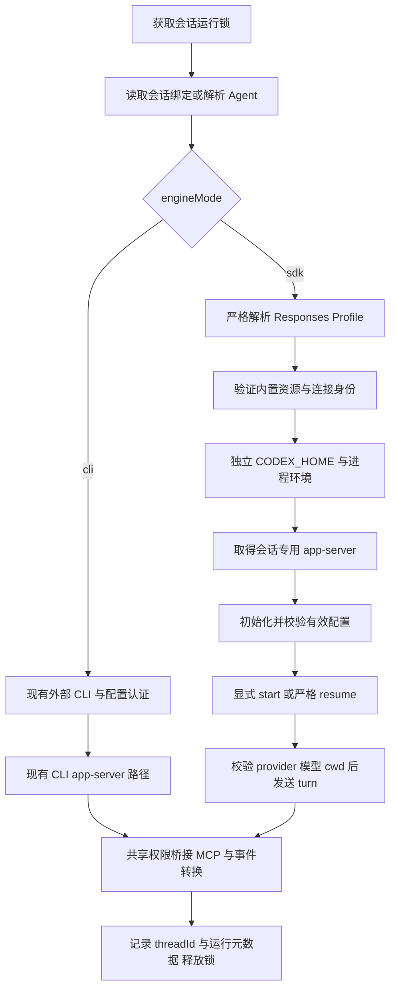

# Codex Runtime 双模式设计

状态：设计提案。

实现状态（2026-09-12）：与 Claude 方案共享的 P1 契约/迁移、本方案的 P2 Codex 执行链（隔离 CODEX_HOME、zclaudia_profile provider、每会话进程、严格恢复）与 P3 入口及会话运行标记（模式/Profile/模型徽章）代码已落地；§9 的日志泄漏独立先行修复已在 commit 1fc15a5f 完成。P0 本地引擎探针已执行并通过（真实 codex 0.154.0 app-server + 本地 Responses SSE fixture：env_key 认证、配置重锁、严格恢复，见文末执行记录）；剩余为需真实凭据的供应商验收与 §10 P4 发布验收。日期：2026-09-11。代码基线：`66eb1d22`。

评审修订：2026-09-12。修正协议检查路径和 cwd 验证范围，将现存日志泄漏列为独立先行修复，并补齐 CLI 模型输入来源与 providerType 运行时准入规则。

本文承接 [Claude Runtime 双模式设计](2026-09-11-claude-dual-mode-runtime-design.md)，共用模式描述、会话绑定和资源交付基础设施。本文只设计 Codex 的扩展，不扩大 Claude 的协议范围：Claude SDK 仍只接受 Anthropic Messages；Codex SDK 接受 OpenAI Responses。

证据边界：仓库 Codex compatibility 的 minimum、testedMaximum、recommendedVersion 当前均为 `0.144.1`。前期用本机 `0.154.0` 执行了 `app-server generate-json-schema --experimental`，确认其 start/resume schema 包含 `modelProvider`、`config`、`developerInstructions` 等字段；这只是本地 schema 探针，没有完成目标版本的模型调用、隔离和恢复验收。官方在线文档也不等于 `0.144.1` 的行为承诺。P0 通过后才确定内置版本，不能将本机版本直接写成已支持版本。

## 1. 决策与范围

保留一个 `runtimeType: 'codex'`，支持以下两种模式：

| 项目               | CLI 模式                                   | SDK + LLM Profile 模式                          |
| ------------------ | ------------------------------------------ | ----------------------------------------------- |
| 配置值             | `engineMode: 'cli'`                        | `engineMode: 'sdk'`                             |
| 界面名称           | CLI（外部环境）                            | SDK（内置引擎 + LLM Profile）                   |
| 执行文件           | 现有显式路径、系统 PATH、Managed Agent CLI | 当前应用版本验证并交付的 Codex 平台资源         |
| 模型连接           | 沿用外部 Codex 配置与认证                  | 显式 Profile、API key、Responses endpoint、模型 |
| 底层通信           | `codex app-server`，JSON-RPC over stdio    | 相同 app-server 协议                            |
| 配置和会话状态     | 现有外部 Codex 环境                        | 后端管理、按 ZClaudia 会话隔离的 CODEX_HOME     |
| 额外安装或登录 CLI | 沿用现有流程                               | 不需要                                          |
| 运行时自动下载     | 沿用既有外部 CLI 管理能力                  | 不下载；资源缺失即报错                          |

这里的 `sdk` 是与 Claude 对齐的产品配置值，表示“应用管理引擎和连接”。首期不引入 `@openai/codex-sdk` npm 包，也不把现有 app-server adapter 改为另一套执行 API。官方将 app-server 用于需要认证、历史、审批和流式事件的完整客户端；现有适配已经建立在这条路径上。[官方 app-server 文档](https://learn.chatgpt.com/docs/app-server)

保留 `com.zclaudia.codex`、`codex`、`codex-default` 身份。默认 Agent 和未填写模式的旧配置继续使用 CLI；不自动生成第二个默认 Agent，也不因缺少 CLI 自动切换 SDK。

首期不做：Chat Completions→Responses 网关、Claude 的 OpenAI 协议接入、SDK 模式使用 ChatGPT/Codex OAuth、任意模型兼容承诺、跨模式续聊、运行中切换连接、跨会话进程池，以及图片/steer/后台任务等新能力。现有 `openai-codex` LLM OAuth Profile 的 pi 执行路径保持原有职责。

LLM 凭据静态加密迁移也不在本期：现有 `llm_profiles.api_key` 明文存放于 SQLite。独立 CODEX_HOME、环境注入和 HMAC 均不改变这一事实，不得宣称 Profile key 已加密落盘。

## 2. 当前实现与需要修改的位置

| 位置                                                                                       | 当前行为                                                     | 本方案改动                                                                                                          |
| ------------------------------------------------------------------------------------------ | ------------------------------------------------------------ | ------------------------------------------------------------------------------------------------------------------- |
| `plugins/agents/codex/plugin.json`                                                         | `model.kind: none`、`capabilities.providers: external`       | 按 engineMode 投影配置编辑器和 readiness                                                                            |
| `src/adapter.ts`                                                                           | 转发模型、权限、CLI 路径、env 和 MCP bridge                  | 转发明确的执行来源和模型连接，校验模式契约                                                                          |
| `src/runner.ts`                                                                            | 按路径、完整 env 和 MCP config signature 缓存 client         | SDK 采用每个宿主会话一个进程；替换前等待旧进程退出                                                                  |
| `src/runner.ts`                                                                            | resume 失败或部分运行错误后自动新建 thread                   | SDK 严格恢复；CLI 兼容行为与限制见 §7.3                                                                             |
| `src/runner.ts`                                                                            | 内存 cwd 记录和 `.worktrees` 路径规则决定恢复                | SDK 采用持久绑定、规范化 cwd 和引擎返回结果校验                                                                     |
| `src/config.ts`                                                                            | buildEnv 继承 process.env，只清理部分模型变量                | SDK 独立构造完整环境，排除外部连接和认证来源                                                                        |
| `src/config.ts`                                                                            | 公共 codex-config 目录、无目录 key 的 lastWrittenConfig      | SDK 独立目录；配置生成和缓存显式带目录身份                                                                          |
| `src/config.ts`                                                                            | ensureCodexProjectTrusted 写用户 Codex 配置                  | SDK 不调用此全局写入路径，信任设置仅写自身目录                                                                      |
| `src/app-server-client.ts`                                                                 | start 只传 cwd，resume 只传 threadId，turn 传 model          | start/resume 显式绑定 provider、model 和受支持的指令/权限参数                                                       |
| `src/app-server-client.ts`                                                                 | updateExtraArgs 打印参数并销毁进程                           | 去除完整参数日志；不得销毁承载其他活动会话的进程                                                                    |
| `src/app-server-protocol.ts`、`plugins/agents/codex/scripts/check-app-server-protocol.mjs` | 维护较窄的协议子集；脚本尚未检查 thread/start、thread/resume | 增加这两个方法的 cwd、modelProvider 等参数及返回字段的 schema 断言；cwd 的实际绑定/恢复语义另用真实引擎集成测试验证 |
| `scripts/plugins/stage-builtin-agents.mjs`                                                 | Codex 只 stage 插件代码，没有平台引擎                        | 加入目标平台完整 runtime payload 和发布验收                                                                         |

表中 `src/*` 均位于 `plugins/agents/codex/`。宿主改动点复用 Claude 方案中的 resolver、readiness、external-agent-shim、run-managed-runtime、Profile CRUD 和 `/api/agent-runtimes` 投影。

现有 runner 对“resume 不能覆盖 cwd”的注释不能作为能力依据：本仓库窄类型已允许 resume.cwd，本机较新 schema 也有该字段。能否安全恢复必须在固定版本实测，不能根据注释或目录名推断。

## 3. 用户体验

选择 Codex 后展示模式选择。CLI 显示执行文件来源、外部认证状态和可选模型覆盖；SDK 显示 Responses 兼容的 LLM Profile、明确模型、只读内置引擎版本，以及“连接由实际执行的后端管理”。SDK 不显示 CLI 路径输入和外部登录按钮。

切换模式、绑定 Profile、选择模型、清空不适用 CLI 路径作为一次完整草稿原子提交。CLI 与 SDK 的未提交输入可以暂存在编辑器内，不以多次 autosave 制造中间无效配置。

Profile 选择器只列出满足 §4.3 的连接。仅支持 Chat Completions 的自定义 OpenAI Profile 显示不可选原因和进入编辑页的操作，不能只凭名称包含 OpenAI 就标为可用。声明支持、配置可运行和最近连接测试成功是三个不同状态；打开设置不自动调用模型。

会话展示自己的模式、Profile、模型和实际引擎版本。Agent 配置变更仅影响新会话；旧会话连接不同则提示差异并提供“使用当前配置新建会话”。恢复失败必须给出明确操作，不能把新 thread 显示成成功续聊。

SDK 模式固定披露：“使用独立 Codex 配置目录，不继承个人 Codex 登录和全局配置；项目指令与受支持的项目配置仍可能由引擎读取。”运行详情展示宿主注入的指令来源、引擎配置层的可确认来源及受控覆盖项。不能照抄 Claude 的“关闭 CLAUDE.md 自动加载”说明，也不能仅凭 CODEX_HOME 就宣称全部项目配置已禁用。

Remote/Gateway 的资源、Profile、密钥和状态目录均属于执行后端。客户端本机的 Codex 版本或登录状态不能决定远端 SDK readiness。

### 3.1 CLI 模型覆盖的输入与候选来源

与 Claude 方案采用同一首期交互：`model.kind: native` 仅表示模型由外部引擎解释，不表示宿主已经能枚举模型。编辑器提供可清空的组合输入框，候选只有“使用外部 CLI 默认模型”和当前已保存的非空覆盖值，并允许手动输入模型 ID。首期不提供自动发现列表，不读取 LLM Profile、pi registry 或另一后端的模型列表来冒充外部 CLI 的可用模型。

“使用默认”保存为空模型，运行时省略模型覆盖参数，不把 UI 标签发给引擎；非空值做长度和控制字符等结构校验后按值传递，由当前 CLI/外部 provider 判断可用性。已有值不因不在候选列表中被清空。UI 标注“由外部 CLI 验证”，保存不触发推理或付费模型探测，运行时无效模型返回明确错误而不自动换模型。

后续如增加自动发现，Codex 优先评估实际选中 CLI 的 app-server `model/list`。当前协议类型和检查脚本包含该方法，不代表已存在通往 Profile 编辑器的候选 API；届时须补宿主/插件发现契约，并验证分页、隐藏项、超时、配置/认证身份和缓存失效。Claude 使用其独立发现入口，不共用 Codex 的候选数据。发现失败仍保留默认和手动输入；SDK 的模型来源继续按 §4.3 处理。

## 4. 公共配置与运行契约

### 4.1 Agent Profile 与迁移

直接共用 Claude 方案的字段，不新增 `codexMode`、第二套模型字段或权限模式字段：

```ts
interface AgentProfileConfig {
  runtimeType?: AgentRuntimeType;
  engineMode?: string;
  llmProfileId?: string | null;
  model: string;
  cliPath?: string;
}
```

`engineMode` 与权限 `mode`、插件执行位置 `executionMode`、前端权限暂存 `sessionConfigStore.runtimeModes` 不同。新增 DB `agent_profiles.engine_mode`、nullable LLM 类型及共享会话绑定迁移只实施一次，不为两个 runtime 创建平行基础设施。

Codex 缺模式解释为 CLI；未知模式报错。PATCH 省略保留、null 清空，兼容入口将旧 LLM 空串规范化为 null。SDK 要求明确 Profile、非空 API key、Responses 协议和非空模型，禁止回退全局默认 Profile；提交非空 cliPath 返回字段不适用错误。新建/显式切换 CLI 清空 LLM 绑定；旧 CLI 记录已有的 LLM ID 保留但不用于引擎认证。

CRUD、默认 Profile 创建、导入导出、WS、删除引用检查、前端草稿与后端严格 resolver 都必须支持。旧宿主或旧插件未声明契约能力时拒绝 SDK 配置，不能把未知模式降级执行。

### 4.2 Descriptor：复用规范字段，增加一种资源来源

沿用 Claude 方案的 `EngineModeDescriptor`：只有 `connection` 和 `executable` 是来源规范，`model.kind`、`capabilities.providers`、`hasCliPath` 统一派生。公共定义在独立的 `@zclaudia/plugin-sdk` 源码中，需要发布契约升级，不能修改 node_modules 代替发布。

Codex 的声明如下，模型选项和工具/技能能力继续取现有 descriptor：

| 模式 | connection                                              | executable     | 派生结果                                                       |
| ---- | ------------------------------------------------------- | -------------- | -------------------------------------------------------------- |
| cli  | external，modelSelection: optional                      | external-cli   | model.kind: native、providers: external、hasCliPath: true      |
| sdk  | llm-profile，acceptedModelProtocols: [openai-responses] | bundled-engine | model.kind: llm-profile、providers: profile、hasCliPath: false |

这是对 Claude 提案契约的显式增量：`executable` 和 `EngineExecutionContext.executableSource` 增加 `bundled-engine`。Claude 仍使用 `bundled-sdk`，因为其资源随 Agent SDK 配套；Codex 使用独立的版本化引擎包。不为二者各造一个布尔字段。顶层 descriptor 从默认 CLI 模式生成兼容视图；旧插件未声明模式时继续使用原有顶层规范。

`capabilities.providers` 是真实类型里的能力字段，没有独立 `provider` 字段。工具、技能、图片和 thinking 能力不由协议名推导；Codex 首期继续现有工具/技能声明与 thinking Auto 范围。SDK 模式不会自动打开任意 reasoning 参数。

### 4.3 LLM Profile：显式声明 Responses 能力

当前 `providerType: 'openai'` 对应的已有 pi 路径不能证明 endpoint 支持 Responses。为避免把“支持哪些协议”和“pi 默认采用哪个协议”混为一谈，增加可选能力声明：

```ts
type LlmWireProtocol = 'anthropic-messages' | 'openai-completions' | 'openai-responses';

interface LlmProfileConfig {
  // 原有字段不变
  supportedProtocols?: LlmWireProtocol[];
}
```

该字段表达 endpoint 能力，不修改现有 pi transport 选择，不取代 `providerType`、模型 dialect 或 compat。它是本 Codex 方案在 Claude “未来扩展协议”位置上的共享增量；Claude resolver 仍限定 Anthropic 类型和 Messages，不会因某个 Profile 声明多个协议而接受 OpenAI。

| Profile                                            | 未声明 supportedProtocols 时的规范化             | Codex SDK                          |
| -------------------------------------------------- | ------------------------------------------------ | ---------------------------------- |
| anthropic                                          | anthropic-messages                               | 拒绝                               |
| openai，默认或规范官方 `https://api.openai.com/v1` | openai-completions + openai-responses            | 可选，API key 和模型仍需验证       |
| openai，自定义 baseUrl                             | openai-completions                               | 显式声明 openai-responses 后才可选 |
| openai-codex                                       | 保持原 OAuth 语义，不推断 API key Responses 能力 | 拒绝，即使手工声明 Responses       |
| 其他 providerType                                  | 不推断                                           | 首期拒绝                           |

现有 `shared/src/core/llm-profile.ts` 将 `LlmProviderType` 定义为 `(typeof LLM_PROVIDER_TYPES)[number] | string`，它实际上是开放字符串类型。上述准入必须在运行时用白名单判断：Codex SDK 首期只接受精确的 `providerType === 'openai'`，再检查协议、凭据和模型；不能依赖 TS 联合类型收窄、类型断言或前端选项来拒绝未知值。HTTP、WS、导入和数据库旧记录最终都经过同一严格 resolver；不收窄其他 runtime 已有的扩展类型范围。

显式数组是完整声明，去重后替代推断结果；空数组表示未声明任何可用协议，不能再回退推断。官方端点判断采用严格 URL 规范化及白名单，不能按域名子串或模型名判断。自定义端点的声明只是准入条件，工具调用、流式事件、错误语义和模型兼容仍需测试。

DB 增加 nullable `supported_protocols` JSON 文本列，并同步 repository、HTTP/WS、导入导出和 Profile 编辑器。旧记录不回填猜测能力，读取时按表规范化。保存不会自动发起收费请求；用户触发的测试结果绑定 endpoint 身份、协议和模型，变更后不能沿用旧的绿色验证状态。

SDK 仅允许 API key Bearer 认证、明确 Responses endpoint、已登记模型或经过既有 registry 校验的兼容模型 ID。Profile 列表为空时允许先登记自定义模型，不能以引擎外部默认模型兜底。自定义模型声明不构成原生工具可靠性的承诺。

`baseUrl` 默认固定为 `https://api.openai.com/v1`；自定义值按 Responses API 基地址解释，保留代理路径前缀，通过专用转换器构造请求路径。不得简单把 `/chat/completions` 替换为 `/responses`，也不在失败后改协议重试。已有 headers 校验继续生效，拒绝 Authorization、Host、Content-Type 及 CR/LF 注入。

`compat`、`dialect`、`cacheRetention` 属于现有 pi 请求行为，不自动映射到 Codex。对当前选中模型/连接上的显式不兼容覆盖返回字段错误，不能声称已应用。contextWindow/maxTokens 元数据与引擎实际限制分别处理，没有受测映射的控制值不能写入引擎。模型列表也不能用一次 `/models` 成功代替 Responses 工具流测试。

### 4.4 宿主到插件

```ts
// 在 Claude 提案的可选公共契约上做版本化增量。
type RuntimeModelConnection =
  | {
      protocol: 'anthropic-messages';
      baseUrl: string;
      apiKey: string;
      requestHeaders?: Record<string, string>;
    }
  | {
      protocol: 'openai-responses';
      baseUrl: string;
      apiKey: string;
      requestHeaders?: Record<string, string>;
    };

// engineExecution.engineMode 与 executableSource 使用 §4.2 的公共定义。
// model、cliPath、cwd 和权限 mode 继续使用既有运行参数。
// SDK 的 cliPath 由后端填写为已经验证的内置绝对路径，非用户 Profile 字段。
```

宿主严格解析 Profile，adapter 再按 runtime 校验协议及来源组合。只传当前连接，不传整个 Profile 仓库、OAuth 刷新凭据或其他密钥。连接仅在当轮内存中使用，不进入前端事件、trace、持久化运行参数或工具输入。SDK 缺少明确连接、已验证路径或隔离目录即失败，client 不再尝试 `resolveCodexCli(...) || 'codex'`。

## 5. 执行流程与职责



宿主负责绑定、Profile 凭据、资源校验、readiness 和错误展示；Codex 插件负责配置映射、app-server 生命周期、权限/MCP、事件转换；引擎负责推理循环、原生工具和 transcript。不要在宿主重做 Codex agent loop。

主会话、workflow、委派任务与其他后台入口复用相同的绑定解析；必须先解析绑定，再构造上下文、模型能力和 fallback，不能先使用 Agent 最新配置再补覆盖。ZClaudia 委派出的新 Agent 会话按自身 Profile 创建独立绑定，不继承父会话凭据；引擎原生子任务则在当前绑定连接内运行。

SDK readiness 是“资源存在且版本/协议可用 + 绑定连接结构有效”的组合，跳过外部 `codex login status`。本地资源检查不能证明远端认证成功；运行时 401/403 映射为 Profile 认证故障。只检查 LLM 或只检查可执行文件都不够。

## 6. SDK 的配置、指令与认证隔离

### 6.1 目录和环境

目录由实际执行后端生成，示意为 `<data-dir>/agent-runtime-state/codex/sdk/<opaque-session-key>/`，该目录作为此会话的 CODEX_HOME，与 Claude 使用同一状态根目录约定。使用不含用户输入路径片段的 namespace，并校验路径归属；目录权限 0700、敏感文件 0600，Windows 使用对应 ACL。HOME 保持真实宿主语义，不通过伪造 HOME 改变项目工具行为。

`buildCodexSdkEnvironment()` 生成最终完整环境：保留受控的系统执行、终端、代理和证书配置；不继承外部 Codex/OpenAI/其他 provider 的认证、base URL、模型覆盖和 CODEX_HOME；最后注入宿主确认的目录、会话 ID、唯一 API key 环境变量和必要 bridge 配置。任意 options.env 不能覆盖这些受管字段。runner/client 收到后直接传入 spawn，不二次合并 process.env。CLI 继续原有环境语义。

认证变量只供引擎请求使用；在引擎支持的 shell 环境策略和显式 MCP 子进程 env 中排除这些变量，验证工具子进程不会默认获得 Profile key。若目标版本做不到，需要在发布前补足，不把环境注入误称为对子进程天然保密。外部 MCP 自己确需的凭据仍走单独的 MCP 配置路径。

独立 CODEX_HOME 控制一部分配置与状态，但 Codex 还支持项目配置层，认证也可能使用 OS keychain。不能仅凭目录隔离就断言外部登录不可见。[官方配置与状态说明](https://learn.chatgpt.com/docs/config-file/config-advanced)

### 6.2 唯一模型连接与配置优先级

使用专用 provider ID `zclaudia_profile`，不覆盖官方内置 `openai` provider。下列 TOML 是目标映射示意，具体字段须由 P0 固定版本验证：

```toml
model = "<selected-model>"
model_provider = "zclaudia_profile"

[model_providers.zclaudia_profile]
name = "ZClaudia LLM Profile"
base_url = "<resolved-responses-base-url>"
wire_api = "responses"
env_key = "ZCLAUDIA_CODEX_API_KEY"
requires_openai_auth = false
supports_websockets = false
```

API key 只写入子进程环境，不写 TOML、argv 或 auth.json。不调用 account/login/start，不复制个人 auth.json。额外 headers 用 `env_http_headers` 引用宿主生成的环境变量；TOML、命令行和诊断只包含变量名。首期采用受测 SSE 路径，WebSocket 与其他认证链不自动开启。上述 custom provider 字段见 [官方配置参考](https://learn.chatgpt.com/docs/config-file/config-reference)。

用户/项目的 `.codex/config.toml` 可能参与合并，所以写一份独立 config.toml 不足以锁定连接。实现必须通过受测高优先级配置覆盖锁定 provider 选择、完整 provider 定义、模型和必要传输字段；start/resume 也传入明确 modelProvider/model。`-c` 的值按 TOML 序列化，不能手拼字符串或以 JSON 代替 TOML。

在首个 turn 前读取受测版本的有效配置与配置来源（例如其 `config/read` 能力），验证所选 provider 不含来自其他层的 auth.command、直接 token、额外 query_params、header 或 endpoint 覆盖。必须实测表级覆盖是否深合并；不能假定写入整个 table 就清除了低优先级子字段。无法证明并校验唯一连接时返回 `RUNTIME_CONFIGURATION_CONFLICT`，不启动模型请求。

这里允许项目指令参与，但连接、认证、宿主权限和 bridge 路由属于受控项。项目出现同名 provider 或强制要求与受管配置冲突时明确报错。组织级受管策略仍须遵守，SDK 不承诺绕过系统策略。

### 6.3 项目指令、扩展和权限

SDK 保留目标引擎受支持的 AGENTS.md 项目指令发现，不照搬 Claude 的 settingSources。独立 CODEX_HOME 下个人全局指令、技能、插件不保证继承；首期不复制整个个人 Codex 目录。既有宿主指令管线产生的内容仍按实际来源记录，避免把“文件存在”标记为“已经注入”。

宿主 systemPrompt 优先映射到固定版本受支持的 `developerInstructions`，保留引擎默认 baseInstructions；验证 start/resume 的替换与累积语义，避免恢复时重复插入。当前 runner 把 `[System Context]` 拼进首条 user 消息的行为不作为 SDK 的目标实现；CLI 暂保留原有提示词语义。

MCP bridge 在该会话目录生成，配置写入使用原子替换；失败即停止 SDK 启动。缓存 key 包含规范化目标目录和配置内容，不能复用无 key 的 lastWrittenConfig。SDK 不调用写个人 Codex config.toml 的 ensureCodexProjectTrusted；确需项目 trust 时仅写自身目录的准确工作目录，不自动信任整个 HOME。

桥接仍复用既有审批和事件转换。`approval_policy=on-request` 不等于 plan 一定只读；对 plan/acceptEdits/bypass 的引擎 sandbox、审批参数和宿主回调逐项验证。SDK 配置不得被项目层放宽权限，未实现审批类型默认拒绝。Profile 的协议或模型声明不能扩大工具权限。

## 7. 进程、绑定与会话恢复

### 7.1 每个 SDK 会话一个进程

首期按 ZClaudia 会话拥有独立 app-server，连续轮次复用同一进程；不同会话不共享进程和 CODEX_HOME。已有 CLI pool 与 SDK pool 分开。activeThreadIds 等映射使用 runtime namespace + 宿主会话 ID，不能只按供应商 threadId 关联取消。

每个进程条目记录 launchFingerprint：内置引擎摘要、目录、连接身份、模型、权限配置、MCP signature 及内存中的凭据修订身份。API key 和 header 原文不进入日志或持久化 fingerprint；凭据比较使用内存受保护的摘要或受控修订号。

同一会话只允许一个活动 run。下一轮发现 key、MCP 或需重启的配置变化时，等待旧 turn 完成、关闭旧进程并确认退出，再从相同状态目录恢复。不能调用 updateExtraArgs 边销毁边复用，也不能让两个进程同时写同一状态目录。额外使用后端间可见的目录锁，防止同数据目录的多实例并发写入。

保留可配置 idle 回收和总并发上限，回收只终止空闲进程，不删除 transcript。初始化、配置校验、resume 及停止都有有界超时；取消必须覆盖 turnId 尚未产生的阶段。已开始 turn 优先 interrupt，超时后终止该会话专用进程并等待退出。取消、断连和响应丢失后不自动重发用户 turn，以免重复执行工具。

### 7.2 绑定与凭据轮换

复用 Claude 提案的 `session_runtime_bindings`，在单会话锁内完成预检后、启动引擎前创建。`llm_profile_id` 使用独立 FK 列，不在 JSON 再存一份。共享字段包括 runtimeType、engineMode、model、connectionIdentityHash、configuredCliPath 和 configNamespace；Codex 扩展版本化 runtimeDetails 保存 providerId 与规范化 cwd。实际引擎版本/摘要作为运行审计和恢复兼容检查依据。

`sessions.sdk_session_id` 继续保存原生 Codex threadId，不另建重复 ID 列。thread/start 成功后及时记录 ID；记录失败则停止且不发送首个 turn。Agent 编辑只作用于新会话，旧会话按绑定解析；Profile 删除检查包含 Agent 和会话 FK。

连接身份采用公共 HMAC-SHA256 方案，包含协议、规范 endpoint、认证方式及路由 headers；不包含主 API key，允许相同连接的 key 轮换在下一轮重启生效。改 endpoint、协议、路由 header 或删除原能力声明时，旧会话停止并明确报错，不能把历史发送给新的 endpoint。更换租户/账户必须使用新 Profile/新会话；系统不能仅从不透明 API key 判断一次轮换是否换了账户。

HMAC 密钥采用 `<data-dir>/runtime-binding-key` 的独立随机文件，复用 MCP OAuth protector 的安全文件创建模式，不复用其密钥，也不继承 hostname:homedir 退化路径。随机 32 字节，安全权限、排他创建；已有绑定时密钥缺失/损坏必须失败，不能重新生成后继续。它用于连接身份比较，不加密 SQLite API key。

### 7.3 恢复和失败语义

SDK 的 start/resume 参数携带锁定的 provider、model、cwd 和受测指令/权限配置。当前 runTurn 只传 model 不足以设置 provider；不能等首个 turn 再切 provider。解析引擎返回的实际 cwd、provider 和 model，并在发出用户内容前校验；返回结构随版本变化由固定协议适配处理，不用宿主输入伪造“引擎已确认”元数据。

SDK resume 失败、状态缺失、目录不匹配、协议错误或 transcript 损坏，一律返回结构化错误，保留旧 threadId；移除 SDK 路径中 catch 后 startThread 和 recoverableError 后 freshThread 的自动回退。UI 提供显式新建会话；不能用原 session ID 静默重启推理。

CLI 首期保留现有恢复回退策略以控制兼容范围，但必须发出可辨认的“原 thread 未恢复，已新建 thread”事件并更新原生 ID，不能标为成功恢复。任何会话绑定不匹配都在进入两种 runner 分支前失败，CLI 也不能借回退跨模式、跨绑定。把 CLI 全面切为严格恢复作为独立后续行为变更，不混在 SDK 开关里。

旧会话首次继续时标记为 CLI 绑定，不能因 Agent 已改为 SDK 就迁移。若旧记录不足以确定原有路径/cwd，不声称可还原；按 CLI 兼容策略处理并披露。SDK 首期不支持跨模式 fork、重绑 Profile 或移动项目目录后无损恢复。

### 7.4 持久化、备份和升级

按固定版本确认 CODEX_HOME 内的 rollout、索引/SQLite 等实际恢复依赖。备份应在进程退出后对该目录作一致快照，并关联业务 DB、绑定 key、目录 namespace 和引擎版本。仅备份 sessions.sdk_session_id 或 history.jsonl 不够；history.persistence 也不能被当作 Claude persistSession 的等价选项。

P0 检查原生 thread 的持久化默认值、临时会话选项、归档、清理和索引重建行为；首期不启用临时 thread。应用 idle 回收只关进程。删除会话的状态清理纳入现有删除/保留策略，并在确认无写者后执行，不在恢复失败时自动清空。

升级前验证新内置引擎对旧状态的读取。活动进程保持原版本完成当前 turn；切换版本前停写并快照。若新版本无法恢复，不改绑到外部 CLI。降级可能无法读取新状态，必须配套恢复升级前业务 DB 与引擎状态，不能只替换二进制。

## 8. 内置引擎交付与版本管理

CLI 使用宿主解析出的版本；SDK 使用应用发布时绑定的精确 Codex 版本。SDK 的下载发生在构建/发布阶段，按目标 OS/架构获取官方完整 runtime 包、校验摘要并随产物交付。用户启动 SDK 模式不需要再装 Codex，也不会运行在线自更新或 `npx latest`。

Codex 没有本方案需要锁定的官方 npm SDK 依赖；需要锁定的是引擎版本、完整资源摘要和 app-server 协议契约。目标包保留所需辅助程序、sandbox 组件、许可证及平台目录布局，不能只复制一个 codex 可执行文件后假定所有工具可用。

扩展现有 runtime compatibility schema，为内置资源提供单独的精确 `bundledRuntime` 引用，指向唯一版本化 artifact 记录；Managed CLI 推荐版本和外部兼容范围仍各有语义。相同 artifact 的 URL/hash 不手写两份。stage 清单和 catalog 校验信息均从该记录生成，不能成为另一个版本真相源。

现有 `0.144.1` managedInstall 元数据可作为 P0 候选来源，不能仅凭记录存在认定 SDK 需求通过。若只有更高版本通过全部探针，选择该精确版本并更新对应 schema/平台验证；外部 CLI 支持范围单独回归，不随内置升级自动放宽。

stage/portable/installer/container 都必须纳入实际引擎 payload。校验 archive 路径、摘要、可执行权限及运行依赖；在没有系统 Codex、没有个人登录、禁止下载的安装环境测试。未交付平台不显示可运行 SDK 能力；缺失或损坏时报 `BUNDLED_ENGINE_UNAVAILABLE`，禁止 fallback PATH 或 Managed CLI。

## 9. 错误与诊断

| 错误                                                      | 用户可采取的动作               |
| --------------------------------------------------------- | ------------------------------ |
| LLM_PROFILE_REQUIRED / LLM_PROFILE_NOT_FOUND              | 选择或恢复原 Profile           |
| LLM_PROTOCOL_UNSUPPORTED / LLM_AUTH_UNSUPPORTED           | 配置 API key Responses Profile |
| LLM_PROFILE_FIELD_UNSUPPORTED                             | 移除或调整未映射的显式覆盖     |
| BUNDLED_ENGINE_UNAVAILABLE / RUNTIME_PROTOCOL_UNSUPPORTED | 修复安装或使用匹配版本         |
| RUNTIME_CONFIGURATION_CONFLICT                            | 查看脱敏的冲突字段与配置来源   |
| SESSION_CONNECTION_CHANGED / SESSION_WORKSPACE_CHANGED    | 恢复原配置或明确新建会话       |
| SESSION_RESUME_UNAVAILABLE                                | 恢复状态备份或明确新建会话     |
| RUNTIME_BINDING_KEY_UNAVAILABLE                           | 恢复匹配的绑定密钥备份         |
| SESSION_RUNTIME_BUSY / RUNTIME_START_TIMEOUT              | 等待当前运行结束或重试启动     |

错误码为目标公共分类，实施时与 Claude 方案统一注册，不创建仅文本不同的平行分类。诊断可显示模式、执行文件来源、引擎版本、协议、Profile ID 和配置来源；不输出 API key、完整 headers、OAuth 凭据或含密钥的 argv/env/config。

**独立先行修复：当前 CLI 已存在日志泄漏，不以 SDK/P2 为处理前提。** config.ts 的 debugLog 每次调用都直接 appendFileSync 到 `/tmp/codex-app-server-debug.log`，没有开关或轮转，并同时 console.log。buildMcpConfigArgs 将 MCP env 原值放入 `-c mcp_servers.*.env.*=<value>`，updateExtraArgs 再记录完整新旧参数，形成敏感值进入文件和控制台的路径。这是代码路径核对结果，未读取用户实际日志或据此认定具体凭据已经泄漏。

该独立修复应立即排期，在双模式运行链路接入及任何使用真实凭据的探针前完成：移除完整参数差异和原始协议内容日志，统一审计 stderr、异常、MCP env 等输出；调试默认关闭，显式开启后也只记录经过允许字段筛选与脱敏的元数据，文件写入使用受控权限及大小/保留上限。哈希值不等于允许记录原始输入，单纯关文件输出也不能消除 console 的泄漏路径。用合成敏感标记验证文件与控制台均不输出原值，不依赖真实密钥做测试。

本次文档修订只调整优先级和修复边界，不代表该独立修复已经完成。P2 仍须检查新增 SDK 日志，但不再承担修复上述既有缺陷的首次责任。

## 10. 分期实施

| 阶段                       | 交付物                                                                  | 退出条件                                                               |
| -------------------------- | ----------------------------------------------------------------------- | ---------------------------------------------------------------------- |
| 独立先行修复：现存日志泄漏 | §9 的日志修复及合成敏感标记回归，可独立发布                             | 文件与控制台不泄漏 MCP env/完整参数；不等待 P2，真实凭据探针开始前完成 |
| P0：固定版本探针           | §11 证据记录、候选引擎和平台清单                                        | 唯一连接、权限、恢复和隔离可验证；失败则调整版本或阻止 SDK 发布        |
| P1：共享契约和数据         | 插件 SDK 发布；engineMode、协议声明、会话绑定及迁移；纯 descriptor 投影 | 旧 CLI 默认行为兼容；新旧 host/plugin 能力门禁有效                     |
| P2：Codex 执行链           | 严格连接 resolver、独立环境/目录、专用进程、协议扩展、取消恢复、脱敏    | 本地可控 Responses fixture 经真实引擎跑通工具/多轮/恢复                |
| P3：全入口体验             | Agent/Profile 编辑、readiness、连接测试、会话标记、错误和远端归属       | HTTP/WS/导入导出/默认 Agent/Remote/Gateway 一致                        |
| P4：发布验收               | 精确资源 stage、真实平台包、升级备份文档                                | 完成 §12 矩阵，干净环境不用宿主 CLI 即可运行                           |

P1 与 Claude 共用的迁移和契约必须作为同一批变更协调：Codex 新增的是 Responses 能力声明、bundled-engine 和连接 union 分支；不顺带给 Claude 增加 OpenAI 支持。

## 11. P0 必须回答的探针

探针结果记录精确引擎版本、平台、输入配置、脱敏请求、实际响应与判定。schema 存在、mock client 通过、真实引擎通过、真实 provider 通过分别标记。

1. **协议和版本**：对候选精确版本生成 schema，确认 initialize、config/read、thread/start、thread/resume、turn/start 和 interrupt 的字段、返回值、稳定性。检查脚本新增 start/resume 的 cwd 与 modelProvider 等字段断言；字段存在只能证明结构，cwd 实际绑定/覆盖行为必须由第 7 项真实引擎探针验证。特别验证 modelProvider 在 start/resume 生效，不能仅验证 turn.model。
2. **完整 Responses 流**：真实引擎连接本地可控 HTTP fixture，覆盖路径前缀、Bearer、额外 headers、SSE、工具调用与结果、流中断、401/429/5xx；再以真实受测 provider 验证模型行为。单次文本成功不够。
3. **外部环境污染**：在宿主设置不同 OPENAI_API_KEY、OPENAI_BASE_URL、CODEX_HOME 和登录状态；项目配置再放同名 provider 与 auth.command。证明选定请求只使用绑定连接，冲突在发送历史前失败，错误不回退个人账号。
4. **配置层和指令**：确认独立 CODEX_HOME、项目/组织配置优先级、表合并行为及有效配置读取。分别测试根目录、子目录、worktree 的 AGENTS.md、宿主 developerInstructions 和个人全局技能，不把 Claude 的配置选项当作 Codex 功能。
5. **认证落点**：确认 SDK 无登录也能用 env_key；检查 auth.json/keychain 是否被读写、key/header 是否泄漏到日志/argv、shell/MCP 环境。不能仅靠文件目录不同判定认证隔离。
6. **权限与 bridge**：plan 的写文件/命令请求、acceptEdits、拒绝、取消、MCP 动态调用和项目权限覆盖。验证实际落盘行为及宿主审批关联，不能只断言 callback 被调用。
7. **恢复与 cwd**：同进程、杀进程、重启后端、worktree、返回 cwd 不一致、thread 不存在和损坏 transcript；SDK 必须失败而不自动新建。检查恢复后 systemPrompt 是否重复及 provider/model 是否回到原值。
8. **状态保留**：盘点 rollout/索引/SQLite 等必要文件，验证临时会话开关、归档/清理策略、长时间闲置、目录一致备份恢复与升级/降级。history 设置不作为 transcript 永久存在的保证。
9. **并发和轮换**：两个 Profile、两个模型、同一原生 ID 的不同 namespace、审批等待中另一会话启动、key/bridge 轮换和启动期间取消。确认没有串连接、误杀、重复 turn 或双写目录。
10. **模型与辅助请求**：主轮次、压缩、review/子任务及其他可触发请求是否使用绑定 provider 和模型；不能静默调用外部默认连接或未声明模型。固定版本需要其他模型时必须明确支持条件并预检。
11. **干净发布包**：逐目标平台验证完整 payload、初始化、shell/sandbox 辅助组件、MCP、启动取消与恢复；PATH 无 codex、用户未登录、网络禁止下载。跨平台只做 JS import smoke 不足以通过。

## 12. 实现验收矩阵

| 类别              | 必须覆盖                                                                                                              |
| ----------------- | --------------------------------------------------------------------------------------------------------------------- |
| 兼容              | 旧 Agent 默认 CLI；已有 CLI LLM 引用不转为 SDK；外部 OAuth 流程可用；无 engineModes 的插件保持原行为                  |
| 配置              | 模式原子切换；null/省略/旧空串；Responses 能力推断与显式空数组；自定义 endpoint 未声明不可选；拒绝 openai-codex OAuth |
| CLI 模型输入      | 默认值省略覆盖；已有/手动值保留；不混入 Profile 模型列表；保存不调用模型；运行时无效值不自动换模型                    |
| 开放 providerType | 未知字符串、大小写变体和手工导入值在 SDK 严格 resolver 被拒绝；不能仅依靠 TS 类型或前端筛选                           |
| 契约              | 模式投影唯一；SDK 缺字段/旧插件拒绝；Claude 不接受 Responses；Codex 不接受 Messages                                   |
| 连接              | Profile key/header 精确命中；代理前缀正确；无外部 fallback；配置冲突在 turn 前失败                                    |
| 生命周期          | SDK 会话进程隔离；启动/审批/流式阶段取消；idle 回收后恢复；轮换重启等待退出；多后端锁                                 |
| 会话              | 绑定冻结；endpoint 变化阻止旧历史外发；cwd 校验；thread 丢失明确错误；CLI 回退事件明确                                |
| 安全与权限        | 日志/argv/子工具无连接密钥；不写个人 Codex 配置；plan 实际只读；审批不串会话                                          |
| 交付              | 固定版本与摘要一致；完整资源可离线安装；无宿主 CLI 仍可运行；缺资源不降级；旧状态升级/恢复                            |

测试分三层：纯配置/契约单测与回归；真实打包引擎连接本地 Responses fixture 的集成测试；受控真实 provider 和目标安装包验收。mock app-server 只能证明宿主分支，不能证明引擎接受配置或认证隔离。本文当前只完成设计与代码/schema 核对，以上发布验收尚未执行。

### P0 探针执行记录（2026-09-12，darwin-arm64，本机 codex 0.154.0，本地 OpenAI Responses SSE fixture，无外部网络）

探针以可重复测试形式固化于 `plugins/agents/codex/src/__tests__/p0.local-engine.test.ts`（插件真实 client/config/环境构造代码路径 + 真实 `codex app-server` 二进制 + 本地 fixture）。执行结果：

| §11 探针             | 结果                                                                                                                                                                                                                                | 证据                                             |
| -------------------- | ----------------------------------------------------------------------------------------------------------------------------------------------------------------------------------------------------------------------------------- | ------------------------------------------------ |
| 1. 协议和版本        | **通过（结构层）**：扩展后的 `scripts/check-app-server-protocol.mjs` 对 0.154.0 真实生成的 schema 断言通过——thread/start 与 thread/resume 均含 `cwd`、`model`、`modelProvider`、`developerInstructions`，Thread 返回含 `id`、`cwd`  | `pnpm --dir plugins/agents/codex protocol:check` |
| 2. 完整 Responses 流 | **通过**：本地 SSE fixture（response.created → output_item.added → output_text.delta → output_item.done → response.completed 含 usage）在真实引擎下完整走通 tool-less 轮次；工具调用/流中断/401/429/5xx 分支仍待 fixture 扩展后回归 | 第 1/3 探针                                      |
| 3. 外部环境污染      | **通过**：宿主环境预置 `OPENAI_API_KEY`（继承毒饵）下，引擎全部请求仅携带 `Authorization: Bearer <Profile key>`（来自 env_key），继承 key 在请求数据中零出现                                                                        | 第 1 探针断言                                    |
| 4. 配置层重锁        | **通过**：项目级 `.codex/config.toml` 预置同名 `zclaudia_profile`（指向 127.0.0.1:1/evil）+ `model="evil-model"` 后，全部请求仍命中绑定 base_url 与绑定模型——`-c` 最高优先级覆盖压制了项目层                                        | 第 2 探针                                        |
| 5. 认证落点          | **通过**：无登录（空 CODEX_HOME）下 env_key 认证可用；运行后 CODEX_HOME 未生成 `auth.json`；config.toml/-c/argv 中无密钥明文（仅变量名 `ZCLAUDIA_CODEX_API_KEY`）                                                                   | 第 1 探针                                        |
| 7. 恢复              | **通过**：真实引擎 thread/resume（携带锁定 provider/model）后第二轮成功；resume 失败时的结构化错误路径由单元测试覆盖（`SESSION_RESUME_UNAVAILABLE`，不自动新建 thread）                                                             | 第 3 探针 + runner.sdk.test                      |
| 6/8/9/10             | **部分/待探**：权限 bridge 实际落盘、rollout 清理边界、并发轮换、review/子任务辅助请求需在 fixture 扩展（工具轮次、SSE 中断、多会话并发）后回归                                                                                     | —                                                |

**P0 发现并已修复的实现缺陷**：`-c model_providers.<id>.*` 表级覆盖由引擎按字段合并后整体校验，部分字段覆盖（缺 `name`）会导致配置加载失败（"provider name must not be empty"）。`buildSdkConfigArgs` 已补齐全部必填 provider 字段；这同时实证了"不能假定写入整个 table 就清除低优先级子字段，也不能只覆盖部分字段"的设计预警（§6.2）。

**仍待真实凭据后执行（P4 门槛，不阻塞 P0 结论）**：真实受测 provider（Responses 端点）的模型行为、工具调用可靠性、流式错误语义、401/429/5xx 真实映射、干净发布包逐平台验收（§11.11）。
