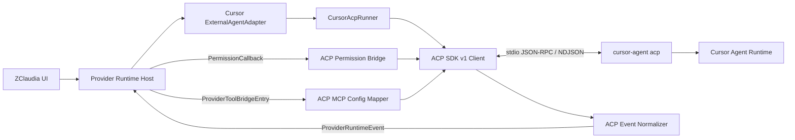

# Cursor Runtime 从 `stream-json` 迁移到 ACP 方案

> 状态：设计提案（P0 核心协议探针已完成，审计资产待入库）
> 日期：2026-09-12
> 最近更新：2026-09-13
> 适用仓库：`zclaudia`、`zclaudia-plugins/agents/cursor`
> 目标协议：Agent Client Protocol（ACP）v1
> 首选实现：`@agentclientprotocol/sdk@1.4.0`（精确锁定版本）
> 探针基线：`cursor-agent 2026.09.10-fd3934a` / macOS 26.6

## 1. 决策摘要

建议将 Cursor Runtime 的主传输层从：

```text
cursor-agent -p ... --output-format stream-json
        ↓
逐行读取 stdout + 自行解析 Cursor 私有事件结构
```

迁移为：

```text
cursor-agent acp
        ↓
ACP SDK 管理 JSON-RPC / NDJSON
        ↓
薄适配层把 ACP 标准事件映射为 ProviderRuntimeEvent
```

本次迁移只替换 Cursor Runtime 的通信协议，不替换 ZClaudia 的插件边界、会话模型、权限 UI 或 MCP bridge。具体决策如下：

1. 使用稳定版 ACP v1，不直接依赖实验性 v2，也不在本阶段切换到 `@cursor/sdk`。
2. 第一阶段仍采用「一次 active run 对应一个 `cursor-agent acp` 子进程」，避免同时引入常驻进程池、跨会话路由和崩溃恢复等额外变量。
3. 新代码通过官方 ACP SDK 处理 framing、请求关联、通知分发和协议协商；项目只保留 Cursor 扩展消息的窄类型定义与业务映射。
4. **首次让 default 模式拥有真正的用户审批**。当前 default 模式走 `--auto-review`，由 Cursor 服务端分类器替用户决定；`PermissionCallback` 在 Cursor adapter 里至今是未使用参数。ACP 的 `session/request_permission` 把审批权交回 ZClaudia，这是本次迁移最大的单项收益。
5. MCP bridge 改为通过 ACP `session/new` / `session/load` 的 `mcpServers` 参数传入，删除 `.cursor/mcp.json` 临时写入和 `cursor-agent mcp enable` 副作用。**该路径已由 P0 探针端到端验证**（见 §2.5）。
6. **新会话不做静默 transport fallback。** 灰度或回滚时只能在启动前通过内部发布配置明确选择 legacy；ACP 握手、认证或启动失败均直接失败。一旦 prompt 已提交，更禁止跨 transport 重试，避免重复执行用户请求或工具调用。
7. 在当前探针基线上，**旧 stream-json 会话无法被 ACP `session/load` 直接恢复**（见 §2.4）。因此 §14 的 session transport binding 是当前确定路径；如果未来 Cursor 提供导入或兼容 load，再以实测迁移旧会话。

最终目标是删除生产路径中的 `stream-json` parser、Cursor 私有事件猜测逻辑和项目级 MCP 配置注入，只保留一个有明确版本边界的 ACP 适配层。

## 2. 实测基线（P0 协议探针结果）

以下全部在 `cursor-agent 2026.09.10-fd3934a` 上用裸 JSON-RPC over stdio 实测，不经 SDK。**本节是后续所有设计决策的事实依据；升级 CLI 后需重跑。**

### 2.1 子命令与握手

`agent acp` 已经出现在 Cursor 官方 ACP 文档中，本机的 `cursor-agent acp` 也可用；但它**不在当前 `cursor-agent --help` 的 Commands 列表中**，官方也未给出明确的最低 CLI 版本。因此：

- 不能靠版本号断言 ACP 可用，只能靠运行时握手探测。
- 不能把顶层 `--help` 是否列出命令当作唯一依据。
- legacy 路径的保留期按实测兼容矩阵规划，而不是假设一个未公布的最低版本。

`initialize` 返回：

```json
{
  "protocolVersion": 1,
  "agentCapabilities": {
    "loadSession": true,
    "mcpCapabilities": { "http": true, "sse": true },
    "promptCapabilities": { "audio": false, "embeddedContext": false, "image": true },
    "sessionCapabilities": { "list": {} }
  },
  "authMethods": [{ "id": "cursor_login", "name": "Cursor Login", "description": "..." }]
}
```

注意 `mcpCapabilities` 只声明 `http` / `sse`——stdio 是 ACP 的 baseline，不在此列，但实测可用（§2.5）。

### 2.2 认证

已登录状态下，即使不调用 `authenticate` 也能直接 `session/new`，说明复用现有 Cursor CLI 登录状态的方案成立。但 Cursor 官方流程明确包含 `authenticate { methodId: "cursor_login" }`，正式实现仍按该流程调用；预登录时它应当是无交互的快速校验，不能为了省一次往返依赖实测到的快捷路径。

### 2.3 modes 与 models

`session/new` 和 `session/load` 的响应**直接携带** `modes` 和 `models`：

```json
"modes": { "currentModeId": "agent", "availableModes": [
  { "id": "agent", "name": "Agent" }, { "id": "plan", "name": "Plan" }, { "id": "ask", "name": "Ask" } ] },
"models": { "currentModelId": "default[]", "availableModels": [
  { "modelId": "default[]", "name": "Auto" },
  { "modelId": "claude-opus-5[thinking=true,context=300k,effort=high,fast=false]", "name": "claude-opus-5" },
  { "modelId": "gpt-5.6-sol[context=272k,reasoning=medium,fast=false]", "name": "gpt-5.6-sol" }, ... ] }
```

- `session/set_mode` 与 `session/set_model` 均为标准 ACP 方法，实测返回 `{}` 成功。
- **`modelId` 带方括号参数，`name` 才是裸模型名。** 这两者不能互换，详见 §7.4 的映射要求。

### 2.4 会话恢复（关键结论）

| 场景                                            | 结果                                                                                         |
| ----------------------------------------------- | -------------------------------------------------------------------------------------------- |
| ACP 建会话 → 关进程 → 新进程 `session/load`     | ✅ 成功，上下文连续（写入的暗号能在新进程答出）                                              |
| `session/load` 期间是否重放历史                 | ✅ **会重放**，实测 3 条：`user_message_chunk`、`agent_thought_chunk`、`agent_message_chunk` |
| stream-json 建会话 → ACP `session/load` 同一 ID | ❌ **失败**：`-32602 Invalid params` / `Session "<id>" not found`（会话完整跑完后仍然失败）  |

结论：在当前 CLI 基线上，旧 session ID **不能被 ACP 直接 load**。这足以要求 §14 的 transport binding，但不能外推为永久不同命名空间；未来 CLI 如果增加兼容 load 或导入能力，可以再迁移存量会话。

### 2.5 inline MCP（关键结论）

用一个最小 stdio MCP server（node 脚本，暴露一个返回固定暗号的工具）作为 `session/new` 的 `mcpServers` 参数传入：

```json
{
  "name": "zclaudia-probe",
  "command": "<node>",
  "args": ["fake-mcp.mjs"],
  "env": [{ "name": "PROBE_TOKEN", "value": "secret-123" }]
}
```

结果：**工具被真实调用，返回值出现在助手回复中**。这意味着：

- inline stdio `mcpServers` 完全可用，`.cursor/mcp.json` 注入和 `cursor-agent mcp enable` 都可以删除。
- `env` 以 `{name, value}` 数组形式直接传入，**不需要 `${VAR}` 间接**——但 §11.2 仍要求把凭据留在进程边界内，不写日志、不进事件。
- **MCP 工具调用同样会触发 `session/request_permission`**，所以 ZClaudia bridge 工具也会走审批流程，这一点必须在 UI 与默认策略上考虑到（见 §8.2）。

MCP 工具调用的事件形状有个陷阱：

```text
tool_call         { title: "MCP: tool", kind: "other", rawInput: {} }        ← 占位，无有效信息
tool_call_update  { title: "zclaudia-probe: zclaudia_probe_ping",
                    rawInput: { providerIdentifier, toolName, args } }        ← 真实内容在这里
tool_call_update  { status: "in_progress" }
session/request_permission ...
tool_call_update  { status: "completed", rawOutput: { success: true } }
```

### 2.6 权限请求

当前探针版本的 `session/request_permission` options **每次均为三个**：

```json
[
  { "optionId": "allow-once", "kind": "allow_once" },
  { "optionId": "allow-always", "kind": "allow_always" },
  { "optionId": "reject-once", "kind": "reject_once" }
]
```

当前 Cursor 未提供 `reject_always`。但 ACP 标准允许 agent 返回不同 option 集合，生产代码必须按 `kind` 查找、容忍额外选项，不能写死数组长度或顺序。`toolCall.content` 里带可展示的原因串（例如 `"Not in allowlist: echo"`），适合作为审批弹窗的 detail。

两个必须写进映射器的顺序事实：

1. 权限请求发生在 `tool_call_update{status:"in_progress"}` **之后**，不是 `pending` 之后。
2. **被拒绝的工具调用，终态仍报 `status: "completed"`。** 实测连拒三次，每次都以 `completed` 收尾。详见 §9.2 的硬规则。

### 2.7 plan 模式

`session/set_mode` 到 `plan` 后，要求写 workspace 文件的探针 prompt **没有产生 workspace 副作用**，agent 转而生成计划。但：

- 在本次「要求生成实施计划」的探针场景中，触发了 **`cursor/create_plan`**（Cursor 私有扩展），携带 `toolCallId` / `name` / `overview` / `plan`（Markdown 正文）。不能把一次探针外推为所有 plan prompt 都必然触发。
- 客户端返回 `-32601 method not found` 时会话**不会崩溃**，正常以 `end_turn` 收尾，计划仍被写入 `~/.cursor/plans/`。
- plan 模式下的只读工具（`search` 等）**不触发权限请求**，直接执行。

这里的「无副作用」专指 workspace 不被修改；Cursor 自己的 `~/.cursor/plans/` 仍会写入 provider-owned 状态。为了支持官方定义的显式计划审批语义，`cursor/create_plan` 是 v1 必须处理的范围，不能推迟到第二阶段。

### 2.8 取消

`session/cancel` 以 notification 发出后，挂起的 `session/prompt` **立即**以 `stopReason: "cancelled"` 收敛（实测响应时间与 cancel 发出时刻相差 6ms），随后关闭 stdin 即可让子进程正常退出，无需 SIGTERM。§12.1 的降级阶梯作为兜底保留，但正常路径不会用到 kill。

### 2.9 未在 §9 映射表覆盖的 update 类型

实测出现但原设计未列入：`session_info_update`（带自动生成的会话标题）、`available_commands_update`（Cursor 的 slash commands，如 `copy-request-id`、`multi-model-review`）、`user_message_chunk`（仅在 `session/load` 重放时出现）。

### 2.10 仍未验证的项

- 多个 ACP 进程并发对同一 provider session 的行为。
- `session/load` 时重新传入 `mcpServers` 是否会重复注册。
- `cursor/ask_question`、`cursor/update_todos`、`cursor/task`、`cursor/generate_image` 的本机行为尚未触发；其 payload 先以 Cursor 官方文档的公开 schema 为准，再用本地 fixture 和探针验证。
- Windows / Linux 上的 spawn 与退出行为。
- 畸形 JSON、响应 ID 错乱时 SDK 的实际容错。

### 2.11 P0 审计资产

本节记录了核心探针结果，但完整脚本、脱敏响应 fixture、CLI/OS 版本和执行日期尚需提交到 `plugins/agents/cursor/probes/`。这些资产入库并可重复执行后，P0 才算对发布流程完整关闭；在此之前可以开始 P1 开发，但不能把 ACP 设为默认。

## 3. 背景与当前实现

当前 Cursor 插件的主要链路位于：

- `plugins/agents/cursor/src/runner.ts`
- `plugins/agents/cursor/src/map-events.ts`
- `plugins/agents/cursor/src/mcp-inject.ts`
- `plugins/agents/cursor/src/adapter.ts`
- `plugins/agents/cursor/src/main.ts`（插件入口，注册 runtime）

当前实现大致为：

1. 根据用户输入拼装 `cursor-agent -p` 命令。
2. 通过 `--output-format stream-json` 获取逐行 JSON。
3. 自行处理换行、解析失败、Cursor 私有字段和嵌套事件。
4. 将事件映射成 `ProviderRuntimeEvent`（已复用 `@zclaudia/agent-common` 的 `boundedJsonText` / `boundedToolInput` / `truncateUtf8` / `makeModeTransition`）。
5. 为暴露 ZClaudia 工具，在项目 `.cursor/mcp.json` 中临时注入 MCP server（env 值经 `${VAR}` 外置到进程环境，避免凭据落盘），并调用 CLI enable。
6. 通过 `--resume` 恢复会话，通过信号终止子进程实现取消。

这个方案已经能工作，四类长期成本如下。**注意与早期版本的差异**：`--yolo` 语义坍缩与 MCP 凭据落盘这两个问题已分别被修复，不应再作为迁移动机。

| 问题                         | 当前影响                                                                                                                                    | ACP 后的改善                                                         |
| ---------------------------- | ------------------------------------------------------------------------------------------------------------------------------------------- | -------------------------------------------------------------------- |
| 私有事件结构漂移             | Cursor CLI 改字段时需要追着修 parser                                                                                                        | 主要依赖 ACP v1 标准类型和能力协商                                   |
| **default 模式没有用户审批** | `--auto-review` 让 Cursor 服务端分类器代替用户决策，`PermissionCallback` 在 adapter 中未使用，manifest 的 `interaction.approval` 为 `false` | `session/request_permission` 把审批交回 ZClaudia，是本次迁移最大收益 |
| MCP 配置有副作用             | 写项目文件、需要 enable 与 cleanup、并发时容易冲突（凭据落盘问题已修）                                                                      | 通过 session 参数传入，仅对当前会话生效，已实测可用                  |
| 生命周期靠 stdout 推断       | 完成、取消、拒绝、会话恢复边界容易含糊                                                                                                      | 由 JSON-RPC 请求、通知和 `PromptResponse.stopReason` 明确表达        |

迁移仍需保留一层适配，因为 ZClaudia 的 `ExternalAgentAdapter` 与 ACP 的模型并不完全一致，尤其是权限回复、结构化问答、计划审批和 Cursor 私有扩展。

### 3.1 前置条件：两份源码的漂移必须先收敛

`zclaudia/plugins/agents/cursor` 目前**领先于** `zclaudia-plugins/agents/cursor`。`zclaudia-plugins` 的 HEAD（`9453561`）尚不包含：

- `--auto-review` / `--yolo` 的模式分离
- `.cursor/mcp.json` 的凭据外置
- engine mode 相关改动

在开始 ACP 工作之前，必须先把这三项同步回 `zclaudia-plugins`，否则任何「改上游再同步下来」的流程都会回退这些修复。**这是本方案的第一个动作项，早于 P1。**

## 4. 目标与非目标

### 4.1 目标

- 以 ACP v1 作为 Cursor Runtime 的默认通信协议。
- 保持现有 `runtimeType: "cursor"`、profile、会话列表和 UI 使用方式不变。
- 将 ACP 文本、思考、工具、模式、任务和结束事件稳定映射到 `ProviderRuntimeEvent`。
- 让 default、plan、ask、bypassPermissions 四种 ZClaudia 模式具有可验证的不同语义，并让 default 模式第一次真正弹出审批。
- 保留现有登录体验，继续复用 Cursor CLI 的用户认证状态。
- 支持新会话、跨进程恢复、取消、并发和优雅关闭。
- 用 ACP session MCP 参数替代项目文件注入。
- 处理 `cursor/create_plan`，使 plan 模式在 ACP 下不退化。
- 提供可回滚、可观测、不会重复执行 prompt 的灰度路径。

### 4.2 非目标

- 不在本次迁移中引入 `@cursor/sdk` 或 Cursor Cloud Agent。
- 不在第一阶段建设常驻 ACP daemon 或多会话进程池。
- 不承诺首版支持图片输入、音频输入、终端代理或文件系统代理。
- 不把 Cursor 的所有私有扩展一次性暴露为 ZClaudia 新 UI（`cursor/create_plan` 是唯一例外，见 §10）。
- 不在未验证的情况下宣称支持 team-level MCP。
- 不承诺立即删除 legacy driver——当前 CLI 不能直接 load 旧会话，legacy 至少保留到存量会话低于退出阈值，或未来出现经过验证的导入路径（见 §14）。

## 5. 目标架构



建议把实现拆成以下职责：

| 模块                       | 职责                                                                        |
| -------------------------- | --------------------------------------------------------------------------- |
| `acp-runner.ts`            | 运行状态机、spawn、超时、取消、清理和最终结果                               |
| `acp-client.ts`            | SDK 初始化、连接、请求/通知注册、能力协商                                   |
| `acp-events.ts`            | 标准 ACP session update 到 `ProviderRuntimeEvent` 的映射与 tool accumulator |
| `cursor-acp-extensions.ts` | Cursor 私有 ACP 方法的窄类型、runtime guard 和响应映射                      |
| `acp-permissions.ts`       | ACP permission options 与 ZClaudia `PermissionCallback` 的桥接              |
| `acp-mcp.ts`               | `ProviderToolBridgeEntry` 到 ACP `McpServer` 的转换与校验                   |
| `acp-models.ts`            | `modelId` ↔ 显示名的双向映射（见 §7.4）                                     |
| `errors.ts`                | 错误分类、脱敏、stderr 摘要和用户提示                                       |

新模块统一走 `acp-` 前缀，与 legacy 的 `runner.ts` / `map-events.ts` 并存且互不引用，方便最终整体删除。

大小限制、截断和 mode transition 复用 `@zclaudia/agent-common` 中的既有 helper，不要在 ACP 侧重新实现一套。

`acp-runner.ts` 不再读取和解析逐行 JSON；stdio framing 与 JSON-RPC request ID 生命周期全部交给 ACP SDK。

## 6. 依赖与版本策略

### 6.1 SDK 选择

首版使用：

```json
{
  "dependencies": {
    "@agentclientprotocol/sdk": "1.4.0"
  }
}
```

`1.4.0` 是当前 npm `latest`。使用精确版本而不是 `^1.4.0`，原因是：

- ACP v1 已能覆盖 Cursor 当前公开的主流程。
- 插件是独立交付单元，协议依赖升级应由兼容性测试驱动，而不是随 lockfile 自动漂移。
- Cursor 私有扩展不属于 SDK 的稳定标准类型，必须由本插件单独守住边界。

后续升级流程应为：升级 SDK → 跑协议 fixture → 重跑 §2 的探针 → 更新 compatibility matrix。

### 6.2 CLI 兼容性

启动形式采用已解析出的 Cursor 可执行文件：

```text
<resolved-cursor-agent> acp
```

ACP 已被 Cursor 正式文档化，但没有公开的最低 CLI 版本（§2.1），因此不能只用版本号做门禁：

1. 静态解析：确认目标 executable 可启动，不依赖顶层 `--help` 是否列出 `acp`。
2. 动态握手：以完整 ACP initialize payload 启动 `acp`，校验 `protocolVersion` 和所需 capabilities。

新会话的动态握手失败时直接返回结构化错误，不自动切换 legacy。灰度与紧急回滚只能在 run 启动前通过内部发布配置明确选择 transport；已有会话始终服从持久化 binding。

现有 compatibility 基础设施不能直接复用：通用 `json-rpc` probe 发送的是 Codex 风格 initialize，`json-rpc-turn` 执行的是 `thread/start` / `turn/start`。本迁移同时增加：

- `probe.kind: "acp"`：发送包含 `jsonrpc: "2.0"`、`protocolVersion`、`clientCapabilities` 和 `clientInfo` 的 initialize。
- `live.kind: "acp-turn"`：执行 authenticate、`session/new`、`session/prompt`，处理 permission request，并以 ACP stop reason 判断结果。
- 对应的 shared descriptor、构建期 validator、Host managed-runtime probe 和测试。

`runtime-compatibility.json` 不猜最低版本；使用现有 `versionPolicy.testedMaximum` 记录最后验证版本，它只产生“新版本未经测试”的诊断，不取代实时握手。

### 6.3 打包

当前 agent 插件构建会 externalize 生产依赖，因此只在 `package.json` 中添加 SDK 不够。必须同时完成：

- 将 Cursor 插件的 `runtime-compatibility.json` 的 `distribution.vendorDependencies` 从 `false` 改为 `true`。
- 更新 `zclaudia/scripts/plugins/stage-builtin-agents.mjs`，像 Claude/Codex 一样为内置 Cursor runtime 复制 portable dependencies。
- 确认独立插件打包脚本会把 `@agentclientprotocol/sdk` 和许可证一起带入产物。
- 在安装后的实际目录执行一次冷启动测试，防止开发仓库的 hoisted `node_modules` 掩盖缺包问题。注意 `browser:build` 不会重新 stage 内置插件，冷启动测试必须走完整构建。

## 7. 运行状态机

每次 `adapter.run()` 创建一个隔离的 ACP 子进程，并执行以下状态机：

```text
resolving_cli
  → spawning
  → initializing
  → authenticating        (预登录时应无交互快速完成)
  → creating_or_loading_session
  → setting_mode_and_model
  → prompting
  → draining_updates
  → closing
```

任何状态只允许单向前进。需要记录两个布尔边界：

- `promptSubmitted`：是否已成功发出 `session/prompt`。
- `terminalObserved`：是否已收到 prompt 的终态响应。

这两个边界决定错误是否可能有执行副作用、是否应报告 provider error，以及关闭时是否需要先 cancel；它们不用于自动切换 transport。

### 7.1 Spawn 与 initialize

- 使用现有 CLI path resolution，避免依赖 shell 展开。
- stdio 仅用于 ACP；stderr 单独收集有限长度的 tail，不把 stdout 当日志。
- initialize 中只声明实际实现的 client capabilities。
- 首版不向 agent 宣称由客户端提供 filesystem/terminal 能力；Cursor 继续使用自己的工具系统。
- 对返回的 `protocolVersion`、auth methods、session capabilities 和 prompt capabilities 做显式校验。
- 所有可选功能必须以握手返回的 capability 为准，不以文档或 CLI 版本推断。

### 7.2 认证

继续依赖用户已有的 Cursor CLI 登录状态，并遵循 Cursor 官方 ACP 流程：

1. initialize 声明 `cursor_login` 时调用 `authenticate { methodId: "cursor_login" }`；已登录用户不应看到额外交互。
2. authenticate 或 `session/new` 因认证失败被拒时，返回 `CURSOR_AUTH_REQUIRED`，沿用现有 `getLoginHelp` 指引用户在终端完成登录。
3. 认证失败不能触发 legacy fallback。
4. runtime 不自动打开浏览器，也不把 token 放入 prompt、日志或 session metadata。

### 7.3 新建与恢复会话

新会话：

```text
session/new {
  cwd: <absolute canonical path>,
  mcpServers: <mapped MCP entries>
}
```

恢复会话：

```text
session/load {
  sessionId: <provider session id>,
  cwd: <same absolute canonical path>,
  mcpServers: <mapped MCP entries>
}
```

规则：

- **只对 `providerTransport === "cursor-acp-v1"` 的会话调用 `session/load`。** 当前基线下，旧 stream-json 会话会返回 not found（§2.4），不要浪费一次往返。
- `cwd` 必须是存在的绝对路径，并在请求前做 canonicalization。
- 新建成功后，先发出带 provider session ID 和 `providerTransport` 的 `init` 事件。async generator 在该 `yield` 处暂停；Host 必须在请求下一条事件前原子持久化两者，持久化失败则关闭 iterator，不能提交 prompt。
- `session/load` 失败时，不允许静默调用 `session/new`；应返回可识别错误，让用户选择新建会话。
- **`session/load` 一定会重放历史**（§2.4 实测）。在 `session/load` 的响应返回之前收到的所有 `session/update` 一律只用于重建协议状态，**不得**作为本轮新消息写入 ZClaudia。重放流中包含 `user_message_chunk`，这是普通对话中不会出现的类型，可作为额外的 replay 判据。
- 每次 load 后都重新设置本轮目标 mode 和 model，不能继承上一进程中的陈旧状态。

### 7.4 Prompt

第一阶段只提交文本 ContentBlock。现有 `systemPrompt` 行为保持兼容：仍在 adapter 边界按当前规则拼接到用户文本，不假设 ACP 存在独立 system prompt 字段。

模型选择使用标准 ACP 方法 `session/set_model`（实测可用，返回 `{}`）。**不需要**早期设计中的 CLI `--model` 兜底层级。

但存在一个必须处理的映射问题（§2.3）：

- ACP 的 `modelId` 形如 `claude-opus-5[thinking=true,context=300k,effort=high,fast=false]`，方括号里是 Cursor 的参数化配置。
- ZClaudia 的 `context.model` 存的是裸模型名（例如 `claude-opus-5`），当前直接喂给 `--model`。
- `session/set_model` 要求精确的 `modelId`，裸名不被接受。

因此 `acp-models.ts` 必须：

1. 从 `session/new` / `session/load` 响应中拿到 `availableModels`。
2. 先按 `modelId` 全等匹配（兼容用户已保存的完整参数化串）。
3. 再按 `name` 全等匹配，取对应的 `modelId`。
4. 两者都不中且用户显式指定了非默认模型时，返回 `CURSOR_MODEL_UNSUPPORTED` 快速失败，不静默落到 `default[]`。
5. 把实际生效的显示名写入 `SystemInfo.model`，精确 ID 写入新增的 `SystemInfo.modelId`，便于 UI 显示和问题定位；当前 contract 没有通用 metadata 字段，不能凭空写入。

当前 Cursor descriptor 的 `model.kind` 是 `none`，正常 Profile UI 不提供模型选择。因此首版模型映射只兼容手工、历史或程序化传入的 `context.model`；空值时保留 Cursor 返回的 `currentModelId`，不调用 `session/set_model`。如果要在 UI 中选择动态 `availableModels`，需另立产品设计，不能只修改 adapter。

> 后续可考虑让 profile 存参数化 `modelId` 全串，以保留 Cursor 的 thinking / context / effort 参数；这需要动态模型 UI 与数据迁移，不属于首版。

### 7.5 完成与关闭

`session/prompt` 返回 `PromptResponse` 后，根据 `stopReason` 形成唯一终态：

| ACP stop reason     | ZClaudia 行为                                          |
| ------------------- | ------------------------------------------------------ |
| `end_turn`          | `provider_turn_finished(isComplete: true)`             |
| `cancelled`         | 若由本地 abort 发起则正常结束，否则生成 cancelled 错误 |
| `max_tokens`        | 结束本轮并附带可重试的容量提示，不伪装成完整成功       |
| `max_turn_requests` | 结束本轮并提示达到请求上限                             |
| `refusal`           | 生成明确的 provider refusal 错误                       |

只有一处代码可以发出最终 terminal event，避免 response、进程 exit 和 stream close 竞争导致重复结束。

## 8. 模式与权限语义

### 8.1 模式映射

| ZClaudia mode       | Cursor ACP mode | 权限策略                                         |
| ------------------- | --------------- | ------------------------------------------------ |
| `default`           | `agent`         | 每个 ACP permission request 交给宿主 callback    |
| `plan`              | `plan`          | 使用 plan mode；任何意外的变更型工具请求默认拒绝 |
| `ask`               | `ask`           | 使用 ask mode；任何意外的变更型工具请求默认拒绝  |
| `bypassPermissions` | `agent`         | runtime 自动选择允许选项，不弹审批               |

设置 mode 前先读取 `session/new` 响应中的 `availableModes`，使用返回的 mode ID（实测为 `agent` / `plan` / `ask`），不把显示名称当稳定 ID。如果请求的 mode 不存在，返回 `CURSOR_ACP_MODE_UNSUPPORTED`，不得退回 agent 模式继续执行。

### 8.2 权限桥接

ACP permission request 包含当前 tool call 和 options。当前探针版本返回 `allow_once` / `allow_always` / `reject_once`，没有 `reject_always`（§2.6）；实现必须按 option `kind` 匹配并容忍未来增加或减少选项。映射策略：

1. 构造 ZClaudia `PermissionRequest`：
   - `requestId`：使用 ACP request ID 或稳定派生 ID。
   - `toolName`：优先使用 tool call 的 `name`，否则用 `kind`/`title`。
   - `toolInput`：使用 `rawInput`，经 `boundedToolInput` 限制深度、字段数和序列化大小。
   - `detail`：包含 title、kind、locations 和 `toolCall.content` 中的原因串（例如 `Not in allowlist: echo`），不包含敏感环境变量。
   - `timeoutSeconds`：使用明确的有界常量；计划审批可使用单独的较长预算，但仍必须超时拒绝。
2. 调用现有 `PermissionCallback`。
3. callback 返回 allow 时，只选择 `allow_once`；不把一次宿主批准升级为永久授权。
4. callback 返回 deny 时，选择 `reject_once`（唯一的拒绝选项）。
5. 如果服务端未提供语义匹配的 option，返回 cancelled，按拒绝处理。

`PermissionDecision.updatedInput` 无法无损映射到 ACP 的 option-only 响应。首版如果收到 modified input，应拒绝本次调用并返回明确的 unsupported 提示，不能忽略修改后继续执行原始参数。

bypass 模式下也固定自动选择 `allow_once`。子进程生命周期不等于权限生命周期；在没有验证 Cursor 是否把 `allow_always` 持久化到 session、项目或用户配置前，不使用该选项。

所有异常路径都 fail closed：callback 超时、callback 抛错、请求 payload 无法解析、没有 reject option 或进程即将退出时，均不能自动 allow。

**ZClaudia bridge 工具同样会触发权限请求**（§2.5 实测）。这是行为变更——当前 `.cursor/mcp.json` 路径下 bridge server 由 `approveCursorMcpServers` 一次性启用，但插件安装权限、server 启用与本次工具调用审批不是同一层信任。

- 首版所有 bridge 工具都走正常 `PermissionCallback`，不因 server 名称或前缀自动放行。
- Host 已有 remembered decision 时，可由统一权限策略自动决策；adapter 不另建一套记忆规则。
- 如果后续要减少打断，必须先给 bridge tool catalog 增加可验证的 effect/risk 元数据，并仅对明确低风险工具建立白名单。
- 不能把 agent 提供的 title、name 或 `rawInput.providerIdentifier` 单独当作可信身份。若未来确需识别自有 bridge，应使用每轮随机的精确 server identity，并同时校验 tool catalog 中的工具定义。

这保证 default 模式新增的用户审批不会被一条过宽的 bridge 豁免重新绕开。

### 8.3 Plan 与 Ask 的附加防线

实测 plan 模式确实不修改 workspace（§2.7），且只读工具不触发权限请求。客户端仍根据 tool kind 做异常检测：

- `read`、`search`、`think`、`fetch` 允许按 provider 正常执行。
- 观察到 `edit`、`delete`、`move`、具有写副作用的 `execute` 时，立即 cancel 当前 session、记录 `CURSOR_PERMISSION_PROTOCOL_ERROR`，并把工具结果标为未执行/错误。
- 无法判断副作用的 `other` 默认进入权限流程；没有 permission request 却开始执行时按协议违约取消。

注意 `other` 也是 MCP 工具与 `cursor/create_plan` 的 kind，不能仅凭 kind 拒绝。是否允许要结合 extension method 或实际 permission request，而不是对所有自有 bridge 建立豁免。

这只能检测和尽快中断违约行为，不能保证在工具真正执行前抢先 cancel，因此不是安全边界。若 plan/ask 的“绝不写 workspace”要成为安全承诺，还必须配合只读 filesystem/OS sandbox；在此之前 capability 文案只能描述 Cursor mode 的实测行为，不能宣称客户端提供强隔离。

## 9. ACP 事件映射

维护一个以 `toolCallId` 为键的 tool accumulator，用来合并 `tool_call` 与后续 `tool_call_update`。核心映射如下：

| ACP 消息                            | ProviderRuntimeEvent                         | 说明                                                                                          |
| ----------------------------------- | -------------------------------------------- | --------------------------------------------------------------------------------------------- |
| session 建立                        | `init`                                       | 写入 provider session ID、`providerTransport` 和 `SystemInfo`；Host 持久化成功后才继续 prompt |
| `agent_message_chunk`               | `assistant_delta`                            | 仅转发 text block；其他 block 按能力处理                                                      |
| `agent_thought_chunk`               | `thinking_delta`                             | 不混入普通 assistant 文本                                                                     |
| `user_message_chunk`                | 丢弃                                         | 仅在 load 重放中出现，属于协议状态重建，不是新内容                                            |
| `tool_call`                         | `tool_started`（可延迟）                     | 初始化 accumulator，见 §9.1                                                                   |
| 非终态 `tool_call_update`           | `tool_activity`                              | 合并 status、content、locations、rawInput/rawOutput                                           |
| completed/failed `tool_call_update` | `tool_finished`                              | 终态由客户端决策覆盖，见 §9.2                                                                 |
| `plan` / `plan_update`              | `tool_activity` 或 todo 语义事件             | 首版展示为计划进度，不虚报可编辑表单能力                                                      |
| `current_mode_update`               | `mode_transition`                            | 走 `makeModeTransition`；与请求 mode 不符时记录警告                                           |
| `session_info_update`               | 内部状态                                     | 当前事件 contract 没有 session title 字段；首版不持久化，后续需专用 host contract             |
| `available_commands_update`         | `SystemInfo.slashCommands`                   | session new/load 响应前先累积，并随首次 `init` 发出；后续增量首版只保存在 run 内              |
| `usage_update`                      | 最终 result usage                            | 只在字段存在且通过 runtime guard 时采用                                                       |
| `compaction_update` / summary       | activity/metadata                            | 不作为新的 assistant message 重复持久化                                                       |
| prompt response                     | `provider_turn_finished` 或 `provider_error` | 根据 stop reason 归一化                                                                       |

事件映射必须满足：

- 文本 chunk 的顺序与 ACP 收到顺序一致。
- tool update 可以先于 tool call 到达；此时创建占位 accumulator，而不是丢弃。
- 重复 terminal update 幂等。
- 大型 `rawInput`、`rawOutput`、diff 和 content 必须有大小上限（复用 `boundedJsonText` / `truncateUtf8`），并保留 truncation 标记。
- 未识别的标准 update 记 debug telemetry 后忽略；未知 request 不得自动成功。

### 9.1 MCP 工具的占位 `tool_call`

实测（§2.5）MCP 工具的首个 `tool_call` 是占位：`title: "MCP: tool"`、`kind: "other"`、`rawInput: {}`，真实的 server 名、工具名和参数在紧随其后的 `tool_call_update` 中。

因此 `tool_started` **不能**在收到 `tool_call` 时立即发出有效载荷。采取以下之一：

- 推荐：收到 `tool_call` 时只建 accumulator，等到首个带 `rawInput` 或有意义 `title` 的 update、或 `status` 变为 `in_progress` 时再发 `tool_started`；并设一个短超时，避免永远不发。
- 或者：立即发 `tool_started`，但允许后续 `tool_activity` 修正 title 与 input，且 UI 必须能承受标题变化。

无论哪种，都不能把 `"MCP: tool"` 当作最终展示名。

### 9.2 硬规则：终态以客户端决策为准

**被拒绝的工具调用，ACP 仍报 `tool_call_update{ status: "completed" }`**（§2.6 实测，连拒三次均如此）。

若直接按 status 映射，被用户拒绝的命令会在 ZClaudia UI 中渲染成「成功完成的工具调用」——这是本方案中最容易漏掉的正确性缺陷。

规则：

1. permission bridge 为每个 `toolCallId` 记录本地决策（allowed / denied / cancelled）。
2. 映射器发出 `tool_finished` 时，**若本地决策为 denied 或 cancelled，一律设置 `isToolError: true`，并把 `toolResult` 归一为有界的拒绝/取消原因**。ACP 的 `status` 不能覆盖该结论；原始 `rawOutput` 只可作为脱敏诊断，不作为成功结果展示。
3. 只有本地无决策记录（未触发权限请求）或决策为 allowed 时，才信任 ACP 的 `status`。
4. 该覆盖行为必须有专门的单元测试与协议集成测试。

## 10. Cursor 私有 ACP 扩展

Cursor 公开了若干 `cursor/*` 扩展。它们不能混入标准 ACP 类型，应集中在 `cursor-acp-extensions.ts` 中，并满足：

- 每个 payload 都有 runtime schema/guard。
- 每个方法单独做降级：**实测返回 `-32601 method not found` 时会话不会崩溃，正常收尾**（§2.7），这是可依赖的降级基线。
- 私有方法变化不能让整个标准 ACP 会话崩溃。

### 10.1 首版范围

| Cursor 扩展             | 首版处理                                                                                                        | 依据                                       |
| ----------------------- | --------------------------------------------------------------------------------------------------------------- | ------------------------------------------ |
| `cursor/create_plan`    | **必须实现。** 映射到现有二元 `PermissionCallback` 的 accepted/rejected；`plan` 正文（Markdown）放入受限 detail | 官方定义为显式计划审批，且 §2.7 探针已触发 |
| `cursor/update_todos`   | 按官方 schema 做 guard，映射为 todo/tool activity；不宣称可编辑 todo                                            | 官方已公布 payload，本机行为待验           |
| `cursor/task`           | 按官方 schema 做 guard，映射为 `task_notification`                                                              | 官方已公布 payload，本机行为待验           |
| `cursor/generate_image` | 按官方 schema 做 guard，记录为 display-only activity；未实现媒体链路时不宣称图片能力                            | 官方已公布 payload，本机行为待验           |
| `cursor/ask_question`   | 首版返回正式 `{ outcome: { outcome: "skipped", reason } }`                                                      | 比 `method-not-found` 更符合已公布扩展协议 |

`cursor/create_plan` 是 v1 的必做项。其余方法先依据 Cursor 官方公开 schema 写 runtime guard，再用本地 fixture/探针验证；不能通过线上 telemetry 收集 plan、prompt、todo 内容或文件路径。生产 telemetry 只记录方法名、schema 校验成败和字段集合 hash，不记录真实 payload。

`cursor/ask_question` 需要结构化选项和答案，而当前 `PermissionDecision` 只有 allow/deny，不能无损承载回答。因此应在第二阶段扩展插件 SDK 的 interaction contract，例如新增：

```ts
interface InteractionDecision {
  outcome: 'submitted' | 'cancelled';
  values?: Record<string, unknown>;
}
```

在该 contract、宿主 UI 和协议测试完成前，Cursor manifest 的 `interaction.form` 必须保持 `false`。

## 11. MCP 迁移策略

### 11.1 目标路径（已验证）

现有 `createToolBridge()` 返回的 stdio config 转换为 ACP `McpServerStdio`：

```text
ProviderToolBridgeEntry
  name                         → MCP server name
  config.command              → command（必须是绝对路径）
  config.args                 → args
  config.env Record<string>   → ACP env 数组 [{ name, value }]
```

注意 `ProviderToolBridgeEntry.config` 的静态类型是 `unknown`（由 external agent SDK 拥有形状），因此转换函数必须带 runtime guard，字段缺失时返回 `CURSOR_MCP_BRIDGE_UNAVAILABLE` 而不是抛未捕获异常。

同一组 MCP server 必须同时传给 `session/new` 和 `session/load`。ZClaudia bridge 中的会话 URL、session ID 或 token 只保留在子进程环境中，不写日志、不写磁盘、不进入 `ProviderRuntimeEvent`。

**inline stdio MCP 已经过端到端验证**（§2.5）：工具被真实调用，`env` 以明文 `{name, value}` 数组传入即可，无需 `${VAR}` 间接（该间接是为了避免写入项目文件而存在的，inline 路径下不再需要）。

### 11.2 删除 `mcp-inject.ts` 的门禁

主路径已验证，但删除前仍需确认：

1. `session/load` 时重新传入同名配置是否会重复注册。
2. session 参数与用户/项目 MCP 配置是合并还是覆盖，同名 server 的优先级。
3. 用户已有的 `.cursor/mcp.json` 在整个流程中保持字节不变。

bridge 名称应使用受控的保留前缀；如果与用户配置冲突，应快速失败或显式改名，不能悄悄覆盖用户 server。

`mcp-inject.ts` 只在 legacy transport 路径下继续存在，随 legacy driver 一起删除，不需要为 ACP 路径保留 fallback。

## 12. 取消、并发与清理

### 12.1 取消顺序

收到 `AbortSignal` 后：

1. 如果 prompt 已提交且 session ID 已知，发送 `session/cancel` notification。
2. 将所有待处理 permission/extension request 以 cancelled 收敛。
3. 等待 grace period 接收 prompt 的 `cancelled` 终态。
4. 关闭 ACP connection/stdin。
5. 子进程未退出时发送 `SIGTERM`。
6. 再次超时后才发送 `SIGKILL`。

实测（§2.8）正常路径在步骤 3 就完成：`session/cancel` 发出后 prompt 于个位数毫秒内以 `stopReason: "cancelled"` 收敛，关闭 stdin 后进程自行退出，`SIGTERM` / `SIGKILL` 未被触发。因此 ACP cancel 的 grace period 取 2 秒足够宽裕；SIGTERM 后 1 秒转 SIGKILL。任何阶段都不能无限等待。

### 12.2 并发隔离

- 每个 run 独立 process、ACP client、tool accumulator 和 pending request map。
- active run 用本地 run ID 管理；拿到 provider session ID 后建立辅助索引，但不能只依赖 provider ID，因为新会话在 ID 返回前也可能取消。
- 同一 provider session 同时只能有一个 active prompt；第二个请求快速失败或排队，不能并发写入同一 Cursor 会话。
- `deactivate()` 应 cancel 全部 active run，等待有界清理后再返回。

## 13. 错误模型与日志

引入稳定错误码，避免 UI 解析 stderr 文案。首版只实现有明确触发场景的一组：

| 错误码                             | 场景                                     | 首版                                                         |
| ---------------------------------- | ---------------------------------------- | ------------------------------------------------------------ |
| `CURSOR_ACP_UNSUPPORTED`           | CLI 无 acp 子命令或协议版本不兼容        | ✅                                                           |
| `CURSOR_AUTH_REQUIRED`             | Cursor CLI 尚未登录或认证失效            | ✅                                                           |
| `CURSOR_ACP_HANDSHAKE_FAILED`      | initialize/能力协商失败                  | ✅                                                           |
| `CURSOR_ACP_MODE_UNSUPPORTED`      | 请求 mode 不在 available modes 中        | ✅                                                           |
| `CURSOR_SESSION_NOT_FOUND`         | `session/load` 找不到 provider session   | ✅（实测错误形状：`-32602` + `data.message` 含 `not found`） |
| `CURSOR_MODEL_UNSUPPORTED`         | 显式模型无法匹配任何 `modelId` 或 `name` | ✅（§7.4）                                                   |
| `CURSOR_MCP_BRIDGE_UNAVAILABLE`    | MCP 映射或启动失败                       | ✅                                                           |
| `CURSOR_PERMISSION_PROTOCOL_ERROR` | permission payload/options 无法安全处理  | ✅                                                           |
| `CURSOR_ACP_PROTOCOL_ERROR`        | JSON-RPC/消息 schema 违约                | ✅                                                           |
| `CURSOR_PROCESS_EXIT`              | 尚无终态时子进程异常退出                 | ✅                                                           |
| `CURSOR_SESSION_CWD_MISMATCH`      | 恢复时 cwd 不兼容                        | ⏸ 暂无已知触发场景，等实际遇到再加                           |

日志要求：

- 默认不记录完整 prompt、assistant 内容、raw tool input/output 或 environment。
- 可记录方法名、request ID、session ID 哈希、耗时、字节数、状态码和 payload schema 版本。
- stderr 只保存有界 tail，并对 token、API key、bridge URL query 和常见 secret 字段脱敏。
- protocol debug log 必须显式开启，且仍执行脱敏与大小限制（沿用 `debugLog` 的 opt-in + `0600` + 脱敏注册表约定）。

## 14. 会话兼容与 transport 持久化（当前路径已锁定）

早期版本把「旧 session ID 能否被 ACP `session/load` 接受」列为待定分支。当前基线已由 §2.4 实测回答：不能直接 load。完整跑完的 stream-json 会话，用同一 ID 调用 `session/load` 返回 `Session "<id>" not found`。

### 14.1 存储位置

transport 与 `sessions.sdk_session_id` 一起描述 provider 会话的恢复方式，且 Cursor 当前不是 dual-engine runtime。为避免把只有 CLI 的 Cursor 强行接入 engine-mode UI，本方案选择给 `sessions` 增加：

```sql
provider_transport TEXT NULL
```

而不是复用当前只为声明了 `engineModes` 的 runtime 创建的 `session_runtime_bindings`。`Session`、run bootstrap、`ExternalAgentRunContext` 与 `ProviderRuntimeEvent` 使用 `providerTransport?: string | null`，首版只允许：

- `cursor-stream-json-v1`
- `cursor-acp-v1`

其他 provider 保持 null。未来若要把所有 provider transport 统一纳入 runtime binding，应另做数据模型迁移，不在本次顺带重构。

### 14.2 迁移与归类

数据库迁移只回填满足以下条件的历史会话：

```text
agent_profile.runtime_type = cursor
AND sessions.sdk_session_id IS NOT NULL
AND sessions.provider_transport IS NULL
    → cursor-stream-json-v1
```

已有但从未运行、`sdk_session_id IS NULL` 的空 Cursor 会话保持 transport null，首次运行时按新会话走 ACP。运行时如果遇到 `sdk_session_id` 非空但 transport 仍为 null 的 Cursor 会话，按 upgrade compatibility 归一为 legacy、持久化修复并记录 warning；不能把它猜成 ACP。

### 14.3 新会话提交时序

新 ACP 会话按以下顺序提交：

1. adapter 完成 initialize/authenticate 和 `session/new`，尚未发送 prompt。
2. adapter `yield { type: "init", sessionId, providerTransport: "cursor-acp-v1" }`。
3. Host 在同一事务中更新 `sessions.sdk_session_id` 与 `sessions.provider_transport`。
4. 事务成功后 Host 才调用 iterator 的下一次 `next()`，adapter 才发送 `session/prompt`。
5. 持久化失败时 Host 关闭 iterator/取消 session，不能提交 prompt。

因此需要给公共 `ProviderRuntimeEvent` 增加可选 `providerTransport`，并扩展 `handleProviderInit` 的原子持久化逻辑。显式 legacy 灰度新建会话也必须通过同一路径写入 `cursor-stream-json-v1`。

### 14.4 恢复与迁移体验

- `cursor-acp-v1` 会话只走 ACP `session/load`。
- `cursor-stream-json-v1` 会话只走 legacy `--resume`。
- 老会话继续由 legacy driver 恢复；新会话默认 ACP。
- UI 提供显式「以新 ACP 会话继续」操作，携带可选的上下文摘要，而不是自动丢失上下文或静默新建。
- 如果未来 Cursor 支持导入或兼容 load，可增加显式迁移任务；当前不能宣称旧会话永久无法迁移。
- legacy driver 的删除条件是存量会话降到退出阈值，或已有可验证迁移路径，见 §21。

无论哪种情况，`session/load` 失败都不得自动改成 `session/new`。

## 15. Transport 与 engine mode 的关系

ZClaudia 近期为 Claude/Codex 引入了 engine mode（bundled SDK engine vs. 用户自己的 CLI，见 `EngineExecutionContext` / `RuntimeModelConnection`）。ACP transport 与 engine mode 是**两个不同概念**：

| 轴               | 取值                                      | 谁决定                                         | 是否暴露给用户                          |
| ---------------- | ----------------------------------------- | ---------------------------------------------- | --------------------------------------- |
| engine mode      | bundled SDK / 用户 CLI                    | 仅由声明 `engineModes` 的 runtime/profile 选择 | 对 Claude/Codex 可见；Cursor 当前不适用 |
| Cursor transport | `cursor-acp-v1` / `cursor-stream-json-v1` | 新建时由发布策略确定，恢复时由会话绑定确定     | ❌ 否，内部实现细节                     |

具体约束：

- Cursor descriptor 当前没有声明 `engineModes`，Profile UI 也没有 Cursor run-mode 选择器。ACP 迁移**不改变**这一点——`cursor-agent acp` 仍然是用户的 CLI。
- transport 不进入 profile 配置，也不作为用户可见开关。灰度期的 `ZCLAUDIA_CURSOR_TRANSPORT=auto|acp|stream-json` 只作为内部环境变量存在，发布后删除。
- `auto` 对已有会话严格读取 `providerTransport`；对未绑定的新会话选择 ACP。ACP 握手失败直接失败，不自动创建 legacy 会话。
- `stream-json` 只用于 Release A 对照、显式回滚和已有 legacy 会话；不能由一次运行错误自动选中。
- 若将来 Cursor 提供可嵌入的 SDK engine，它会是 engine mode 轴上的新取值，与本方案无关。

## 16. Capability 声明调整

manifest 与 host capability descriptor 必须只声明已经端到端验证的能力。Cursor manifest 当前的 `interaction.approval` 为 `false`、`tool.inject` 为 `bridged/best_effort`，本次迁移会改变其中数项。下表只列当前 PCP schema 中真实存在的 capability ID：

| Capability                | 当前                | 首版建议                | 条件                                                                                       |
| ------------------------- | ------------------- | ----------------------- | ------------------------------------------------------------------------------------------ |
| `chat.stream`             | native/best_effort  | native/strict           | 文本 chunk 顺序、终态和错误测试通过                                                        |
| `tool.call`               | native/best_effort  | native/strict           | start/update/finish、§9.1 占位处理与 §9.2 终态覆盖通过                                     |
| `interaction.approval`    | **false**           | **true, native/strict** | default/bypass/deny/timeout 全部通过——本次迁移的核心新增                                   |
| `tool.inject`             | bridged/best_effort | bridged/strict          | inline MCP 已验证（§2.5），补完 §11.2 门禁后升级                                           |
| `session.abort`           | native/strict       | native/strict           | 维持；cancel + kill fallback 测试通过                                                      |
| `permission.mode`         | native/strict       | native/best_effort      | plan/ask 已有初步实测，但客户端异常检测不是安全隔离；只有加入强制只读边界后才能恢复 strict |
| `interaction.todo`        | false               | false                   | 官方 schema 已知，但本机行为、Host 映射和 UI 尚未端到端验证                                |
| `interaction.form`        | false               | false                   | 等结构化回答 contract                                                                      |
| `input.image`             | false               | false                   | ACP 声明 `promptCapabilities.image: true`，但 ZClaudia 媒体链路未实现，保持 false          |
| `session.steer`           | false               | false                   | 未实现 active prompt steering                                                              |
| `session.background_task` | false               | false                   | task notification 不等于可控后台任务                                                       |

以下是 runtime event/行为覆盖，不是当前 PCP capability ID，不能写进 manifest：

- thinking：Cursor 实测会发送 `agent_thought_chunk`，adapter 可以转成 `thinking_delta`。
- session resume：ACP `session/load` 与历史去重通过后由 runtime 实现，但当前 PCP schema 没有 `session.resume`。
- model reporting：通过扩展后的 `SystemInfo.model` / `modelId` 报告，不是 capability。

同时修正 default 与 bypass 的产品文案：default 表示受监督的 agent 模式（**并且从本版起真的会弹审批**），bypass 表示自动授权。`authNote` 中关于 `.cursor/mcp.json` 注入的描述需要在 §11 完成后改写。

## 17. 实施阶段

### P-1：收敛源码漂移（前置，见 §3.1）

把 `zclaudia/plugins/agents/cursor` 领先的三项改动同步回 `zclaudia-plugins/agents/cursor`，确认两边一致后再开工。

### P0：协议与兼容性探针（**核心探针已完成，审计资产待入库**）

已在 `cursor-agent 2026.09.10-fd3934a` / macOS 上验证：initialize 与 capabilities、认证、`session/new` / `set_mode` / `set_model`、跨进程 `session/load` 与历史重放、旧 session 不可 load、inline stdio MCP 端到端可用、permission options 形状与拒绝后的 status 行为、plan 模式副作用与 `cursor/create_plan`、`session/cancel` 时序、未知方法的降级行为。

剩余协议/平台验证项（不阻塞 P1，可在 P2/P3 顺带完成）：

- 多进程并发对同一 provider session 的行为。
- `session/load` 重新传入 `mcpServers` 是否重复注册。
- `cursor/update_todos` / `cursor/task` / `cursor/generate_image` / `cursor/ask_question` 的本机行为；payload schema 以官方文档为基线。
- Windows / Linux 的 spawn 与退出行为。
- 畸形 JSON、响应 ID 错乱下 SDK 的容错。

完整探针脚本、脱敏 fixture 和环境记录必须作为不进入生产包的审计资产保留在 `plugins/agents/cursor/probes/`。它们入库是 ACP 默认上线门禁，也是 P0 完整关闭条件。

### P1：实现标准 ACP 主链路

- 添加并 vendor 固定版本 ACP SDK。
- 新增 `acp-client.ts`、`acp-events.ts`、`acp-models.ts`、`errors.ts`。
- 新增 `acp-runner.ts` 状态机，legacy `runner.ts` / `map-events.ts` 原地保留、互不引用。
- 增加 `sessions.provider_transport`、历史 Cursor 会话回填、公共 `providerTransport` 字段和 init 原子持久化链路（§14）。
- 扩展 runtime compatibility descriptor/validator/Host runner，支持 `acp` probe 与 `acp-turn` live test（§6.2）。
- 完成 initialize、`session/new`、`session/load`（含重放闸门）、`session/prompt`、文本/思考/工具映射、§9.2 终态覆盖、`session/cancel`。
- 使用假的 ACP executable 建立确定性单元和集成测试。

### P2：权限、模式、模型与 MCP

- 实现 permission bridge 和 fail-closed 策略；bridge 工具默认走统一审批，不做名称前缀自动放行（§8.2）。
- 实现 agent/plan/ask/bypass 四种模式与 §8.3 第二层防线。
- 实现 `acp-models.ts` 的 `modelId` ↔ `name` 映射。
- 实现 `cursor/create_plan`；其余 `cursor/*` 根据官方 schema 做 guard、映射或正式 skipped 降级，不采集真实 payload。
- 接入 inline MCP 并通过真实 ZClaudia bridge 调用测试，完成 §11.2 门禁后让 `mcp-inject.ts` 仅服务 legacy。

### P3：打包与端到端验收

- `vendorDependencies: true`，更新 built-in staging、standalone plugin packaging 和 license inventory。
- 在全新安装目录验证不存在隐式 hoisted dependency（注意 `browser:build` 不重 stage 内置插件）。
- 完成 macOS、Linux、Windows 的路径、spawn、取消和关闭测试。
- 加入真实 Cursor CLI 的人工/受控验收套件（§19.3）。

### P4：灰度切换

内部环境变量 `ZCLAUDIA_CURSOR_TRANSPORT=auto|acp|stream-json`（见 §15，不进 profile）。它只在 run 启动前选路，**不表示错误后自动 fallback**：

- Release A：开发/测试环境 opt-in ACP，生产仍默认 legacy。
- Release B：`auto` 对**新** Cursor 会话选择 ACP 并写入 `providerTransport: cursor-acp-v1`；旧会话按 §14 的持久化 transport 继续运行。ACP 启动失败直接报错。
- Release C：ACP 成为新会话的唯一路径，删除环境变量开关。
- Release D：旧会话淘汰后删除 legacy parser、命令拼装和 MCP 注入。

显式紧急回滚到 `stream-json` 只影响尚未绑定的新会话；已有 ACP/legacy 会话始终服从自己的 transport。运行途中 ACP 错误只报告失败，不重放 prompt 到 legacy。

### P5：第二阶段增强

- 扩展插件 SDK interaction contract，支持 `cursor/ask_question` 结构化回答。
- 为 `cursor/create_plan` 提供专用计划审批 UI，而不是复用通用 permission dialog。
- 暴露 `available_commands_update` 中的 Cursor slash commands。
- 设计 Cursor 动态模型选择 UI，再决定 profile 是否存参数化 `modelId`，以保留 thinking / context / effort 配置。
- 评估一个 ACP 进程复用多轮的收益与隔离成本。
- 按实际 capability 增加图片、embedded context 或其他 content blocks。
- 再单独评估 `@cursor/sdk` 是否能提供云端 agent 等 ACP 不覆盖的产品能力。

## 18. 文件级改动清单

> **同步方向**：目前 `zclaudia/plugins/agents/cursor` 领先于 `zclaudia-plugins/agents/cursor`（见 §3.1）。必须先把领先的改动回流上游，此后再恢复「改 `zclaudia-plugins` → 同步到 `zclaudia/plugins`」的单向流程。在 P-1 完成之前，不要按单向流程操作，否则会回退已有修复。

### `zclaudia-plugins`

| 文件                                         | 改动                                                                                          |
| -------------------------------------------- | --------------------------------------------------------------------------------------------- |
| `agents/cursor/package.json`                 | 添加固定版本 ACP SDK                                                                          |
| `agents/cursor/runtime-compatibility.json`   | `vendorDependencies: true`；改用 ACP probe/live kind；以 `testedMaximum` 记录验证版本         |
| `agents/cursor/src/acp-runner.ts`            | 新增 ACP 状态机编排                                                                           |
| `agents/cursor/src/acp-client.ts`            | 新增 SDK client 与连接管理                                                                    |
| `agents/cursor/src/acp-events.ts`            | 新增标准事件映射与 tool accumulator（含 §9.1 / §9.2）                                         |
| `agents/cursor/src/cursor-acp-extensions.ts` | 按官方 schema 新增 Cursor 扩展类型与 runtime guards；`create_plan` 完整审批，ask 返回 skipped |
| `agents/cursor/src/acp-permissions.ts`       | 新增权限 option 桥接与本地决策记录                                                            |
| `agents/cursor/src/acp-mcp.ts`               | 新增 MCP config 映射（`config: unknown` 需 runtime guard）                                    |
| `agents/cursor/src/acp-models.ts`            | 新增 `modelId` ↔ `name` 映射                                                                  |
| `agents/cursor/src/errors.ts`                | 新增稳定错误码与脱敏                                                                          |
| `agents/cursor/src/adapter.ts`               | 按 transport 选择 runner；接上此前未使用的 `onPermission`                                     |
| `agents/cursor/src/runner.ts`                | 兼容期仅供 legacy 使用，最终删除                                                              |
| `agents/cursor/src/map-events.ts`            | 兼容期仅供 legacy 使用，最终删除                                                              |
| `agents/cursor/src/mcp-inject.ts`            | 仅供 legacy 使用，随 legacy driver 一起删除                                                   |
| `agents/cursor/plugin.json`                  | 按 §16 更新 capabilities 与 `authNote`                                                        |
| `agents/cursor/probes/`                      | 新增 P0 探针脚本（不入生产包）                                                                |
| `agents/cursor/src/__tests__/*`              | 增加 fake ACP、协议 fixture、状态机和真机验收测试                                             |

### `zclaudia`

| 文件/区域                                                                    | 改动                                                                     |
| ---------------------------------------------------------------------------- | ------------------------------------------------------------------------ |
| `scripts/plugins/stage-builtin-agents.mjs`                                   | 为内置 Cursor runtime 复制 portable dependencies                         |
| runtime compatibility descriptor/validator/runner                            | 新增 ACP initialize probe 与 ACP live turn，不复用 Codex `thread/*` 流程 |
| Cursor provider capability descriptor                                        | 修正 default/bypass 语义和已验证能力                                     |
| storage migration + `sessions` repository/types                              | 增加 `provider_transport`，按 §14.2 精确回填历史 Cursor 会话             |
| plugin SDK `ExternalAgentRunContext` / `ProviderRuntimeEvent` / `SystemInfo` | 增加 `providerTransport` 与 `modelId` 可选字段                           |
| run bootstrap / provider session coordinator                                 | 读取 transport，并在首次 init 时原子保存 transport + provider session ID |
| 插件 SDK interaction 类型                                                    | P5 增加结构化问答，不阻塞首版 ACP                                        |
| runtime/e2e fixtures                                                         | 增加 ACP executable、取消、并发和恢复测试                                |

## 19. 测试方案

### 19.1 单元测试

- 每种标准 ACP update 到 `ProviderRuntimeEvent` 的映射。
- tool update 乱序、重复、缺字段和超大 payload。
- **MCP 占位 `tool_call`（`title: "MCP: tool"`、空 `rawInput`）不得作为最终展示名**（§9.1）。
- **被拒绝的 tool call 即使 ACP 报 `completed` 也必须渲染为被拒绝**（§9.2）。
- permission allow/deny/timeout/exception/无匹配 option；option 乱序、增减时仍按 kind 安全匹配。
- bypass 每次自动选择 `allow_once`，即使存在 `allow_always` 也不触发持久授权。
- mode ID 查找和 unsupported 行为。
- `modelId` 全等 / `name` 匹配 / 都不中时快速失败。
- MCP stdio/http/sse config 的校验、`config: unknown` 的 guard 与环境脱敏。
- stop reason 和错误码映射。
- load 重放抑制（含 `user_message_chunk` 判据）。
- terminal event exactly-once。
- 首次 init 后 Host 原子保存 `sdk_session_id + provider_transport`；保存失败时 fake agent 不得收到 prompt。
- ACP 握手、认证、超时或 crash 不会自动启动 legacy runner。

### 19.2 协议集成测试

提供一个可执行 fake ACP agent，通过真实 stdio 和 SDK 运行，而不仅仅 mock 函数调用。场景至少包括：

- 正常文本流。
- tool call 多次更新后完成/失败。
- agent 主动发 permission request，客户端拒绝后 agent 仍报 `completed`。
- MCP 工具的占位 → 补全 → 权限 → 完成序列。
- prompt 期间取消。
- initialize 后立即退出。
- 发送未知 notification/request（含 `cursor/*`），验证不崩溃。
- response ID 错乱或畸形 JSON。
- `session/load` 重放历史。
- ACP compatibility probe 使用完整 initialize；ACP live test 使用 `session/*` 而不是 `thread/*`。
- 两个独立 run 并发且事件不串线。
- `deactivate` 同时终止多个 active run。

### 19.3 真机验收

每个支持平台至少执行：

1. 登录状态下新建普通问答。
2. 编辑文件并批准一次。
3. 编辑文件并拒绝——确认 UI 显示为「已拒绝」而非「已完成」。
4. bypass 自动执行。
5. plan/ask 不修改 workspace，出现意外变更工具时会取消并报协议违约；允许 Cursor 写自己的 `~/.cursor/plans/`，且 `cursor/create_plan` 审批正常。
6. 关闭 app 或点击停止时及时取消。
7. 新进程恢复 ACP 会话且上下文连续、历史不重复写入。
8. 旧 legacy 会话在 UI 上给出明确的「以新 ACP 会话继续」引导，而不是报错或静默新建。
9. 通过 ZClaudia MCP bridge 调用一个工具。
10. 用户已有 `.cursor/mcp.json` 时内容完全不变。
11. 两个项目并发运行。
12. CLI 未登录、缺少 `acp` 子命令和 session 不存在时错误可操作。
13. 通过测试/程序化 profile 指定一个非默认模型，确认生效或明确失败；正常 UI 暂不宣称支持动态模型选择。
14. 新会话 ACP 握手、认证或启动失败时明确报错，不创建 legacy provider session。
15. bridge 工具在 default 模式进入统一审批，不因 server 名称前缀自动放行。

## 20. 上线门禁

ACP 成为新会话默认之前，以下条件必须全部满足：

- [ ] `zclaudia` ↔ `zclaudia-plugins` 源码漂移已收敛（§3.1）。
- [ ] P0 完整探针脚本、脱敏 fixtures 和环境记录已入库且可重复执行。
- [ ] 支持平台上的 initialize / `session/new` / `session/load` / prompt / cancel 真机测试通过。
- [ ] `sessions.provider_transport` 已落库并完成精确回填；首次 init 原子保存 session ID 与 transport，失败时不提交 prompt。
- [ ] default 模式真的弹出审批；bypass 才自动批准。
- [ ] bridge 工具不因名称前缀绕过 default 审批；bypass 也只自动选择 `allow_once`。
- [ ] **被拒绝的工具调用不会显示为成功完成。**
- [ ] plan/ask 不修改 workspace；检测到意外变更工具会取消并报错，且 `cursor/create_plan` 正常工作。
- [ ] permission 异常路径全部 fail closed。
- [ ] load 历史不会重复写入当前对话。
- [ ] 一个 prompt 最多产生一个 terminal event。
- [ ] 新会话握手/认证/启动失败和 prompt 提交后都不存在自动 transport fallback。
- [ ] inline MCP bridge 可用，且用户 `.cursor/mcp.json` 字节不变。
- [ ] 显式模型可生效或明确失败。
- [ ] standalone 与 builtin 安装包都能在干净环境加载 SDK。
- [ ] abort、进程 crash、app deactivate 后无残留 Cursor/MCP 子进程。
- [ ] capability manifest 与真实功能一致。
- [ ] 日志中无 prompt、token、bridge secret 和未截断 raw payload。

## 21. 可观测性与回滚

只记录不含内容的运行指标：

- 实际 transport：ACP 或 legacy。
- CLI 版本、ACP 协议版本和握手耗时。
- session new/load 成功率与耗时。
- mode 与 model 设置结果（含 model 未匹配的次数）。
- permission allow/deny/cancel/timeout 数量，按 native/bridge 分类；不记录工具参数。
- inline MCP attach 结果。
- prompt stop reason、取消耗时和非零进程退出率。
- ACP 失败发生在 prompt 前还是 prompt 后。
- `cursor/*` 方法的出现次数、schema 校验结果和字段集合 hash；不记录 payload 内容、路径或正文。

回滚原则：

- 通过发布配置把「下一条尚未绑定的新会话」切回 legacy；已有会话不能在 run 之间改变 transport。
- 已经提交到 ACP 的 prompt 继续由 ACP 收敛或明确失败，不能被 legacy 重放。
- 当前基线下两类 session ID 不能直接互相 load，**必须**按 `sessions.provider_transport` 回滚，不能用另一 transport 猜测恢复。
- 回滚不应重新启用无边界的项目配置覆盖；legacy MCP 注入仍必须恢复原文件并记录使用情况。

### Legacy 删除标准

`stream-json` 路径的删除条件**不是**「ACP 稳定」，而是旧会话的存量问题。同时满足以下条件后删除：

- ACP 默认运行至少跨过一个约定的稳定观察窗口。
- 支持范围内的 ACP 握手成功率达到发布目标。
- **`provider_transport = cursor-stream-json-v1` 的活跃会话降到约定阈值以下**，或已完成明确的迁移/淘汰通告。
- 不再需要支持缺少 `acp` 子命令的 Cursor CLI 版本。
- inline MCP 已覆盖生产需求。
- 无依赖 legacy parser 的未解决高优先级故障。

## 22. 主要风险

| 风险                                                | 影响                                           | 缓解                                                                         |
| --------------------------------------------------- | ---------------------------------------------- | ---------------------------------------------------------------------------- |
| **ACP 无公开最低 CLI 版本，且当前顶层 help 未列出** | 不同 CLI 版本的能力可能不同                    | 运行时握手而非纯版本门禁；探针 fixture 每次 CLI 升级后重跑                   |
| **当前基线不能直接 load 旧会话**                    | 用户无法在 ACP 下续聊旧会话                    | `sessions.provider_transport` + 显式「以新会话继续」；未来有导入能力时再迁移 |
| **拒绝后 status 仍为 completed**                    | 被拒绝的破坏性命令显示为成功，用户误判         | §9.2 客户端决策覆盖 + 专项测试 + 上线门禁                                    |
| MCP 占位 tool_call                                  | UI 短暂显示 `"MCP: tool"` 无意义标题           | §9.1 延迟或可修正的 `tool_started`                                           |
| Cursor 私有扩展变化                                 | 问答/计划等交互失效                            | 与标准 ACP 隔离、runtime guard、method 级降级（已验证 `-32601` 不致崩溃）    |
| load 重放历史（已确认）                             | 对话重复、计费/持久化异常                      | load 响应前的 update 一律作为协议状态；`user_message_chunk` 作辅助判据       |
| modelId 参数化串不匹配                              | 用户选的模型静默失效                           | `acp-models.ts` 双向映射 + 未匹配时快速失败                                  |
| bridge 工具触发审批                                 | 用户被自己的工具反复打断                       | 首版保持统一审批；后续基于可信 effect/risk 元数据建立窄白名单                |
| `allow_always` 作用域未知                           | bypass 可能意外形成持久授权                    | 首版始终自动选择 `allow_once`，验证持久化行为后再评估                        |
| SDK 被 externalize 但未随包分发                     | 安装后启动失败                                 | `vendorDependencies`、干净安装测试、许可证检查                               |
| 权限 option 无法表达宿主 decision                   | 错误放行或用户困惑                             | `allow_once`/`reject_once` 显式映射；无匹配即 cancel                         |
| 自动 fallback                                       | 权限语义变化、会话被永久绑定 legacy 或重复执行 | 新会话启动失败直接失败；transport 仅由发布配置或已有 binding 选择            |
| plan/ask 缺少强只读边界                             | provider 回归时 cancel 可能晚于工具执行        | capability 降为 best-effort；需要强承诺时增加只读 filesystem/OS sandbox      |
| 每轮新 ACP 进程启动较慢                             | 首 token 延迟增加                              | 先测量；稳定后再单独评估进程复用                                             |
| 能力声明超前                                        | UI 暴露不可用功能                              | capability 以端到端测试为门禁                                                |

## 23. 结论

本次切换值得做，原因不是「少写一个 JSON parser」，而是两条：

1. **default 模式第一次拥有真正的用户审批。** 当前 `--auto-review` 把决策权交给 Cursor 的服务端分类器，`PermissionCallback` 在 Cursor adapter 里从未被使用，manifest 的 `interaction.approval` 为 `false`。ACP 的 `session/request_permission` 是唯一能补上这个洞的路径，且已实测可用。
2. 把 Cursor 集成从对 CLI 输出形状的非正式耦合，升级为带初始化、能力协商、会话、权限、取消和终态语义的正式协议边界。

代价也已经明确：当前基线下**旧会话不能被 ACP 直接 load**，legacy driver 要多活一段时间，并需要一次用户可见的「以新会话继续」体验；未来若 Cursor 提供导入能力可以重新评估。

推荐的实施顺序是：

```text
收敛源码漂移
  → 标准 ACP 主链路
  → 权限 / 模式 / 模型 / MCP
  → 打包与端到端测试
  → 新会话灰度（旧会话留在 legacy）
  → 旧会话淘汰后删除 legacy
  → 再做结构化交互和进程复用
```

其中最重要的六条不可妥协约束是：

1. 新会话失败和 prompt 提交后都不自动跨 transport 重试。
2. 工具终态以客户端权限决策为准，不信 ACP 的 `status`。
3. `session/load` 返回前的一切 update 都不是新内容。
4. provider session ID 与 transport 持久化成功后才能提交首个 prompt。
5. bridge 工具不能仅凭名称绕过 default 审批，bypass 也不使用 `allow_always`。
6. 未经端到端验证的 ACP/Cursor 扩展能力不得写进 manifest。

## 参考资料

- [Cursor CLI ACP 文档](https://cursor.com/docs/cli/acp)
- [Agent Client Protocol](https://agentclientprotocol.com/)
- [`@agentclientprotocol/sdk`](https://www.npmjs.com/package/@agentclientprotocol/sdk)

## 附录：探针复现方式

§2 的全部结论可用裸 JSON-RPC over stdio 复现，不需要 SDK：

```bash
printf '%s\n' '{"jsonrpc":"2.0","id":1,"method":"initialize","params":{"protocolVersion":1,"clientCapabilities":{"fs":{"readTextFile":false,"writeTextFile":false},"terminal":false},"clientInfo":{"name":"zclaudia-acp-probe","version":"1"}}}' \
  | cursor-agent acp
```

完整探针脚本（initialize / authenticate / session 生命周期 / inline MCP / 权限 / plan 模式 / 取消）、脱敏 fixtures 和环境记录必须落在 `plugins/agents/cursor/probes/`，每次 Cursor CLI 升级后重跑，并把结果回写到 §2。
