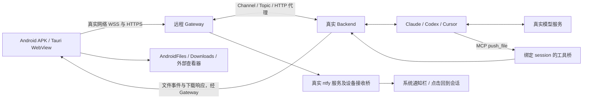

# Android 真实端到端测试计划：远程 Gateway

日期：2026-09-16  
状态：测试设计完成，尚未安装 APK、执行用例或验证远程环境。  
范围：按用户确认，**只测试本机 Android 模拟器连接远程 Gateway**。

## 1. 测试目标与通过依据

回答一个问题：用户能否在 Android 上，从连接服务器开始，完成一次真实的远程编程任务，并在中断后继续工作、收到并打开产物？



Backend 可以运行在本机或远程主机，但 APK 的业务请求必须经过指定的远程 Gateway。ADB 只用于设备控制、采证和测试数据准备。

**每个核心用例至少具备两种相互独立的证据：**

- 用户结果：实际 APK 中的状态、文件选择器、通知栏、Downloads 或外部查看器。
- 系统结果：对应 backend/session/run 的真实事件、仓库变更、实际测试结果或文件字节校验。

模型回复“已完成”、工具卡片变绿、HTTP 返回成功，都不能单独证明任务成功。浏览器移动视口测试、假 CLI、模型 API fixture、直接调用 `/api/files/push`，保留为其他测试层，不计入本计划的成功路径。

## 2. 已核实的环境与实现

### 2.1 本机只读检查结果

| 项目       | 结果                                                                     |
| ---------- | ------------------------------------------------------------------------ |
| 模拟器     | `emulator-5554`，`sdk_gphone64_arm64`，在线                              |
| Android    | Android 14 / API 34                                                      |
| 屏幕       | 1080 × 2400，density 420；APK 实际可用视口待测                           |
| ADB        | `/opt/homebrew/share/android-commandlinetools/platform-tools/adb`        |
| 应用       | 查询时未发现 `com.zclaudia` 前缀的已安装包                               |
| 自动化工具 | 当前 PATH 中未发现 Appium / Maestro；尚未检查其他安装位置                |
| 远程环境   | Gateway 地址、测试设备凭证、测试 Backend、模型账户和通知链路待执行前配置 |

这些结果是设计时快照，正式执行前重新检查。现有 ADB reverse 映射属于其他工作；本计划不使用或删除它们。

### 2.2 决定测试设计的代码事实

- Android 不启动内嵌 Node Backend；入口是 Gateway 配置和 Backend 选择。Gateway 已连接不代表 Backend 已可用，后者还要求 runtime 为 `ready`。见 [MobileSetup](../../apps/desktop/src/components/setup/MobileSetup.tsx)、[mobileConnectionState](../../apps/desktop/src/services/mobileConnectionState.ts)。
- Gateway 输入框仍称 `Secret`，但应填签发的**设备凭证**，不能填管理员令牌或 Backend 凭证。签发方式见 [Gateway README](../../../zclaudia-gateway/README.md#认证)。
- APK 远程连接采用受信任证书的 HTTPS/WSS。现有 [网络配置](../../apps/desktop/src-tauri/android-overrides/app/src/main/res/xml/network_security_config.xml) 仅对 loopback 放行明文；不通过放宽策略来让远程测试通过。Android 的证书与明文规则见 [官方网络安全配置文档](https://developer.android.com/privacy-and-security/security-config)。
- `push_file` 经 session 绑定的 MCP 工具桥注入；默认额外系统提示词已移除。需要新建会话，避免旧历史影响。见 [native-agent-context](../native-agent-context.md)。
- 当前 [文件服务](../../server/src/infra/services/file-transfer-service.ts) 对图片自动下载，对非图片仅在 **小于 500 × 1024 字节**时自动下载；Android 保存涉及 MediaStore 和 FileProvider。打开方法立即返回的成功值不等于外部查看器已打开。
- 系统通知涉及远程 ntfy、设备接收桥、Android 权限和会话跳转，不能用 ADB 人工广播替代真实送达。
- 既有 [移动 UI 问题记录](../mobile-ui-findings.md) 和 [Profile 编辑器记录](../mobile-profile-editor-findings.md) 来自浏览器移动视口，适合选取回归点，不能证明 APK 已通过。

## 3. 执行方式

### 3.1 先跑通人工路径，再固化自动化

首轮用真实触控操作完成 P0，并录屏采证。自动化采用 **Appium + UiAutomator2**，覆盖 APK、系统弹窗、文件选择器、通知栏和外部查看器；为长按、中文输入法和视觉布局保留人工探索。

UiAutomator2 支持 Android 原生与混合应用。安装时固定 Appium/driver 兼容版本，先运行 `appium driver doctor uiautomator2`。参见 [UiAutomator2 官方文档](https://github.com/appium/appium-uiautomator2-driver)。以下为待实现的 capability 模板，不是现有运行脚本：

```json
{
  "platformName": "Android",
  "appium:automationName": "UiAutomator2",
  "appium:udid": "emulator-5554",
  "appium:appPackage": "com.zclaudia.mobile.dev",
  "appium:noReset": true,
  "appium:fullReset": false,
  "appium:autoGrantPermissions": false
}
```

执行时补入从实际 APK 解析出的启动 Activity；正式包相应替换 package。保留权限弹窗与应用数据，首装场景使用独立干净快照，持久化场景连续执行。

定位先用可访问名称、文本及控件结构。WebView 调试可用时，可以切入真实 APK 的 WebView context 操作 DOM；需要先验证调试端点及匹配的 Chromedriver。`--dev` 是应用变体，不能据此假设 WebView 可调试。无法访问时使用原生交互或人工执行，并单独标记自动化覆盖缺口。禁止修改 store、注入消息或调用业务函数来替代受测交互。

### 3.2 执行前准备清单

| 准备项       | 完成标准                                                                                   |
| ------------ | ------------------------------------------------------------------------------------------ |
| APK          | 明确来源、commit、版本、签名、SHA-256；主链路优先测试拟交付 APK                            |
| 远程 Gateway | 真实域名，HTTPS/WSS 可达，证书有效；记录版本和协议；不使用本机转发替代远程路由             |
| 身份         | 独立测试 namespace 与 `zgd_*` 设备凭证；Backend 使用相应签发凭证；密钥不进入报告           |
| Backend A/B  | 同测试 namespace 中两台可区分的 Backend，独立数据目录与项目路径；B 用于切换/隔离测试       |
| 真实 Agent   | Claude、Codex、Cursor 分别可登录和运行；记录 CLI/SDK/ACP 版本、实际执行模式和模型          |
| Agent 配置   | 新建 profile / 会话，额外 `systemPrompt` 留空；使用原生默认上下文与真实 MCP 桥             |
| 权限场景     | 准备能稳定触发原生审批的测试操作；不得用自动允许模式覆盖审批用例                           |
| 通知         | 远程 Gateway 通知规则、ntfy 服务、测试 topic、设备接收桥均可用；Android 权限可人工选择     |
| 设备应用     | 安装中文输入法、至少一个 PDF 查看器；确认系统文件选择器和 Downloads 可用                   |
| 测试数据     | 专用 Git 仓库、附件、输出目录；每轮唯一 `runId`，不使用当前产品工作仓库执行 Agent 改码任务 |
| 可观测性     | 能读取指定测试 session/run 的事件和脱敏日志；文件能从设备导出后校验                        |

Backend A 可运行在本机：使用独立 `ZCLAUDIA_DATA_DIR`、未占用的 `PORT`、指向**远程**的 `GATEWAY_URL`，以及 Backend 凭证 `GATEWAY_SECRET`。不复用日常工作服务的数据目录。按现有服务启动流程加载插件；预检不能只看进程存在，还要确认移动端可发现 Backend、进入项目并读取内容。

### 3.3 APK 安装与启动示例

优先使用已有目标 APK。下列命令只作为执行手册，本轮没有运行：

```bash
export ANDROID_E2E_SERIAL=emulator-5554
export ANDROID_E2E_PACKAGE=com.zclaudia.mobile.dev
export ANDROID_E2E_APK=/absolute/path/to/test.apk

adb devices -l
adb -s "$ANDROID_E2E_SERIAL" shell getprop ro.build.version.sdk
shasum -a 256 "$ANDROID_E2E_APK"
adb -s "$ANDROID_E2E_SERIAL" install -r "$ANDROID_E2E_APK"
adb -s "$ANDROID_E2E_SERIAL" shell cmd package resolve-activity --brief "$ANDROID_E2E_PACKAGE"
# 用上一条解析出的真实 component 执行 am start -n，或从系统桌面点击应用。
```

需要本地构建时，入口是 [android.sh](../../scripts/build/android.sh)。使用 `--dev --no-bump` 前有两个已核实的前置条件：

1. 当前脚本在 `--no-bump` 下仍引用 `VERSION`，需显式提供与目标包一致的版本；不能直接复制裸命令。
2. 脚本会 source 仓库 `.env`，执行前保证最终 `RELEASE` 不为 `1`；优先在没有发布环境配置的构建目录中运行。

满足上述条件后的示例：

```bash
VERSION="$(node -p "require('./package.json').version")" RELEASE=0 \
  bash scripts/build/android.sh --dev --no-bump
```

APK 从构建输出中选择并核对包名/版本；不依靠文件名猜测 dev 变体。安装使用指定 serial 的命令，避免脚本内不带 `-s` 的安装步骤误选设备。同签名升级场景禁止先卸载规避安装失败。

## 4. 测试数据与独立断言

每轮创建 `mobile-e2e-<时间>-<短随机值>`，每个 runtime、Backend 和并发会话使用不同标记。

| 数据                | 用途与校验                                                                                        |
| ------------------- | ------------------------------------------------------------------------------------------------- |
| 小型 Git 仓库       | `add.mjs` 故意把加法写成减法，`node --test` 初始失败；Agent 修复后独立运行测试通过，diff 范围正确 |
| `input-<runId>.txt` | 含中文、emoji、多行和唯一内容；从 Android 文件选择器上传，后台字节一致                            |
| PNG                 | 已知尺寸与像素内容；上传后使用支持图像的真实模型识别，下载后应用内预览正确                        |
| PDF                 | 2 页中文样例；真实 `push_file` 后从卡片打开外部查看器，两页可读                                   |
| 三个非图片边界文件  | 511999 / 512000 / 512001 字节，验证自动下载边界；均由真实 Agent 调用 `push_file`                  |
| 5 MiB ZIP           | 必须手动下载，验证进度、断网失败与重试；设备文件 SHA-256 与后台源文件相同                         |
| 同名不同内容文件    | 验证二次保存行为、旧文件不被无提示覆盖；用内容和返回 URI 识别，不预设系统重命名格式               |
| 长中文名称          | 项目、会话、profile、文件名均包含空格/中文，验证触控和布局                                        |

上传常规样例控制在 10 MiB 以下；超限测试按实际上传路径区分 JSON/base64 与 multipart，当前文件服务和路由具有 10 MiB 限制，不能把编码膨胀误判为随机网络失败。

**真实编程任务模板：**

> 当前项目是 E2E 专用仓库，标记为 `<runId>`。请先运行测试，修复 add.mjs 的加法错误，保持测试断言不变，再运行测试。把最终测试结果写入 output/<runId>.txt，完成后使用 push_file 把这个文件发给我。

这条指令同时验证“明确点名工具时能否调用”。再新建独立会话，仅说“请生成一份含 `<runId>` 的结果文件并发送给我”，不提工具名，验证移除额外提示词后能否根据工具描述完成文件交付。两者分开记录，不能用前者代替自然表达的工具选择结果。

文件通过必须同时满足：真实工具调用及 session 绑定正确 → APK 收到卡片 → 下载/保存完成 → 在系统 Downloads 中可见 → 内容/哈希一致 → 支持的文件类型实际打开。后台绝对路径和 Android 的 `content://` URI 是两个不同位置。

## 5. P0：每个候选版本必跑

表中为用例组；执行报告须展开子场景以及 runtime 变体，逐项计数。

| ID                       | 用户操作与前置条件                                                                                | 必须断言 / 证据                                                                                                       |
| ------------------------ | ------------------------------------------------------------------------------------------------- | --------------------------------------------------------------------------------------------------------------------- |
| P0-01 首装与连接         | 干净测试快照安装 APK；处理通知权限；输入远程 Gateway URL 和设备凭证；选择 Backend A               | 无白屏；连接成功后可读项目；Gateway 在线、Backend 可用状态一致；真实远程连接日志和截图                                |
| P0-02 连接失败恢复       | 分别输入无效凭证、不可达地址；回到正确配置重连                                                    | 有可理解的错误和可操作的重试入口；不永久转圈；错误凭证下没有项目数据；正确配置可恢复                                  |
| P0-03 创建项目与会话     | 从移动 UI 选择后台测试仓库目录、创建项目/新会话，选择 Agent/模型                                  | 名称、目录和运行配置保存正确；长名称下创建按钮可点击；实际 runtime/model 与所选一致                                   |
| P0-04 输入与真实编程     | 中文输入法输入多行指令，含 emoji；发送上面的编程任务；查看流式回复、工具详情及 diff               | 候选词不提前提交、不重复发送；键盘不挡发送按钮；后台测试由失败变成功；diff 不改测试断言；消息归属正确                 |
| P0-05 审批允许与拒绝     | 在需要审批的原生模式下分别请求向专用目录写文件；一次拒绝，一次允许                                | 拒绝之前/之后都无对应副作用；允许后仅执行一次；审批内容和结果可读；后台事件与实际文件共同证明                         |
| P0-06 取消运行           | 让 Agent 执行预设有界长任务，确认已开始后点 Stop；再发一条短任务                                  | 当前 run 进入取消终态；测试任务/子进程实际停止；无迟到写入被算成成功；下一任务能正常执行。常驻 runtime 服务不要求退出 |
| P0-07 附件上传           | 从 Android 系统文件选择器选 TXT 与 PNG，另测取消选择；发送后让 Agent读取                          | 真正经过文件选择器和远程 Gateway；后台文件字节一致；支持图像的模型能读取图片；取消不产生幽灵附件                      |
| P0-08 工具与文件交付     | 新会话分别执行点名 `push_file` 和自然表达的交付任务；小文件、PDF、5 MiB ZIP 各至少一次            | 真实 MCP 调用存在；工具参数无需客户端提供 sessionId；小文件自动保存、ZIP 手动下载；PDF 外部打开；下载字节一致         |
| P0-09 前后台切换         | 流式运行期间按 Home，后台 1 分钟后返回；再后台 5 分钟后返回                                       | 后台真实任务继续或以明确原因结束；返回补齐结果，无重复消息/重复执行；项目和会话选择正确，输入区可用                   |
| P0-10 断网重连           | 真实运行中关闭模拟器所有有效出网链路，确认 Gateway socket 已断；离线期间尝试发送一次，30 秒后恢复 | 离线状态与真实链路一致；未提交的输入可找回，不能显示已成功执行；恢复补齐历史；同一发送意图最多触发一次实际运行        |
| P0-11 重开与继续         | 完成一轮后退出再打开；后台运行时另测应用进程结束并显式重开；续问前一轮结果                        | 凭证/Backend/项目/会话恢复；历史无丢失或重复；后端 run 状态可恢复；原生会话可继续。进程结束不被误当成用户取消         |
| P0-12 Backend 与会话隔离 | A/B 各建会话；A 运行时切到 B 并发送；两会话分别推送不同标记文件                                   | 无串消息、审批、文件卡片或下载；实际读取与写入发生在对应后台目录；切回 A 后状态完整                                   |
| P0-13 返回键与布局       | 依次打开键盘、弹窗、侧栏、设置和会话；使用真实系统返回；滚动较长回复                              | 返回关闭当前交互层且无误发/误退；首页菜单随时可达；状态栏/导航栏不盖按钮；用户查看旧消息时不被流式更新强行拉回        |
| P0-14 系统通知闭环       | 授予通知权限，配置真实 ntfy；应用后台时让测试任务完成或等待审批；展开系统通知栏并点击             | 验证远程发布→设备接收→实际系统通知；点击进入正确 Backend/项目/会话，冷启动和热启动分别通过；无重复跳转或错会话        |

P0-05 若某 runtime 明确不支持交互审批，必须记录能力声明和 UI 行为，作为 `N/A`，并由至少一个支持的 runtime 完成审批闭环。缺登录、缺 ntfy、缺查看器或工具没有触发，属于 `BLOCKED` 或 `FAIL`，不能标为能力不支持。

P0-10 额外在“发送后、客户端收到确认前”制造一次断网，使用请求标识和后台运行记录检查重复提交。不能依赖肉眼只看到一条消息。

## 6. P1：故障恢复与日常操作

| ID                       | 场景                                                                         | 操作与验收重点                                                                                                                   |
| ------------------------ | ---------------------------------------------------------------------------- | -------------------------------------------------------------------------------------------------------------------------------- |
| P1-01 后台离线           | 只停止测试 Backend A，Gateway 和 B 保持在线；恢复 A                          | 准确区分 Gateway 与 Backend 状态；B 可用；A 重注册后重新订阅，不显示旧 ready 状态                                                |
| P1-02 Gateway 中断       | 阻断测试设备到指定远程 Gateway 的连接；另在独占测试 Gateway 上执行重启       | 区分 Gateway 不可达与设备完全断网；重连恢复 registry/channel/topic；原 Backend 身份与凭证可继续使用。共享 Gateway 不执行全局重启 |
| P1-03 失效凭证与 TLS     | 撤销专用测试设备凭证；连接受控的无效证书地址                                 | 在线连接失效后界面可重新配置；受保护数据不可继续获取；不静默绕过 TLS 或将管理员凭证当设备凭证                                    |
| P1-04 文件边界与失败     | 推送三个大小边界文件、同名文件、中文空格文件；ZIP 下载中断后重试             | 自动下载边界准确；错误可恢复；无“已完成”的残缺文件；重复文件行为可解释；无查看器时有可理解的反馈                                 |
| P1-05 上传异常           | 上传中断网、重复点发送、选择接近/超过当前路径上限的文件                      | 保留输入；不产生重复 run；失败附件可移除/重试；上传错误信息明确，恢复后能发送正常附件                                            |
| P1-06 计划与配置         | 选择支持的原生 Plan 模式完成只读规划，再切可执行模式；更换模型并新发一轮     | Plan 阶段测试仓库无写入；实际模式与选择一致；新模型用于新一轮，旧历史完整；未支持的选项不虚假生效                                |
| P1-07 Profile 与工具设置 | 移动端编辑长名称 Agent/LLM/MCP 配置并保存、重开                              | 保存/取消可见可点；工具名不截断到无法辨认；选择框易点；切 Backend 后配置不串；不在报告中暴露密钥                                 |
| P1-08 项目与导航         | 重命名/归档测试会话，搜索唯一标记，打开项目文件与 dashboard，再返回聊天      | 列表/搜索/历史一致；归档可恢复；导航后流式任务不丢失；不能依赖 hover 才出现操作                                                  |
| P1-09 自动化入口         | 在测试项目创建并手动触发一个有界任务，检查结果后禁用                         | 真实后台只执行一次；运行状态与产物对应；移动端行操作不重叠。定时任务只用测试项目并在结束时停用                                   |
| P1-10 通知权限与异常     | 首装拒绝权限，再经系统设置允许；接收桥断开再恢复；点击已结束/已归档会话通知  | 拒绝不阻塞聊天；设置能反映实际状态；恢复后真实送达；失效目标有明确反馈，无错误跳转                                               |
| P1-11 进程与会话恢复     | 分别测试划掉最近任务、普通后台进程终止、系统设置 Force stop 后显式打开       | 三种情况独立记录；重开可恢复已保存数据/后端状态；不把 Force stop 后不自动唤醒当作普通后台推送结论                                |
| P1-12 触屏与可读性       | 竖横屏、深浅色、字体 1.3/1.5 倍、手势/三键导航；长按复制、粘贴多行、连续滚动 | 无裁切、遮挡、误触、草稿丢失；关键按钮可点击；原生键盘与网页布局共同正确                                                         |
| P1-13 模型服务异常       | 用测试账户制造鉴权失败或连接失败；实际遇到限流时保留现场，再恢复正常配置     | UI 显示可归因错误并允许后续任务；不将失败 run 标成成功，不因重试产生重复副作用                                                   |

故障操作只作用于测试资源。每次先证明故障确实发生，再观察 UI。仅切换 Wi-Fi 图标而实际仍能联网，不构成断网测试；通过 Appium 连接失效也不能推断 APK 业务连接失效。

## 7. Runtime 与设备矩阵

### 7.1 三种 Agent 都必须经过真实链路

| 用例组合                                 | Claude         | Codex          | Cursor         |
| ---------------------------------------- | -------------- | -------------- | -------------- |
| 新会话 → 流式回复 → 读/改文件 → 运行测试 | 必跑           | 必跑           | 必跑           |
| `push_file` 点名调用 + 自然表达交付      | 必跑           | 必跑           | 必跑           |
| 取消 → 再发任务                          | 必跑           | 必跑           | 必跑           |
| 重开 APK → 原会话继续                    | 必跑           | 必跑           | 必跑           |
| 两会话不同标记文件的隔离                 | 必跑           | 必跑           | 必跑           |
| 审批 / Plan / 图片输入                   | 按声明能力展开 | 按声明能力展开 | 按声明能力展开 |

共享 UI、系统下载、通知、字体和布局先在一个主测 Agent 上完整执行；其他 Agent 执行上表，减少重复模型消耗。若产品提供多种 CLI/SDK/ACP 执行模式，首轮测试实际默认模式，其他交付模式列入补充回归，不把一个模式的结果外推到全部模式。

自然表达交付每个 Agent 使用 3 个独立新会话，分别请求文本结果、PDF 交付和已有产物发送。记录真实工具调用比例；任一失败保留原始结果，不通过反复补充“请用 push_file”把该次改记为通过。三个样本用于发现回归，不宣称统计可靠性。

### 7.2 设备覆盖分层

- 本轮基线：现有 Android 14 / API 34 / ARM64 AVD，完整 P0 与 P1。
- 补充 AVD：从实际 APK 的 minSdk/targetSdk 和产品支持范围选一台最低支持版本、一台较新受支持版本；重点重跑连接、文件、权限、通知和后台恢复。
- P2：200+ 消息历史、较大 diff、连续运行 60 分钟、同签名 APK 覆盖升级、并发多会话。采样 UI 卡顿、内存、ANR 和消息/文件一致性。
- 模拟器结果不覆盖厂商省电策略、真实蜂窝切换或真机推送长期存活；这些项目留作后续真机验证，报告明确区分。

## 8. 执行顺序、等待与通过门槛

### 推荐顺序

1. **环境预检**：验证 APK、远程凭证、Backend、三种 Agent、文件查看器与真实通知依赖；记录基线。
2. **主用户旅程**：首装连接 → 项目/会话 → 中文输入 → 改码与审批 → 文件交付 → 后台通知 → 点击返回 → 续问。
3. **三种 runtime 回归**：执行矩阵，使用独立新会话。
4. **中断与恢复**：取消、断网、Backend 离线、进程结束、下载重试、并发隔离。
5. **探索与收尾**：P1 设置/布局，按需 P2；收集报告后恢复设备状态、停用测试任务。

已有可用环境时，首轮人工执行估计 2–4 小时，模型等待和问题复现另计。自动化脚手架建设单独排期；本计划不假设仓库已有可直接运行的 Android E2E 命令。

### 等待策略

- 等待“Backend ready”“run 终态”“文件下载完成”等可观察状态，避免用固定 sleep 代替断言。
- 首连 UI 当前有约 15 秒等待逻辑：验证成功或明确错误，不允许无限 loading；记录各阶段耗时。
- 断网恢复从“网络已实际恢复”开始计时，建议先用 60 秒作为测试观察上限，首轮核对现有退避/心跳后固定回归阈值。这是测试预算，不是已承诺的产品 SLA。
- 普通真实模型任务初始观察上限建议 180 秒，长任务另设有界时长；超时保留证据并区分模型、应用和环境问题。超时清理仍需取消测试 run，不能只结束自动化进程。
- 通知记录任务事件、Gateway 发布、设备收到和实际显示时间，首轮确定稳定基线；不把 UI 点击“发送测试通知成功”当作送达。

### 验收

- 所有适用 P0 子场景、三种 runtime 必跑矩阵通过；三种 Agent 的自然表达文件交付均完成规定样本。
- 数据丢失、重复执行、审批拒绝后仍写入、跨 Backend/session 串数据、下载内容错误，均阻止通过。
- 核心链路无崩溃/ANR、永久 loading 或用户无法恢复的状态。
- P1 问题逐项列出影响与复现路径；未解决的高影响问题不能被总通过率掩盖。
- 结果状态仅用 `PASS / FAIL / BLOCKED / N/A`，附首次执行与复测结果；禁止无限重试直到绿。未执行或依赖缺失不能记为 PASS。
- 只有 API/后台证据而未观察 Android 实际结果的用例，不算完整 E2E 通过。

## 9. 证据包与报告模板

建议落盘到不纳入版本控制的 `artifacts/mobile-e2e/<runId>/`；实现时先确认 ignore 规则。文件内容仅包含测试数据，日志与截图去除凭证和非测试会话信息。

```text
<runId>/
  manifest.json           # commit/APK hash/package/系统/WebView/服务/runtime/model/连接方式
  results.md              # 用例变体、结论、耗时、缺陷、首次结果和复测结果
  P0-08-codex-natural-1/
    steps.md              # 前置条件、操作、预期与实际
    screen.png
    recording.mp4
    device-log.txt
    backend-events.jsonl  # 仅该 backend/session/run 的事件，脱敏
    hashes.txt            # 后台源文件与设备导出文件校验
    downloaded-file.pdf
```

ADB 截图示例：

```bash
adb -s "$ANDROID_E2E_SERIAL" exec-out screencap -p > "$ANDROID_E2E_EVIDENCE/screen.png"
```

执行前将 `ANDROID_E2E_EVIDENCE` 设置为已创建的当前用例目录。日志按测试时间范围和应用进程/native bridge 标签采集，保留系统崩溃信息；不清空全设备日志。普通截图证明位置与状态，录屏覆盖完整操作及恢复过程。

Downloads 校验先通过系统 UI 确认目标文件，再按唯一文件名/返回 URI 定位实际内容；可读时从 `/sdcard/Download/` 导出对应文件，或经系统文件 UI 导出。计算 SHA-256 与 Backend 源文件比对。若权限导致无法导出，标明字节校验被阻塞，不能改用后台文件哈希冒充设备文件哈希。

单条结果模板：

```text
用例/变体：P0-08 / Cursor / 自然表达 / PDF
APK/设备/Runtime：
BackendId / ProjectId / SessionId / RunId：
前置条件与操作：
预期：
实际：
状态：PASS | FAIL | BLOCKED | N/A
首次耗时/失败阶段：
证据路径：
归因：应用 | Agent/模型 | Gateway/网络 | Android | 测试设施 | 待定位
复测结果（保留首次结果）：
```

结束后保留失败证据，停止本轮测试 run/自动化，恢复网络、字体和导航设置，清理本轮创建的数据与文件。保持日常 Backend、已有模拟器数据和其他 ADB 映射不受影响。

## 10. 自动化实施拆分（后续工作）

1. 建立 `e2e/mobile/` 独立入口、配置模板、Appium 会话管理及证据收集；不与现有浏览器 E2E 混报。
2. 固化远程环境预检、测试 namespace/仓库 fixture、APK 版本记录；敏感配置从执行环境读取。
3. 自动化 P0 主旅程，封装真实系统文件选择器、通知栏、返回键与外部查看器交互。
4. 加入只读 backend/run 观测和设备文件哈希校验，然后覆盖三种 runtime。
5. 加入受控故障、持久化与并发隔离测试；最后扩展 P1/P2 和设备矩阵。

第一阶段交付标准是“一条可复跑、带证据的 Android → 远程 Gateway → 真实 Agent → push_file → Android 打开文件链路”，之后再扩展用例数量。
