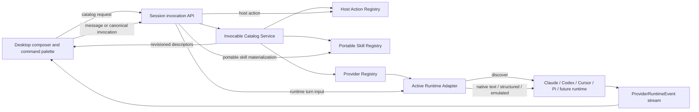

# Unified Runtime Invocation Protocol Design

> **Status:** Proposal (revised after code-verified design review)  
> **Date:** 2026-09-12 (revised 2026-09-13)  
> **Scope:** ZClaudia host, desktop, Plugin SDK, Pi runtime, and external agent runtimes  
> **Primary objective:** Make commands, skills, and future runtime-native invocables discoverable and executable without teaching the host the syntax or storage format of every runtime.

## 1. Executive summary

ZClaudia currently models all slash commands as a flat `SlashCommand[]` and ultimately starts every provider turn with `run(input: string)`. Discovery is centralized around Claude's legacy `.claude/commands` layout, while execution either forwards raw text or expands a Markdown file into a prompt. This cannot faithfully represent runtimes whose invocation protocol is structured, session-dependent, engine-mode-dependent, or not slash-based.

This design introduces the **Unified Runtime Invocation Protocol (URIP)**. URIP standardizes the host/runtime boundary around an **invocable** rather than around slash syntax:

- `/name` remains a convenient desktop interaction, not the protocol identity.
- Every catalog entry receives a stable, opaque canonical ID.
- The active runtime plugin owns native discovery, argument handling, and execution translation.
- ZClaudia host actions and portable skills remain separate from runtime-native invocables.
- Native, bridged, emulated, and unavailable behavior is reported truthfully.
- Catalogs are resolved per session, working directory, runtime version, and engine mode.
- Unknown unqualified slash-like input is preserved as ordinary provider input; only documented reserved namespaces are resolved by the host.

After migration, adding another runtime requires a plugin to declare invocation capabilities and implement the URIP adapter contract. The desktop, HTTP/WebSocket surface, catalog service, and conversation lifecycle do not need runtime-specific branches.

## 2. Context and problem statement

### 2.1 Current flow

```text
Desktop requests commands for provider type
        │
        ▼
provider-commands.ts  (/:id/commands and /type/:type/commands)
        │
        ├─ LOCAL_COMMANDS
        ├─ CLI_COMMANDS            (currently an empty array)
        ├─ ZClaudia plugin commands
        └─ scanCustomCommands()
              └─ ~/.claude/commands, project .claude/commands,
                 and Claude plugin command directories
        │
        ▼
Flat SlashCommand[]; deduplicateCommands() keeps the FIRST
name match and silently drops later collisions
        │
        ▼
Desktop useCommandHandler
        ├─ ~12 hard-coded name branches (/help, /context, /worktree,
        │   /goal, /pause, /resume, …) → client/server local behavior
        ├─ provider source OR unknown  → raw text startRun()
        └─ everything else → POST /api/commands/execute
              ├─ 'builtin' result → client handleBuiltInCommand
              │                     (UI actions such as show_panel)
              └─ 'custom' result  → SERVER reads the Markdown file,
                                    substitutes args, returns prompt
                                    text; client startRun()s that text
```

Both routes accept a runtime identity but delegate every runtime to the same discovery function; neither branches on Claude, Codex, or Cursor. The current scanner therefore exposes a Claude-shaped catalog to Claude, Codex, Cursor, and any future runtime.

Two further facts about the current wire and cache shape matter for migration:

- `run_start.input` is typed as a plain string, but the desktop client JSON-encodes `{ text, attachments }` into that string (`server/src/application/conversation/runtime/message-input.ts`). Attachments already ride inside the "string" channel, so legacy normalization cannot treat the string as raw text.
- The desktop command cache is keyed by provider/profile only (`useProviderCapabilities`); `projectRoot` is a fetch input but not part of the cache key, so two sessions in different projects sharing one profile overwrite each other's command list.

### 2.2 Structural failures

The problem is not solved by adding more directories to the scanner. The current abstraction loses information required for correct execution:

1. **Syntax is mistaken for identity.** `/review` is used as both the UI label and the execution identifier.
2. **Discovery is not runtime-owned.** The host knows provider directories and precedence rules.
3. **Execution is string-only.** A runtime cannot receive structured skill references or native command payloads.
4. **Catalogs are not session-aware.** Runtime, engine mode, working directory, runtime version, settings source, and live session state can all change availability.
5. **Arguments are parsed generically.** Splitting on whitespace cannot preserve provider-specific quoting, positional parameters, named parameters, or raw argument strings.
6. **Name collisions are silently discarded.** Host commands can shadow provider commands, and the user cannot select a specific origin.
7. **Emulation is presented as native compatibility.** Expanding Markdown into a normal prompt does not preserve native frontmatter, tool restrictions, dynamic context, or runtime lifecycle behavior.
8. **Portable skill state is Pi-specific, and the current path is a live correctness bug.** `skillState` is built for every run (`run-bootstrap.ts`), `prepareDirectSkillInvocation` intercepts `/name` input for **all** providers (`run-provider-launch.ts`), the inline branch rewrites the input to `"Use the X skill."`, and the external-agent shim does not forward `skillState`. A Claude/Codex/Cursor run therefore receives a placeholder sentence with no skill body at all.
9. **Command caches ignore the project.** The desktop cache key is provider/profile only; `projectRoot` changes the fetched result but not the key, so cross-project sessions clobber each other.
10. **Autocomplete data can come from the wrong backend.** The composer's skill list is fetched via the local/primary backend (`fetchLocalApi`) even when the session executes on a remote/gateway backend, so suggestions and the executing environment can disagree.

### 2.3 Why a universal slash-command parser is insufficient

Runtime invocation models differ fundamentally:

- Some runtimes accept a native text trigger.
- Some expose a structured catalog and require structured input blocks.
- Some publish a catalog only after session initialization.
- Some discover files using runtime-specific directories and precedence.
- Some have no discoverable catalog but still accept opaque commands.
- Some support commands but not portable skills, or vice versa.
- The same runtime can behave differently in CLI and isolated SDK engine modes.

URIP therefore unifies **discovery, identity, capability negotiation, routing, and outcome reporting**. It intentionally does not attempt to give every runtime the same native feature set.

## 3. Goals

1. Preserve the exact native invocation path whenever the runtime exposes one.
2. Let the desktop provide a unified `/` autocomplete experience without making `/` the internal protocol.
3. Make runtime-specific discovery and translation plugin-owned.
4. Support text commands, structured commands, runtime-native skills, ZClaudia portable skills, and host actions.
5. Prevent host commands from silently shadowing runtime commands.
6. Express fidelity and degradation explicitly.
7. Make catalogs correct for the active session, cwd, runtime version, and engine mode.
8. Keep normal text chat and unknown command pass-through working when catalog discovery is unavailable.
9. Preserve compatibility with existing Plugin SDK adapters during a staged migration.
10. Provide a reusable conformance suite so a new runtime can demonstrate compatibility without live paid-provider tests.

## 4. Non-goals

- Defining a universal provider command-file format.
- Translating every provider frontmatter dialect into one schema.
- Guaranteeing feature parity when a runtime exposes no native or emulatable mechanism.
- Letting the browser or desktop execute provider command files directly.
- Persisting provider-private structured payloads in ZClaudia messages or traces.
- Treating runtime control commands as ordinary model prompts when the runtime provides a control API.
- Replacing MCP, tool calling, workflow actions, or the existing provider event protocol.

## 5. Terminology

| Term                         | Meaning                                                                                                                 |
| ---------------------------- | ----------------------------------------------------------------------------------------------------------------------- |
| **Invocable**                | Anything a user can explicitly invoke: host action, runtime command, runtime skill, prompt template, or portable skill. |
| **Display trigger**          | Human-facing syntax such as `/review`; never a globally unique identity.                                                |
| **Canonical ID**             | Opaque identifier used between desktop and server to select one exact catalog item.                                     |
| **Native locator**           | Runtime-private identifier retained server-side and returned to the owning adapter during execution.                    |
| **Runtime-native invocable** | Item discovered and executed according to the active runtime's semantics.                                               |
| **Portable skill**           | ZClaudia-managed skill materialized by the host and handed to an adapter through a defined payload.                     |
| **Host action**              | ZClaudia UI/server action such as help, clear, config, or worktree management.                                          |
| **Catalog snapshot**         | Revisioned, context-specific set of invocables available to a session.                                                  |
| **Exact fidelity**           | Execution uses the runtime's native mechanism without semantic reinterpretation by the host.                            |
| **Best-effort fidelity**     | An adapter deliberately emulates behavior and reports that fact to the user.                                            |

## 6. Design principles

### 6.1 Native first

If a runtime supports native discovery or invocation, ZClaudia must use it. Filesystem scanning and prompt expansion are fallbacks owned by the runtime adapter, not generic host behavior.

### 6.2 Session context is authoritative

The same provider type can expose different invocables for different projects, worktrees, sessions, runtime versions, configuration roots, and engine modes. Discovery must receive the resolved run context rather than only a provider type.

### 6.3 Canonical IDs cross the UI boundary

The client selects an opaque catalog item. It does not send an arbitrary file path, native locator, or provider-private payload.

### 6.4 The adapter owns provider semantics

The host must not know that Claude uses one directory, Codex uses a structured skill block, or Cursor uses a particular configuration hierarchy. Those facts belong to their plugins.

### 6.5 No silent semantic downgrade

An emulated command or skill is labeled `best-effort`. Unsupported execution fails with a typed error. It must never appear as exact native support.

### 6.6 Plain input remains lossless

If the user submits an unknown `/something`, the host forwards the original text to the active runtime. This preserves native commands that are intentionally absent from or newer than the catalog.

### 6.7 One turn lifecycle

Text messages and invocations enter the same run lifecycle for cancellation, persistence, streaming, permissions, usage, recovery, and terminal-event handling. URIP changes the turn input type, not the surrounding conversation state machine.

## 7. Target architecture



### 7.1 Ownership boundaries

| Layer                   | Owns                                                                            | Must not own                                                    |
| ----------------------- | ------------------------------------------------------------------------------- | --------------------------------------------------------------- |
| Desktop                 | Display, filtering, autocomplete, canonical selection, user-visible fidelity    | Provider directories, provider argument parsing, file execution |
| Session Invocation API  | Authentication, session resolution, revision validation, routing                | Provider syntax translation                                     |
| Catalog Service         | Merge host/runtime/portable catalogs, stable IDs, cache, collision presentation | Provider filesystem rules                                       |
| Host Action Registry    | ZClaudia-only actions and their schemas                                         | Runtime commands                                                |
| Portable Skill Registry | ZClaudia skill discovery, eligibility, materialization                          | Pretending portable execution is runtime-native                 |
| Runtime Adapter         | Native catalog, native precedence, native locators, invocation translation      | Host UI behavior                                                |
| Runtime                 | Final command/skill semantics                                                   | ZClaudia catalog merging                                        |

## 8. Protocol data model

The canonical types should live in the public Plugin SDK and be re-exported from `@zclaudia/shared`. Names below are normative; exact file placement is listed in the migration plan.

### 8.1 Invocable descriptor

```ts
export type StandardInvocableKind =
  | 'host.action'
  | 'runtime.command'
  | 'runtime.skill'
  | 'prompt.template'
  | 'portable.skill';

/** Forward-compatible plugin-defined kinds use an x- namespace. */
export type InvocableKind = StandardInvocableKind | `x-${string}`;

export type InvocableScope = 'session' | 'project' | 'user' | 'system';
export type InvocableOwner = 'host' | 'runtime' | 'plugin' | 'user' | 'project';
export type InvocationExecutionMode =
  | 'host'
  | 'native-text'
  | 'native-structured'
  | 'bridged'
  | 'emulated';

export type InvocationArgumentKind = 'raw' | 'structured';

export interface InvocationArgumentContract {
  /** Non-empty, unique values. The server rejects every other representation. */
  accepted: InvocationArgumentKind[];
  /** Must be one of `accepted`; used by generated composer UI only. */
  preferred: InvocationArgumentKind;
  /** Required when `structured` is accepted; JSON Schema draft 2020-12. */
  schema?: Record<string, unknown>;
  /** Server-owned policy with one key for each accepted representation. */
  transcript: {
    raw?: 'verbatim' | 'omit-arguments';
    structured?: 'schema-redacted' | 'omit-arguments';
  };
}

export interface InvocableDescriptor {
  /** Opaque to clients. Never derive execution behavior from this value. */
  id: string;
  kind: InvocableKind;
  /** Execution target for this session; `host` only for host actions. */
  runtimeType: string | 'host';
  name: string;
  label: string;
  description?: string;

  /** Composer-facing syntax. It is not a globally unique key. */
  displayTrigger: string;
  aliases?: string[];
  argumentHint?: string;

  origin: {
    owner: InvocableOwner;
    scope: InvocableScope;
    displayName?: string;
  };

  execution: {
    mode: InvocationExecutionMode;
    fidelity: 'exact' | 'best-effort';
    arguments: InvocationArgumentContract;
  };

  availability: { available: true } | { available: false; reason: string; code?: string };
}
```

`InvocableDescriptor` is safe to send to the desktop. It does not include command content, absolute file paths, environment variables, provider tokens, or provider-private structured payloads.

Argument-contract invariants are normative: `accepted` is non-empty and contains no duplicates, `preferred` is a member of `accepted`, `schema` is present exactly when structured arguments are accepted, and `transcript` contains exactly the accepted representation keys. Unsupported schema keywords may be ignored by the form generator, but the server still validates submitted structured data against the complete schema. Schema fields marked `writeOnly: true` are always redacted from transcripts and telemetry.

### 8.2 Server-private catalog record

```ts
interface ResolvedInvocableRecord {
  descriptor: InvocableDescriptor;
  source: 'host' | 'runtime' | 'portable';

  /** Opaque data created by and returned only to the owning adapter. */
  nativeLocator?: unknown;

  /** Used to revalidate file-backed entries immediately before execution. */
  contentDigest?: string;
  trustedRoot?: string;
}
```

The server stores this record in the catalog cache. For identity and context, the client returns only `descriptor.id`, catalog revision, and context fingerprint; it never returns the private record or locator.

Runtime adapters use a corresponding private discovery result:

```ts
export interface RuntimeInvocableRecord {
  /** Descriptor fields before the host assigns its canonical public ID. */
  descriptor: Omit<InvocableDescriptor, 'id'>;
  /** Stable within this adapter/runtime and opaque to the host. */
  providerLocalKey: string;
  /** Returned only to this adapter when the item is invoked. */
  nativeLocator: unknown;
  contentDigest?: string;
  trustedRoot?: string;
}

export interface RuntimeInvocableCatalog {
  items: RuntimeInvocableRecord[];
  diagnostics: InvocableDiagnostic[];
  phase: 'bootstrap' | 'initializing' | 'live' | 'degraded';
  completeness: 'partial' | 'complete';
  runtimeRevision?: string;
  /** Changes whenever runtime initialization creates a new live catalog epoch. */
  runtimeSessionEpoch?: string;
}

export type RuntimeCatalogDelta =
  | { type: 'invalidate'; reason: string }
  | { type: 'replace'; catalog: RuntimeInvocableCatalog };
```

`nativeLocator` must be immutable, non-secret adapter data. It may identify a runtime item or structured reference, but it must not contain credentials or mutable execution state. It must also be structured-clone-serializable (no functions, class instances, or handles): plugins load in-process today, but the contract must not preclude a future process-isolated plugin host.

Catalog lifecycle fields are validated against negotiated capabilities. `live` is `complete`; `degraded` is `partial`; `bootstrap-then-live` and `live-only` remain `partial` until a live replacement arrives. A session-scoped `initializing`, `live`, or `degraded` catalog must include `runtimeSessionEpoch`. Invalid combinations are rejected as adapter contract errors rather than guessed by the host.

### 8.3 Catalog snapshot

```ts
export interface InvocableCatalogSnapshot {
  protocolVersion: 1;
  revision: string;
  generatedAt: number;
  contextFingerprint: string;
  phase: 'bootstrap' | 'initializing' | 'live' | 'degraded';
  completeness: 'partial' | 'complete';
  invocables: InvocableDescriptor[];
  diagnostics: InvocableDiagnostic[];
}

export interface InvocableDiagnostic {
  severity: 'info' | 'warning' | 'error';
  code: string;
  message: string;
  runtimeType?: string;
  invocableId?: string;
}
```

Catalog generation failure must be represented in `diagnostics`; it must not make plain chat unavailable.

### 8.4 Invocation request

```ts
export type InvocationArguments =
  | { type: 'raw'; value: string }
  | { type: 'structured'; value: Record<string, unknown> };

export interface InvocationRequest {
  invocableId: string;
  catalogRevision: string;
  contextFingerprint: string;
  /** Exactly one representation; validated against the descriptor contract. */
  arguments: InvocationArguments;
}
```

The server never reconstructs raw arguments by joining a token array. A request cannot carry both raw and structured arguments, so there is no precedence rule for an adapter to guess. The server validates the selected variant against `descriptor.execution.arguments` and validates structured values against its schema before creating a provider turn.

The client does not supply authoritative transcript text. After resolving the canonical descriptor, the server derives transcript content from `displayTrigger`, the validated argument variant, and that variant's transcript policy. Raw arguments are appended byte-for-byte under `verbatim`; structured arguments are rendered with stable field ordering and schema-directed redaction; `omit-arguments` records only the trigger. A desktop may retain its local draft for optimistic UI and stale-retry UX, but that draft is neither trusted nor persisted as the invocation audit record.

### 8.5 Unified turn input

```ts
export type RuntimeTurnInput =
  | {
      type: 'message';
      text: string;
      attachments?: RuntimeAttachment[];
    }
  | {
      type: 'runtime-invocation';
      descriptor: InvocableDescriptor;
      nativeLocator: unknown;
      arguments: InvocationArguments;
      attachments?: RuntimeAttachment[];
    }
  | {
      type: 'portable-skill';
      skill: MaterializedPortableSkill;
      assessment: PortableSkillAssessment;
      arguments: InvocationArguments;
      attachments?: RuntimeAttachment[];
    };

export interface PortableSkillResourceEntry {
  relativePath: string;
  size: number;
  contentDigest: string;
  mediaType?: string;
}

export type PortableSkillResourceAccess =
  | {
      type: 'host-read-handle';
      handleId: string;
      entries: PortableSkillResourceEntry[];
    }
  | {
      type: 'read-only-mount';
      rootPath: string;
      entries: PortableSkillResourceEntry[];
    };

export interface MaterializedPortableSkill {
  id: string;
  name: string;
  description: string;
  body: string;
  metadata: Record<string, unknown>;
  resources?: PortableSkillResourceAccess;
  contentDigest: string;
}
```

`RuntimeAttachment` reuses the existing host attachment contract; URIP does not define a second attachment format.

`RuntimeTurnInput` exists only inside the trusted host/plugin process boundary. Provider-private locators, resource handles/mount paths, and portable skill bodies are never returned to the desktop. A `host-read-handle` is an opaque, revocable capability serviced by a host reader that accepts only manifest-listed relative paths. A `read-only-mount` is permitted only when the host or runtime sandbox enforces immutability; a normal writable directory with `chmod` as the sole control does not qualify.

## 9. Runtime adapter contract

### 9.1 Long-term interface

```ts
export interface RuntimeDiscoveryContext {
  readonly runtimeType: string;
  readonly engineMode: string;
  readonly runtimeVersion?: string;
  readonly adapterVersion: string;
  readonly canonicalCwd: string;
  readonly canonicalRepositoryRoot?: string;
  readonly configurationRoots: readonly string[];
  readonly settingsSourcePolicy: readonly string[];
  readonly configurationRootFingerprint: string;
  readonly session?: {
    readonly id: string;
    readonly phase: 'bootstrap' | 'initializing' | 'live' | 'degraded';
    readonly runtimeSessionEpoch?: string;
    /** Opaque, non-secret value that changes when catalog-relevant state changes. */
    readonly catalogStateToken?: string;
  };
  readonly cliPath?: string;
}

export interface RuntimeInvocationCapabilities {
  catalog: 'none' | 'static' | 'filesystem' | 'runtime' | 'hybrid';
  executionModes: InvocationExecutionMode[];
  refresh: 'manual' | 'watch' | 'runtime-events';
  discoveryScope: 'shared-context' | 'session';
  catalogLifecycle: 'bootstrap-only' | 'bootstrap-then-live' | 'live-only';
  unknownTextPassthrough: boolean;
  /** Runtime-wide maximum only; every portable skill is assessed separately. */
  portableSkills: 'native' | 'context' | 'emulated' | 'unsupported';
}

export interface PortableSkillCandidate {
  id: string;
  name: string;
  description: string;
  metadata: Record<string, unknown>;
  requirements?: Record<string, unknown>;
  resourceManifest: PortableSkillResourceEntry[];
  contentDigest: string;
}

export type PortableSkillAssessment =
  | {
      supported: true;
      mode: 'native' | 'context' | 'emulated';
      executionMode: Exclude<InvocationExecutionMode, 'host'>;
      fidelity: 'exact' | 'best-effort';
      resourceAccess: 'none' | 'host-read-handle' | 'read-only-mount';
    }
  | {
      supported: false;
      mode: 'unsupported';
      code: string;
      reason: string;
    };

export interface PortableSkillResourceReader {
  read(handleId: string, relativePath: string, signal: AbortSignal): Promise<Uint8Array>;
}

export interface RuntimeTurnContext extends ExternalAgentRunContext {
  services: {
    /** Validates handle ownership, manifest membership, traversal, size, and expiry. */
    portableSkillResources: PortableSkillResourceReader;
  };
}

export interface RuntimeInvocationProvider {
  capabilities(context: RuntimeDiscoveryContext): Promise<RuntimeInvocationCapabilities>;

  discover(context: RuntimeDiscoveryContext, signal: AbortSignal): Promise<RuntimeInvocableCatalog>;

  watch?(context: RuntimeDiscoveryContext, signal: AbortSignal): AsyncIterable<RuntimeCatalogDelta>;

  assessPortableSkill?(
    skill: PortableSkillCandidate,
    context: RuntimeDiscoveryContext,
    signal: AbortSignal
  ): Promise<PortableSkillAssessment>;
}

export interface ExternalAgentAdapterV2 {
  readonly type: string;
  readonly invocations?: RuntimeInvocationProvider;

  startTurn(
    input: RuntimeTurnInput,
    context: RuntimeTurnContext,
    onPermission: PermissionCallback
  ): AsyncGenerator<ProviderRuntimeEvent, void, void>;

  abort?(sessionId: string, cwd: string): Promise<void>;
  getRunState?(context: ExternalAgentRunContext): ExternalAgentRunState;
  setSessionMode?(sessionId: string, mode: string): void;
}
```

Discovery receives a deliberately minimal context. It excludes `modelConnection`, API keys, the general environment map, server port, abort controller, callbacks, mutable run state, and every other field from `ExternalAgentRunContext` that discovery does not require. If a future runtime needs authenticated discovery, the host adds a narrowly scoped broker capability instead of passing credentials through this DTO. `RuntimeDiscoveryContext` itself is immutable for the duration of one discovery call.

`assessPortableSkill` is required whenever `portableSkills` is not `unsupported`; registration fails if it is missing. A runtime declaring `unsupported` may omit the method. The runtime-wide field is only an advertised maximum and must never make all skills appear supported automatically. The Catalog Service publishes each portable skill using its individual assessment and omits or disables it when requirements or resource access cannot be honored.

Supported assessments also obey mode invariants: `native` uses `native-text` or `native-structured`; `context` uses `bridged`; and `emulated` uses `emulated` with best-effort fidelity. These checks make descriptor execution badges deterministic instead of asking the host to infer them from adapter prose.

Only `startTurn` receives the complete run context. Its narrow `portableSkillResources` service is the only way to dereference a `host-read-handle`; the service can become an RPC proxy without changing the turn DTO when plugins move out of process. The adapter receives the complete typed turn input and returns the existing `ProviderRuntimeEvent` stream. All current cancellation, approval, persistence, usage, and finalization behavior remains shared.

### 9.2 Compatibility with existing adapters

The Plugin SDK initially adds `startTurn` and `invocations` as optional fields while retaining `run(input: string, ...)`:

```ts
interface ExternalAgentAdapter {
  run?(
    input: string,
    context: ExternalAgentRunContext,
    onPermission: PermissionCallback
  ): AsyncGenerator<ProviderRuntimeEvent, void, void>;
  startTurn?(
    input: RuntimeTurnInput,
    context: RuntimeTurnContext,
    onPermission: PermissionCallback
  ): AsyncGenerator<ProviderRuntimeEvent, void, void>;
  invocations?: RuntimeInvocationProvider;
}
```

Host validation requires at least one of `run` or `startTurn`.

- Message input to a legacy adapter is converted to its original string.
- Legacy adapters do not receive a runtime catalog from the generic host scanner.
- Unknown unqualified slash text remains ordinary string pass-through; the host may still resolve its documented reserved namespaces before reaching a legacy adapter.
- Portable skill invocation is unavailable unless the adapter declares how it consumes the materialized skill.
- A plugin that claims invocation capabilities but omits the required methods fails registration with a contract error.

After all bundled runtimes implement `startTurn`, `run(string)` can be deprecated in one major Plugin SDK release and removed in the next.

## 10. Capability negotiation

### 10.1 PCP additions

Add the following capability IDs to PCP as additive capabilities:

```ts
type PCPCapabilityId =
  | ExistingCapabilityId
  | 'invocation.catalog'
  | 'invocation.execute'
  | 'invocation.refresh'
  | 'invocation.structured-input'
  | 'skill.portable';
```

Their meanings are:

| Capability                    | Meaning                                                                                                   |
| ----------------------------- | --------------------------------------------------------------------------------------------------------- |
| `invocation.catalog`          | Runtime can publish at least one class of invocable.                                                      |
| `invocation.execute`          | Runtime can execute a canonical runtime invocation.                                                       |
| `invocation.refresh`          | Runtime can notify the host or support watched catalog invalidation.                                      |
| `invocation.structured-input` | Runtime accepts something more precise than reconstructed command text.                                   |
| `skill.portable`              | Runtime may consume host-materialized portable skills; each skill still requires an effective assessment. |

PCP `mode` continues to distinguish `native`, `bridged`, and `emulated`; `reliability` and `degradation` remain mandatory for non-native claims.

A second, orthogonal capability axis already exists: `AgentRuntimeDescriptor.capabilities` (`tools` / `providers` / `skills`). Its `skills` value is a `CapabilityMode` describing **configuration ownership and editability** (`profile`, `external`, `native-readonly`, or `unsupported`). URIP `skill.portable` describes **execution support for a host-materialized portable skill**. Neither supersedes, derives, nor validates the other. For example, `skills: "external"` can coexist with native portable-skill execution, and `skills: "profile"` can coexist with portable execution being unsupported. Phase 1 validates each axis against its own schema and exposes both to UI with distinct labels; it must not report a cross-axis contradiction.

### 10.2 Static versus effective capabilities

The plugin manifest declares the maximum capability its installed adapter understands. Effective capability is resolved at runtime from:

- runtime and adapter versions;
- selected engine mode;
- CLI/SDK handshake result;
- available protocol methods;
- settings/configuration source policy;
- current session state.

A static declaration must never force-enable a feature the live runtime does not expose. For example, a runtime plugin may declare `invocation.structured-input`, while an older installed CLI negotiates only `native-text` and reports a diagnostic.

## 11. Catalog discovery

### 11.1 Discovery priority inside an adapter

Each adapter selects the highest-fidelity source available:

1. Runtime RPC or SDK catalog.
2. Runtime initialization/session metadata.
3. Runtime-documented filesystem discovery.
4. Plugin-defined static built-ins.
5. No catalog, with opaque text pass-through retained.

This priority is adapter-internal. The host does not combine provider RPC results with its own provider filesystem scan.

### 11.2 Catalog composition in the host

The Catalog Service combines three independent catalogs:

```text
Host Action Registry
       +
Active Runtime Adapter Catalog
       +
Portable Skill Registry
       =
Session Invocable Catalog Snapshot
```

Composition never deduplicates by `displayTrigger`. Each item retains its canonical ID and origin. Ordering affects presentation only:

1. Exact active-runtime matches.
2. Project-scoped runtime items.
3. Project-scoped portable skills.
4. User-scoped runtime items.
5. User-scoped portable skills.
6. Host actions.
7. Unavailable items, when the UI requests them for diagnostics.

Native precedence remains owned by the runtime. The catalog's sort order must not be interpreted as native execution precedence.

### 11.3 Stable ID generation

Adapters return a stable provider-local key. The host derives an opaque ID from non-secret identity fields:

```text
inv1:<base64url(sha256(runtimeType, engineMode, kind, scope, providerLocalKey))>
```

Rules:

- File content is excluded so editing a command does not change its UI identity.
- Absolute home paths are excluded from the public ID.
- Runtime type and engine mode are included to prevent cross-runtime confusion.
- A content digest is stored separately for stale-entry and time-of-check/time-of-use validation.
- Clients must treat IDs as opaque even if the initial implementation uses this encoding.

### 11.4 Context and cache key

Catalog caching uses two layers so that N sessions in the same project do not repeat identical discovery work:

**Discovery layer** (shared across sessions) — adapter discovery results are cached by the inputs that can actually change them:

```text
backend identity
runtime type
engine mode
runtime version
adapter version
canonical cwd
repository root
configuration-root fingerprint
settings-source policy
```

**Snapshot layer** (per session) — the composed `InvocableCatalogSnapshot` additionally keys on:

```text
session ID
catalog phase
runtime session epoch
catalog state token
```

An adapter whose catalog genuinely depends on live session state declares `discoveryScope: "session"`; all others use `shared-context`. The host supplies only the explicit phase/epoch/token fields in `RuntimeDiscoveryContext`, not the complete mutable run context.

Both layers have a short bounded TTL and can be invalidated by watchers, runtime events, explicit refresh, plugin reload, engine-mode change, cwd change, or session reset.

Every snapshot cache entry retains a server-private context binding containing backend identity, session ID, runtime type, engine mode, canonical cwd, canonical repository root, configuration-root fingerprint, settings-source policy, catalog phase, runtime session epoch, and catalog state token. The public `contextFingerprint` is an opaque server-instance-scoped HMAC of that canonical binding; it does not expose paths or permit cross-session replay. The router recomputes and compares the binding immediately before execution. Catalog revision alone is not accepted as proof of context.

Snapshots are not durable business data. They are regenerated after server restart. Invocation history stores display metadata and the canonical ID used at the time, not the entire catalog or provider-private locator.

### 11.5 Refresh and watching

- Filesystem adapters watch only resolved, trusted roots.
- Watch events are debounced and coalesced.
- Runtime event adapters translate native catalog-change notifications into `CatalogDelta`.
- Runtime initialization, reinitialization, resume onto a different native session, and provider-session reset always advance `runtimeSessionEpoch` and invalidate the session snapshot.
- A changed catalog revision is pushed to the desktop as `invocable_catalog_changed`.
- The desktop refetches once per revision; it does not independently watch provider directories.
- Watch failure degrades to TTL/manual refresh and emits a diagnostic.

### 11.6 Bootstrap and live catalog lifecycle

Catalog completeness is explicit and must not be inferred from a non-empty list:

| Adapter lifecycle        | Before runtime initialization                                              | After runtime initialization                                    |
| ------------------------ | -------------------------------------------------------------------------- | --------------------------------------------------------------- |
| `bootstrap-only`         | `bootstrap` + `complete`                                                   | Unchanged unless a normal watcher invalidates it.               |
| `bootstrap-then-live`    | `bootstrap` or `initializing` + `partial`                                  | Runtime event replaces it with `live` + `complete`.             |
| `live-only`              | Host entries plus a runtime diagnostic, `initializing` + `partial`         | Runtime event publishes the first `live` + `complete` catalog.  |
| Any lifecycle on failure | `degraded` + `partial`; plain chat and independently valid entries remain. | A successful refresh returns to the lifecycle's expected phase. |

The live catalog replaces the runtime portion of the bootstrap snapshot; the host does not union stale bootstrap runtime entries with live entries. Host actions remain independently available. Portable skills are re-assessed whenever the runtime phase or epoch changes, because a live runtime can support a skill that the bootstrap transport could not.

Initialization notifications are ordered by `runtimeSessionEpoch` and `runtimeRevision`. A late event from an older epoch is ignored. A `replace` delta states its phase and completeness through `RuntimeInvocableCatalog`; an `invalidate` delta triggers discovery with a newly constructed `RuntimeDiscoveryContext`. The UI may show a subtle “runtime commands still loading” state for partial snapshots, but it must not disable the composer.

## 12. Invocation resolution and routing

### 12.1 Composer behavior

The desktop has two submission paths:

1. **Catalog selection:** Selecting an autocomplete item submits its canonical ID, revision, context fingerprint, and exactly one argument representation.
2. **Raw submission:** Pressing Enter without selecting a catalog item submits the original message text. The server performs only the reserved-namespace recognition defined below; all other text remains raw runtime input.

The desktop must not infer execution behavior from `kind`, `origin`, a filename, or the displayed trigger.

### 12.2 Reserved namespaces

Recommended namespace policy:

| Syntax                               | Resolution                                             |
| ------------------------------------ | ------------------------------------------------------ |
| `/zc:<name>`                         | ZClaudia host action only.                             |
| `/skill:<name>`                      | ZClaudia portable skill only.                          |
| `/<runtime>:<name>`                  | Explicit item from the active runtime adapter catalog. |
| `/<name>` selected from autocomplete | Exact canonical item selected by the user.             |
| `/<name>` submitted as raw text      | Passed untouched to the active runtime.                |

Short legacy host aliases such as `/help` can remain temporarily, but the UI must advertise `/zc:help` and warn on collisions. Legacy aliases are removed after telemetry shows low use.

Reserved namespaces are recognized by a small server-side lexical parser before generic message routing. It recognizes only a token at byte zero matching `/zc:<name>`, `/skill:<name>`, or `/<active-runtime-type>:<name>` followed by end-of-input or whitespace. It never interprets unqualified `/name`, Markdown found later in a message, or a prefix for an inactive runtime. The argument suffix after the token is preserved byte-for-byte.

- `/zc:` resolves against the fixed Host Action Registry, whose canonical names are unique.
- `/skill:` resolves against the Portable Skill Registry using explicit scope precedence: session, project, user, then system. Equal-precedence ambiguity is rejected with candidate IDs; it is never resolved by array order.
- `/<active-runtime-type>:` resolves only an exact active-adapter catalog entry. Ambiguity is rejected and requires canonical autocomplete selection.
- Unknown names inside a reserved namespace return `INVOCATION_NOT_FOUND`; they do not fall through to the runtime.
- A deliberate “send literally” composer action submits `reservedNamespaceMode: "literal"`; normal message submission defaults to `"resolve"`.

For reserved raw syntax, the server resolves against the latest snapshot for the session and internally creates the same canonical invocation used by catalog selection. The client therefore does not need to invent a revision or ID. This narrow parser is the sole exception to the rule that raw input is passed through.

### 12.3 Server routing algorithm

```text
Receive run_start
  │
  ├─ input.type == message
  │    ├─ reservedNamespaceMode == literal
  │    │    └─ pass the original text to adapter.startTurn(message)
  │    ├─ text starts with a recognized reserved namespace
  │    │    ├─ resolve against the latest session snapshot
  │    │    └─ continue through the canonical invocation branch below
  │    └─ otherwise pass the original text to adapter.startTurn(message)
  │
  └─ input.type == invocation
       ├─ resolve session and active runtime context
       ├─ verify contextFingerprint, canonical cwd, phase, and runtime session epoch
       ├─ load snapshot by catalogRevision
       ├─ resolve invocableId
       ├─ verify argument contract, availability, ownership, digest, and trusted root
       ├─ derive canonical transcript text server-side
       ├─ source == host
       │    └─ execute Host Action Registry handler
       ├─ source == portable
       │    ├─ materialize portable skill
       │    └─ adapter.startTurn(portable-skill)
       └─ source == runtime
            └─ adapter.startTurn(runtime-invocation)
```

If the revision is stale but the ID still resolves to the same identity, digest, context fingerprint, phase, and runtime session epoch, the host may transparently rebind it and emit an informational event. If identity, content, or execution context changed, it returns `INVOCATION_CATALOG_STALE` or `INVOCATION_CONTEXT_CHANGED` and asks the desktop to refresh rather than executing the wrong artifact.

### 12.4 Host actions

Host actions remain outside provider runs when they do not require a model turn. They use a typed registry:

```ts
interface HostActionDefinition {
  descriptor: InvocableDescriptor;
  /** Where the action body runs. */
  executionLocus: 'server' | 'client';
  /** Required when executionLocus is 'server'. */
  execute?(request: InvocationRequest, context: HostActionContext): Promise<HostActionResult>;
  /** Required when executionLocus is 'client': a registered client action ID. */
  clientActionId?: string;
}

type HostActionResult =
  | { type: 'completed'; message?: string }
  | { type: 'text'; content: string } // rendered into the transcript
  | { type: 'client-action'; actionId: string; payload?: Record<string, unknown> };
```

Not every host action has a server-side body. A large share of today's local commands are pure client UI behavior: `/help` renders from client state, `/context` opens a panel, and plugin `builtin` results dispatch UI actions such as `show_panel`. URIP models these as **client-executed host actions**: the catalog still lists them with canonical IDs and `/zc:` triggers, but the desktop dispatches a registered client action instead of calling the server. A server-executed action may also return `client-action` to finish with a UI step. The client action registry is a fixed desktop-side table; the server never sends arbitrary instructions, only registered action IDs with typed payloads.

Actions that mutate session state, such as clear or reset, must distinguish ZClaudia transcript state from provider session state. `/zc:clear` cannot imply that a Claude, Codex, or Cursor native session was reset unless its implementation explicitly requests that operation.

Migration note: the existing `useCommandHandler` is not a single source-based switch; it contains roughly a dozen hard-coded name branches with deep hook dependencies (`/worktree`, `/goal`, `/pause`, `/resume`, …). Phase 3 must budget for extracting each branch into a client action or server host action individually.

## 13. Portable skills

Portable skills and runtime-native skills are separate catalog entries even if they have the same name.

Before publishing portable entries, the Catalog Service creates a body-free `PortableSkillCandidate` for each discovered skill and calls the active adapter's `assessPortableSkill`. The returned assessment, not the runtime-wide maximum, determines that descriptor's availability, execution mode, fidelity, and resource-access badge. Assessment runs again when the runtime version, engine mode, cwd, configuration fingerprint, phase, or runtime session epoch changes.

### 13.1 Materialization

Immediately before execution, the Portable Skill Registry:

1. Resolves the canonical skill reference.
2. Revalidates eligibility and requirements.
3. Reads `SKILL.md` and supported metadata.
4. Computes a content digest.
5. Verifies that the current adapter assessment still matches the snapshot context.
6. Builds a manifest of eligible supporting resources.
7. Issues the assessed access type: a revocable host-read handle, an enforced read-only mount, or no resource access.
8. Produces `MaterializedPortableSkill`.

The skill body must be present in the typed turn input. A mutable host-only `skillState` reference is not a valid external-runtime transport.

### 13.2 Adapter behavior

An adapter declares one of four runtime-wide maximum portable skill modes, then returns one assessment per skill:

| Mode          | Required behavior                                                                                                                 |
| ------------- | --------------------------------------------------------------------------------------------------------------------------------- |
| `native`      | Materialize/register the skill using an exact runtime-native mechanism and invoke it natively.                                    |
| `context`     | Inject the complete skill content into an isolated runtime context channel that is semantically stronger than ordinary user text. |
| `emulated`    | Compile the skill into an ordinary prompt and mark execution best-effort.                                                         |
| `unsupported` | Reject before starting a provider turn with a typed explanation.                                                                  |

Supporting resources are never exposed as an unconstrained “trusted root.” A host-read handle permits only manifest-listed relative paths, rejects traversal and symlink escape, enforces size limits, and is revoked after the turn. A read-only mount is used only when immutability is enforced by the host or runtime sandbox. Resources are not recursively copied into the prompt. If a skill requires resources and the adapter cannot honor either safe access type, that individual skill is unavailable even when simpler portable skills are supported.

## 14. Runtime mappings

### 14.1 Claude

Discovery:

- Prefer the Claude SDK/session initialization catalog for runtime-known slash commands.
- Use Claude settings-source behavior when the selected engine mode permits user/project settings.
- A filesystem supplement, if required for pre-session autocomplete, belongs to the Claude plugin and must reproduce Claude's documented source and precedence rules.
- CLI and isolated SDK engine modes publish separate effective catalogs.

Invocation:

- Native slash commands use `native-text` and preserve the exact `/name` plus raw argument suffix.
- Runtime-native skills stay on the native path.
- A ZClaudia portable skill uses the adapter's declared portable mode; it is never mislabeled as a Claude-native skill.
- The `system/init.slash_commands` information updates the catalog instead of remaining display-only session metadata.

### 14.2 Codex

> **Precondition (verify before Phase 4 / the first slice):** the bundled Codex plugin's App Server protocol table currently contains no skills methods at all (`plugins/agents/codex/src/app-server-protocol.ts` covers config/thread/turn/account/model only). Confirm that the pinned Codex version actually exposes `skills/list`, `skills/changed`, and structured skill input — and at which protocol version — before building the adapter on them. If the pinned version lacks them, either upgrade the pin or start the first external slice with Claude native-text instead.

The [current official Codex App Server documentation](https://learn.chatgpt.com/docs/app-server) documents cwd-scoped `skills/list`, `skills/changed` invalidation, and a recommended `{ type: "skill", name, path }` turn input item. That establishes the target protocol shape, but it does not prove availability in ZClaudia's pinned Codex versions; the version probe above remains a release gate.

Discovery:

- Prefer App Server `skills/list` and subscribe to `skills/changed` when supported by the negotiated version.
- Treat deprecated custom prompts as a separate `prompt.template` compatibility source only when the installed Codex version supports them.
- Do not invent built-in slash commands that App Server does not expose.

Invocation:

- A selected Codex skill uses `native-structured`.
- The adapter constructs Codex-native text such as `$skill-name` when required and attaches the structured skill input item containing the runtime-provided name/path reference.
- The host never constructs the Codex block itself and never reduces the invocation to generic prompt substitution.
- If an older App Server lacks structured skill input, the adapter negotiates a truthful native-text or unsupported fallback.

### 14.3 Cursor

Discovery:

- Prefer a negotiated ACP/CLI catalog if the selected Cursor transport exposes one.
- Otherwise, the Cursor plugin may scan Cursor's documented command and skill roots using Cursor's precedence rules.
- Compatibility roots supported by Cursor are handled by the Cursor plugin, not the host.

Invocation:

- Use `native-text` only after a compatibility probe verifies that the selected headless transport expands the command/skill syntax.
- If headless native invocation is unavailable but the artifact can be safely compiled, publish it as `emulated` with best-effort fidelity.
- If neither is true, keep raw unknown-text pass-through but omit the catalog entry or mark it unavailable.

### 14.4 Pi

Discovery:

- Publish Pi commands and ZClaudia-managed skills through the same URIP descriptor model.
- Pi may retain its internal progressive skill-state implementation, but `startTurn` consumes a typed `portable-skill` input so the host boundary matches external runtimes.

Invocation:

- Host-managed skills use structured internal activation.
- Pi-specific runtime commands are cataloged as `runtime.command`.
- No special desktop branch is required.

### 14.5 Future runtimes

A new runtime with no catalog support implements only text `startTurn`; plain chat and raw slash pass-through work, while autocomplete truthfully contains no runtime items.

A runtime with a structured API implements `discover` and `startTurn(runtime-invocation)`. It can return any native locator shape because the locator remains inside the server/plugin boundary. No host or desktop code changes are required.

## 15. API and wire protocol

### 15.1 Catalog HTTP API

```http
GET /api/sessions/:sessionId/invocables?includeUnavailable=false
```

Response:

```json
{
  "success": true,
  "data": {
    "protocolVersion": 1,
    "revision": "invcat_...",
    "generatedAt": 1789142400000,
    "contextFingerprint": "...",
    "phase": "live",
    "completeness": "complete",
    "invocables": [],
    "diagnostics": []
  }
}
```

Explicit refresh:

```http
POST /api/sessions/:sessionId/invocables/refresh
```

The existing provider-type command route remains read-only compatibility infrastructure during migration. New desktop code must not use it.

### 15.2 Run-start WebSocket message

Introduce a versioned turn input while accepting the legacy string:

```ts
type RunStartMessageV2 = {
  type: 'run_start';
  protocolVersion: 2;
  clientRequestId: string;
  sessionId: string;
} & (
  | {
      turnInput: {
        type: 'message';
        text: string;
        attachments?: RuntimeAttachment[];
        reservedNamespaceMode?: 'resolve' | 'literal';
      };
      mode?: string;
      workingDirectory?: string;
    }
  | {
      turnInput: {
        type: 'invocation';
        request: InvocationRequest;
        attachments?: RuntimeAttachment[];
      };
      /** Invocation context comes from the referenced session snapshot. */
      mode?: never;
      workingDirectory?: never;
    }
);
```

The `message` branch carries attachments as a first-class field, matching `RuntimeTurnInput`. `reservedNamespaceMode` defaults to `resolve`; `literal` is set only by an explicit “send literally” UI action.

For a V2 invocation, the server derives runtime, engine mode, and canonical cwd from the session context that produced the snapshot. The invocation cannot override `mode` or `workingDirectory`. Before resolution, the server recomputes the active context fingerprint and compares it with both `request.contextFingerprint` and the cached snapshot. A mismatch returns `INVOCATION_CONTEXT_CHANGED` before any host action, resource materialization, or provider turn begins. To invoke after changing cwd or mode, the client must first update the session context, fetch the replacement catalog, and submit its new revision/fingerprint.

Legacy and ordinary message branches may still carry `workingDirectory` for compatibility, subject to the existing workspace authorization and canonicalization checks. That value never rebinds a selected invocation implicitly.

Legacy normalization must account for the fact that the current client JSON-encodes `{ text, attachments }` into `input`. The wire boundary therefore normalizes legacy `input: string` in two steps:

1. If the string parses as the existing `{ text, attachments }` envelope (the current `message-input.ts` decoding rules), produce `turnInput: { type: 'message', text, attachments }`.
2. Otherwise, produce `turnInput: { type: 'message', text: input }`.

A naive `{ type: 'message', text: input }` mapping would silently drop attachments for legacy clients and must not ship.

### 15.3 Catalog-change event

```ts
type InvocableCatalogChangedMessage = {
  type: 'invocable_catalog_changed';
  sessionId: string;
  revision: string;
  reason:
    | 'filesystem'
    | 'runtime-event'
    | 'runtime-initialized'
    | 'session-reset'
    | 'engine-mode'
    | 'cwd'
    | 'plugin-reload'
    | 'manual';
};
```

This event carries no full catalog; the desktop refetches through the authenticated HTTP API.

## 16. Desktop behavior

### 16.1 State

Replace provider-type command caches with a session catalog store:

```ts
interface SessionInvocableState {
  snapshot?: InvocableCatalogSnapshot;
  loading: boolean;
  /** True when the runtime portion is expected to be replaced after initialization. */
  waitingForLiveCatalog: boolean;
  error?: string;
}
```

Catalog state is keyed by backend and session. A changed runtime, engine mode, cwd, or server-provided revision invalidates the entry.

Two existing composer paths need explicit handling:

- **Backend correctness.** The catalog must always be fetched from the backend that will execute the session's runs. Today the skill list is fetched via `fetchLocalApi` against the local/primary backend even for remote/gateway sessions; the session-scoped catalog API fixes this by construction, and Phase 3 removes the local-backend skill fetch from the composer.
- **Sessionless composers.** `ClaudiaChat` mounts a composer with a synthetic session ID (`"claudia-input"`) and no real run session. Such composers either disable the invocable catalog entirely (raw text only) or are migrated onto a real session before URIP autocomplete is enabled there. The session catalog API is never called with a synthetic ID.

### 16.2 Autocomplete

Autocomplete rows show:

- display trigger and argument hint;
- description;
- runtime/host/portable source badge;
- project/user/system scope;
- native or compatibility-mode fidelity;
- disabled reason when included for diagnostics.

Entries with the same display trigger remain visible. Keyboard selection records the canonical ID in composer state while preserving editable display text. Editing the trigger so it no longer matches clears the hidden selection.

### 16.3 Submission

- Selected item: submit `InvocationRequest`.
- No selected item: submit raw text; reserved namespaces are resolved by the server unless the user chooses “send literally.”
- Stale-catalog response: refresh, keep the draft, and ask the user to select again when the artifact changed.
- Context-changed response: refresh the session context and catalog; never retry the old invocation automatically.
- Catalog unavailable: show a non-blocking notice; raw provider input remains available.

### 16.4 Transcript representation

Persist the server-derived canonical transcript text as the message content. The client draft may be used optimistically until the server acknowledges the turn, but it is then replaced by the canonical representation. Optional metadata records:

```ts
interface InvocationMessageMetadata {
  invocableId: string;
  kind: InvocableKind;
  runtimeType: string | 'host';
  executionMode: InvocationExecutionMode;
  fidelity: 'exact' | 'best-effort';
  argumentType: InvocationArgumentKind;
  catalogRevision: string;
  contextFingerprint: string;
}
```

Do not persist portable skill bodies, provider locators, absolute source paths, resource handles, unredacted structured fields marked `writeOnly`, or prepared provider payloads.

## 17. Collision and precedence policy

### 17.1 No silent deduplication

`displayTrigger` is not a map key. All colliding descriptors remain in the snapshot. The catalog service may compute collision groups for UI presentation, but it cannot choose a winner for canonical selection.

### 17.2 Raw input precedence

Unqualified raw `/name` belongs to the active runtime because only the runtime can apply its complete native precedence rules. ZClaudia host actions require `/zc:`. Portable skills require canonical selection or `/skill:`.

One deliberate asymmetry follows: on Pi, raw `/skill-id args` continues to resolve to a host-managed skill because the Pi adapter _is_ the active runtime and keeps its existing skill parsing; on Claude/Codex/Cursor the same raw text passes to the external runtime untouched. This is intentional — each runtime interprets its own raw input — but it is a user-visible behavior difference and must be documented in the migration notes, not discovered by surprise.

### 17.3 Compatibility aliases

During migration:

- Existing host aliases remain available behind a compatibility setting.
- If an alias collides with a discovered runtime item, autocomplete favors the runtime item and labels the host alias deprecated.
- Telemetry counts alias use without recording arguments.
- Alias removal occurs only after a documented deprecation window.

## 18. Security and trust model

### 18.1 Trust boundaries

| Boundary             | Rule                                                                                                                                                   |
| -------------------- | ------------------------------------------------------------------------------------------------------------------------------------------------------ |
| Desktop → server     | Accept only canonical ID, revision, context fingerprint, and one typed argument variant; never accept transcript authority or an executable file path. |
| Catalog → invocation | Resolve server-side and revalidate availability, real path, trusted root, and digest.                                                                  |
| Host → plugin        | Native locator and portable content stay in process and are supplied only to the owning adapter.                                                       |
| Plugin → runtime     | Adapter applies provider-specific escaping, structured encoding, and permission policy.                                                                |

### 18.2 Filesystem discovery

Any filesystem-based adapter must:

- canonicalize roots and discovered paths;
- reject symlink escapes from declared roots unless the provider explicitly permits them;
- bound file size, traversal depth, entry count, and scan duration;
- treat frontmatter and Markdown as untrusted data;
- avoid executing dynamic shell fragments during discovery;
- return diagnostics without leaking private absolute paths to remote clients.

### 18.3 Execution

- Native command execution uses the runtime's permission and sandbox model.
- Emulated compilation cannot execute command-file shell interpolation in the host.
- Portable skill resource handles are manifest-scoped and revocable; mount-based access must be sandbox-enforced read-only. A normal runtime tool may separately receive permission to modify workspace files, but that does not make the portable resource capability writable.
- Provider-private prepared payloads are excluded from logs, traces, analytics, and persisted run parameters.
- Invocation errors are sanitized using the same provider error policy as ordinary turns.

### 18.4 TOCTOU protection

File-backed records retain a digest and trusted root. Immediately before invocation, the adapter or portable registry re-resolves the path and digest. A changed artifact produces a stale-catalog response rather than executing content different from what the user selected.

## 19. Failure and degradation behavior

Define shared error codes:

```ts
type InvocationErrorCode =
  | 'INVOCATION_NOT_FOUND'
  | 'INVOCATION_CATALOG_STALE'
  | 'INVOCATION_CONTEXT_CHANGED'
  | 'INVOCATION_UNAVAILABLE'
  | 'INVOCATION_UNSUPPORTED'
  | 'INVOCATION_ARGUMENTS_INVALID'
  | 'INVOCATION_PROTOCOL_MISMATCH'
  | 'INVOCATION_DISCOVERY_FAILED'
  | 'INVOCATION_PREPARE_FAILED'
  | 'INVOCATION_PROVIDER_REJECTED'
  | 'PORTABLE_SKILL_UNSUPPORTED'
  | 'PORTABLE_SKILL_RESOURCE_UNAVAILABLE'
  | 'PORTABLE_SKILL_CHANGED';
```

Behavioral rules:

- Discovery timeout or failure: return host/portable entries plus a runtime diagnostic; do not block chat.
- Unknown raw command: pass through unchanged if the adapter permits unknown text.
- Unknown or ambiguous reserved-namespace command: reject deterministically; do not fall through to the runtime.
- Selected unavailable entry: reject before creating a provider turn.
- Wrong argument variant or schema-invalid structured data: reject before transcript persistence or provider turn creation.
- Context fingerprint, cwd, phase, or runtime session epoch mismatch: reject without automatically retrying against a different context.
- Structured invocation unsupported by the installed runtime version: use only a declared fallback; otherwise reject.
- Adapter throws before the runtime accepts the turn: emit a typed prepare error and keep the session resumable.
- Runtime rejects after accepting the turn: normalize to the existing provider error stream and attach invocation metadata.
- Watcher failure: fall back to TTL/manual refresh.

## 20. Observability

Emit structured, content-free lifecycle events:

```text
invocation.catalog.requested
invocation.catalog.completed
invocation.catalog.failed
invocation.resolved
invocation.started
invocation.completed
invocation.failed
invocation.fallback_used
```

Recommended fields:

```text
runtimeType, engineMode, adapterVersion, runtimeVersion,
kind, scope, executionMode, fidelity, argumentType, catalogRevision,
catalogPhase, catalogCompleteness,
cacheHit, durationMs, errorCode
```

Never record raw arguments, command/skill bodies, source paths under a home directory, provider payloads, environment variables, or credentials.

Operational counters should distinguish native success, emulated success, raw pass-through, stale catalog, discovery failure, and unsupported portable skills. These counters drive deprecation decisions for legacy aliases and routes.

## 21. Implementation layout

Proposed host/shared files:

```text
shared/src/core/invocations.ts                         # public DTOs and errors
shared/src/wire/messages/invocations.ts               # run_start v2/catalog event

server/src/application/invocations/catalog-service.ts # compose/cache/revision
server/src/application/invocations/catalog-store.ts   # private records/locators
server/src/application/invocations/router.ts           # resolve and dispatch
server/src/application/invocations/namespace-parser.ts # reserved /zc:/skill: parsing
server/src/application/invocations/host-actions.ts     # /zc:* registry
server/src/application/invocations/portable-skills.ts  # materialization
server/src/application/invocations/resource-access.ts  # scoped reads/mount lifecycle
server/src/interfaces/http/session-invocables.ts       # catalog/refresh routes
server/src/infra/providers/external-agent-shim.ts      # V2 forwarding

apps/desktop/src/hooks/chat/useInvocableCatalog.ts
apps/desktop/src/hooks/chat/useInvocationHandler.ts
apps/desktop/src/stores/invocableCatalogStore.ts
apps/desktop/src/features/chat/InvocableAutocomplete.tsx
```

Proposed plugin files:

```text
plugins/agents/claude/src/invocations.ts
plugins/agents/codex/src/invocations.ts
plugins/agents/cursor/src/invocations.ts
server/src/infra/providers/pi-runtime/invocations.ts
```

The public `@zclaudia/plugin-sdk` package must add the URIP types before this repository consumes them. Shared should continue to re-export Plugin SDK contracts instead of creating a divergent local copy.

Note that the adapter contract lives **only** in the external `@zclaudia/plugin-sdk` repository — `shared/src/providers/external-agent.ts` is a re-export. Phase 1 is therefore a cross-repository release train, not a local edit: SDK prerelease → bundled plugin upgrades → this repository's consumption, in that order. The Phase 1 exit criteria include a published SDK prerelease version number, and no repo-local fork of the contract types is permitted as a shortcut.

## 22. Migration plan

### Phase 0 — Correctness hotfix

Goal: stop losing skill semantics before the new protocol is complete. **This is a live bug today and ships independently of the rest of this design.** The concrete defect: `prepareDirectSkillInvocation` is called for every provider in `run-provider-launch.ts`, the inline branch rewrites the user's input to a `"Use the X skill."` placeholder, and the external-agent shim never forwards `skillState` — so external runtimes receive the placeholder with no skill body.

- Do not intercept unqualified runtime-native slash input as a generic ZClaudia skill for external runtimes (gate the `prepareDirectSkillInvocation` call on the provider type).
- Ensure any explicitly invoked portable skill either reaches the external adapter with its complete body or fails as unsupported.
- Add regression tests proving external adapters never receive a rewritten placeholder without skill content.
- Keep current commands UI otherwise unchanged.

Exit criteria:

- No inline external-runtime skill path can silently discard the loaded skill body.
- Unknown `/name` remains byte-for-byte pass-through.

### Phase 1 — Plugin SDK and shared protocol

- Add URIP DTOs, capability IDs, error codes, `RuntimeTurnInput`, and optional adapter methods.
- Add `RuntimeDiscoveryContext`; discovery must not receive `ExternalAgentRunContext`.
- Add mutually exclusive argument variants, descriptor argument contracts, and server-owned transcript formatting.
- Add runtime registration validation for capability/method consistency, including the conditional `assessPortableSkill` requirement.
- Add legacy `run(string)` compatibility wrapping.
- Publish a Plugin SDK prerelease and update the bundled runtime plugins.

Exit criteria:

- Old adapters still run ordinary text.
- A fixture V2 adapter can publish and execute a structured invocation.
- Contract tests prove discovery DTOs contain no credentials or mutable run state.
- Descriptor-level configuration ownership and URIP execution capability remain orthogonal.

### Phase 2 — Host catalog and router

- Implement server-private session-context bindings and opaque context fingerprints.
- Implement revisioned catalog store, bootstrap/live lifecycle, and composition.
- Add Host Action Registry using `/zc:*` canonical names.
- Add the narrow reserved-namespace parser and literal-send escape path.
- Add per-skill assessment, portable skill materialization, revocable resource reads, and enforced read-only mount lifecycle.
- Add HTTP catalog/refresh routes and WebSocket v2 input normalization.
- Forward typed turn input through the external shim.

Exit criteria:

- Host, portable, and fixture runtime items coexist without name deduplication.
- Stale revisions, context changes, and digest changes fail safely.
- A bootstrap catalog is visibly partial and is atomically replaced by the matching live runtime epoch.
- No client-supplied transcript string is treated as authoritative.

### Phase 3 — Desktop migration

- Add session catalog store and hook.
- Replace `useProviderCapabilities` command fetching with session invocable fetching.
- Replace `useCommandHandler` dispatch with canonical invocation submission, extracting each of its hard-coded name branches (`/help`, `/context`, `/worktree`, `/goal`, `/pause`, `/resume`, …) into a registered client action or server host action individually.
- Remove the local-backend skill fetch from the composer; all catalog data comes from the session's executing backend.
- Preserve raw text submission when no item is selected.
- Add an explicit “send literally” action for text that begins with a reserved namespace.
- Surface source, scope, execution mode, fidelity, catalog completeness, and diagnostics.
- Introduce `/zc:*` while retaining measured legacy aliases.

Exit criteria:

- Selecting a duplicate trigger invokes the selected canonical item.
- Typing the same trigger without selecting passes raw text to the runtime.
- Typing `/zc:` or `/skill:` resolves server-side, while “send literally” preserves it byte-for-byte.
- Catalog failure does not disable message submission.

### Phase 4 — Bundled runtime adapters

Implement in this order so the two structured paths establish the contract before filesystem fallback:

1. Pi typed portable skill invocation.
2. Codex App Server catalog and structured skill invocation.
3. Claude initialization catalog and engine-mode-aware settings sources.
4. Cursor negotiated catalog or plugin-owned documented filesystem fallback.

Each adapter ships only when its protocol fixture and conformance suite pass.

Exit criteria:

- Claude, Codex, Cursor, and Pi return meaningfully different catalogs for the same project when appropriate.
- Execution payload tests prove that each adapter uses its documented native path.

### Phase 5 — Legacy retirement

- Stop new desktop clients from calling provider-type command routes.
- Stop classifying `.claude/commands` as universal custom commands.
- Remove generic provider Markdown execution from `/api/commands/execute`.
- Keep unrelated ZClaudia plugin actions in the Host Action Registry.
- Remove short host aliases after the deprecation window.
- Remove `run(string)` after the declared Plugin SDK major-version window.

Exit criteria:

- Core server code contains no Claude/Codex/Cursor command directory knowledge.
- Runtime plugins are the only modules containing provider invocation semantics.

### Phase 6 — External runtime enablement

- Publish adapter authoring documentation.
- Publish a fixture runtime and protocol test harness.
- Add a plugin template for URIP discovery and execution.
- Add compatibility-matrix fields for minimum runtime version and negotiated invocation modes.

Exit criteria:

- A sample new runtime can be added without modifying desktop, session API, catalog service, or invocation router code.

## 23. Feature flag, rollout, and rollback

Use a backend-advertised feature flag such as `runtimeInvocationsV2`.

Rollout stages:

1. Protocol types and host services dark-launched; old desktop path remains authoritative.
2. Catalog comparison mode records counts and diagnostics without changing execution.
3. Enable V2 for Pi and one external runtime in development builds.
4. Enable per runtime/engine mode after conformance and live smoke tests.
5. Make V2 default while retaining the legacy wire normalizer.
6. Remove legacy routes and aliases in a later release.

Rollback disables V2 catalog exposure and returns message submission to raw text. It must not require a database rollback because catalog snapshots are ephemeral and invocation metadata is additive.

## 24. Test strategy

### 24.1 Shared protocol tests

- Descriptor and request serialization.
- Argument-contract invariants and mutually exclusive raw/structured request variants.
- Structured argument schema validation and `writeOnly` transcript redaction.
- Forward-compatible `x-` kind handling.
- Capability negotiation with independent configuration-ownership and execution axes.
- `RuntimeDiscoveryContext` allowlist serialization; secrets and run-scoped fields are absent.
- Legacy message normalization.
- Error-code stability.

### 24.2 Catalog service tests

- Context fingerprint changes for backend, session, runtime, engine mode, cwd, settings policy, phase, epoch, and catalog state token.
- Stable ID generation without leaking paths.
- Duplicate display triggers remain distinct.
- Runtime discovery failure preserves host and portable catalogs.
- Cache hit, TTL expiry, watcher invalidation, and explicit refresh.
- Discovery-layer sharing: two sessions in the same project/runtime/engine mode trigger one adapter discovery; a session-scoped adapter opts out.
- Stale revision rebind versus digest-change rejection.
- Bootstrap/initializing partial snapshots transition atomically to the correct live epoch; late older-epoch events are ignored.
- Each portable skill uses its own assessment; a resource-free skill can be supported while a resource-dependent sibling is unavailable.
- Plugin unload removes its records and invalidates revisions.

### 24.3 Router tests

- Host action never reaches the provider.
- Runtime invocation reaches only the owning adapter.
- Portable skill body, metadata, assessment, and scoped resource capability reach only the owning adapter.
- Unknown raw slash input is preserved byte-for-byte.
- Reserved namespaces resolve server-side; unknown/ambiguous reserved names reject, and literal mode bypasses recognition.
- Raw arguments preserve quoting and whitespace.
- Raw and structured arguments cannot both be supplied; invalid variants fail before provider turn creation.
- Client transcript spoofing is impossible because persisted text is server-derived.
- Invocation after cwd, mode, phase, or runtime-epoch change returns `INVOCATION_CONTEXT_CHANGED`.
- Unavailable and unsupported items fail before provider turn creation.
- Invocation metadata is persisted without content or locator leakage.

### 24.4 Runtime conformance suite

Every adapter claiming URIP support runs the same contract tests:

1. `discover()` respects abort and timeout.
2. Discovery receives only the minimal allowlisted context and no credential-bearing run fields.
3. Public descriptors contain no private locator or unsafe path.
4. IDs remain stable across unchanged scans.
5. `startTurn(message)` preserves plain text.
6. `startTurn(runtime-invocation)` invokes the selected native locator.
7. Raw arguments are not reparsed by the host.
8. Per-skill portable assessments match actual requirement and resource support.
9. Unsupported portable skills fail explicitly.
10. Cancellation and terminal events remain single-shot.
11. Catalog refresh does not mutate another session's context.
12. Declared fidelity matches the exercised transport.
13. Bootstrap and live catalogs publish truthful phase/completeness and epoch ordering.

### 24.5 Adapter fixtures

| Runtime                 | Required offline fixtures                                                             |
| ----------------------- | ------------------------------------------------------------------------------------- |
| Pi                      | Portable skill materialization, conditional eligibility, structured activation        |
| Claude CLI              | Init slash catalog, raw native invocation, project/user collision                     |
| Claude SDK              | Isolated settings sources, no accidental personal-skill exposure                      |
| Codex CLI/App Server    | `skills/list`, `skills/changed`, structured skill input, old-version fallback         |
| Codex SDK engine        | Isolated config root and structured invocation                                        |
| Cursor                  | API catalog if present, documented filesystem fallback, headless native probe failure |
| Generic fixture runtime | No catalog + raw pass-through; structured catalog + invocation                        |

### 24.6 Security tests

- Symlink and `..` root escape.
- Host-read handle access outside the manifest, use after revocation, and oversized resource reads.
- Reject a writable-directory disguise as `read-only-mount`.
- Catalog ID tampering and cross-session ID reuse.
- Client-supplied context fingerprint tampering and cwd/mode changes after selection.
- Client attempt to forge transcript text or submit both argument representations.
- Stale digest execution attempt.
- Oversized file, excessive entry count, and scan timeout.
- Malicious frontmatter and dynamic shell text remain inert during discovery.
- No path, content, native locator, or credential in HTTP responses and traces.

### 24.7 End-to-end acceptance

- Switch a session from Claude to Codex and observe a catalog replacement, not a cached reuse.
- Invoke one native command/skill in each bundled runtime and verify the adapter payload.
- Create identical names in runtime, project portable skill, and host action; invoke each exact item.
- Edit a selected file-backed item before submission and receive a stale-catalog response.
- Disable catalog discovery and verify raw `/unknown` still reaches the active runtime.
- Verify `/zc:help` and `/skill:example` resolve without autocomplete selection, while literal-send preserves the same bytes for the runtime.
- Reset the provider session and verify session-scoped catalog invalidation.
- Observe an initializing partial catalog become a live complete catalog without retaining stale bootstrap runtime entries.
- On a remote/gateway session, verify the catalog is served by the executing backend, not the local one.
- Send a legacy-format `run_start` whose string input carries the JSON `{ text, attachments }` envelope and verify attachments survive normalization.

Live provider tests remain optional release canaries. Default CI uses fake CLIs/SDK transports and deterministic protocol fixtures.

## 25. Acceptance criteria

The design is complete when all of the following are true:

1. No generic host module scans `.claude`, `.codex`, or `.cursor` command/skill directories.
2. The commands endpoint and cache are session-aware rather than provider-type-only.
3. The desktop executes selected items by canonical ID, not by source enum or file path.
4. Duplicate display triggers are visible and individually invocable.
5. Unknown unqualified slash text remains unchanged through the entire host path; only documented reserved namespaces are intercepted.
6. Claude uses its native slash path and publishes engine-mode-correct availability.
7. Codex uses structured skill discovery and input when supported.
8. Cursor truthfully distinguishes verified native invocation from emulation.
9. Each portable skill is assessed independently; its content and scoped resources reach supporting adapters through a typed payload.
10. Unsupported portable skills or unsafe resource requirements fail before a provider turn begins.
11. Provider-private locators, skill content, resource handles, and mount paths never cross into desktop DTOs or persisted message metadata.
12. Adding the generic fixture runtime requires no edits outside its plugin and registration fixture.
13. Every bundled runtime passes the shared URIP conformance suite.
14. Legacy Plugin SDK adapters continue to support ordinary text during the published migration window.
15. Catalogs for remote/gateway sessions come from the executing backend; no composer path fetches invocables or skills from the local backend for a remote session.
16. Attachments submitted by legacy clients (JSON-in-string envelope) and by V2 clients (typed field) both reach the adapter.
17. Discovery receives no credential-bearing `ExternalAgentRunContext`; it receives only `RuntimeDiscoveryContext`.
18. A selected invocation cannot override or outlive the catalog's canonical cwd, phase, or runtime session epoch.
19. Persisted invocation text is server-derived, and request arguments use exactly one declared representation.
20. Bootstrap/live catalog phase and completeness are visible and race-safe.

## 26. Alternatives considered

### 26.1 Extend `SlashCommand` with more provider fields

Rejected. It retains syntax as identity, keeps provider semantics in the host, and cannot safely carry structured invocation payloads.

### 26.2 Add every provider directory to one scanner

Rejected. Directory layout is only one discovery mechanism, precedence changes by runtime/version, and it cannot represent session-published catalogs.

### 26.3 Expand every command or skill into a prompt

Rejected. This discards native frontmatter, tool policy, runtime context, structured references, control-command behavior, and exact error semantics.

### 26.4 Pass every slash input through untouched

Rejected as the complete solution. It preserves some native execution but provides no reliable autocomplete, canonical selection, collision handling, portable skills, capability reporting, or structured invocation.

### 26.5 Build runtime-specific desktop handlers

Rejected. It moves provider knowledge into the least trusted and hardest-to-version layer and requires desktop releases for every runtime protocol change.

## 27. Locked decisions

- The internal abstraction is `Invocable`, not `SlashCommand`.
- Catalogs are session-contextual and revisioned.
- Provider-specific discovery and invocation live in runtime plugins.
- Canonical IDs, not file paths or display triggers, cross the client boundary.
- Raw unqualified slash input belongs to the active runtime.
- ZClaudia host actions use `/zc:` and portable skills use `/skill:`; a narrow server parser owns reserved namespaces.
- Client requests carry exactly one declared argument representation; canonical transcript text is server-derived.
- Invocation snapshots are bound to canonical cwd, phase, and runtime session epoch through an opaque context fingerprint.
- Runtime-wide portable support is only a maximum; each portable skill is assessed independently.
- Portable resources use revocable manifest-scoped reads or an enforced read-only mount, never an unconstrained root.
- Catalog phase and completeness explicitly model bootstrap-to-live transitions.
- Runtime configuration ownership and portable-skill execution support are orthogonal capability axes.
- Portable and runtime-native skills are distinct catalog entries.
- Emulation is explicit and never reported as exact native support.
- Plain chat remains available when discovery fails.
- Provider-private prepared payloads are neither persisted nor returned to the client.

## 28. Open implementation decisions

Resolved during design review:

1. **Portable skill namespace is `/skill:`.** `/zc-skill:` is longer and the `/zc:` prefix already owns the host namespace; `/skill:` reads naturally alongside it.
2. **Unavailable catalog entries are hidden by default** and shown only in a diagnostic view, consistent with the §11.2 ordering rule.
3. **A stale revision with unchanged identity, digest, context fingerprint, phase, and runtime session epoch is silently rebound**, with an informational event. Any execution-context change rejects instead of rebinding.
4. **Reserved raw namespaces are parsed server-side.** Catalog selection is not mandatory for `/zc:`, `/skill:`, or the active runtime's explicit namespace; an explicit literal-send mode is the escape path.
5. **Invocation arguments are a discriminated union.** Raw and structured arguments are never simultaneously present, and the descriptor declares accepted variants.
6. **Transcript authority belongs to the server.** It derives canonical display text after descriptor and argument validation; a client draft is never persisted as audit truth.
7. **Portable support is assessed per skill.** Runtime-wide capability is a maximum, and resource requirements may make an individual skill unavailable.
8. **Selected invocations cannot override cwd or mode.** Their context is derived from and compared with the referenced session snapshot.
9. **Catalog lifecycle is explicit.** Bootstrap/initializing catalogs may be partial; a matching live epoch atomically replaces the runtime portion.
10. **The two skill capability axes remain independent.** `AgentRuntimeDescriptor.capabilities.skills` describes configuration ownership, while URIP `skill.portable` describes execution support.

Still open; resolve before Phase 3:

1. Length of the legacy host-command alias deprecation window.
2. Exact Plugin SDK release containing optional V2 fields and the later major version removing `run(string)`.
3. Whether runtime catalog telemetry is opt-in for external plugins; arguments and content remain excluded regardless.

## 29. Recommended first implementation slice

The smallest vertical slice that validates the architecture is:

0. Ship the Phase 0 hotfix (independent of everything below), and verify the Codex App Server precondition in §14.2 — the pinned Codex version must actually expose `skills/list` / `skills/changed` / structured skill input. If it does not, substitute Claude native-text as the first external adapter in step 5.
1. Add protocol types, the minimal discovery context, argument contracts, portable assessments, and optional `startTurn`/`invocations` Plugin SDK fields.
2. Implement the session Catalog Service with context binding, lifecycle state, host actions, portable resource brokerage, and a generic fixture runtime.
3. Add WebSocket `turnInput` V2, reserved-namespace parsing, server-owned transcript formatting, and the external shim forwarding path.
4. Update one desktop autocomplete path to submit a canonical fixture invocation and render partial/live catalog state.
5. Implement Codex `skills/list` plus structured skill input as the first real external adapter.
6. Prove collision handling, context/digest protection, per-skill assessment, bootstrap/live replacement, raw/literal pass-through, cancellation, and transcript integrity through tests.

Codex is the recommended first external runtime because its structured skill input demonstrates why URIP cannot remain string-only. Claude and Cursor can then implement their native-text and fallback discovery paths without changing the contract.
