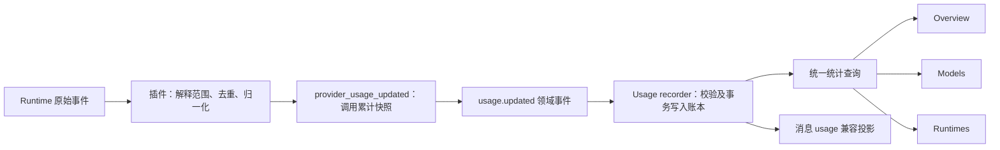

# Runtime Token Usage 统一统计方案

> 状态：已实施（2026-09-16）——P0/P1/P2 全量落地；P0 的真实 CLI 协议验证仍按第 11 节以离线 fixtures/回放为主要依据，未声明的范围一律降级 partial/missing  
> 日期：2026-09-16  
> 范围：ZClaudia 发起的会话 runtime 调用，覆盖 Pi、Claude Code、Codex、Cursor

## 1. 产品目标与范围

用户应能回答：我在 ZClaudia 中使用各个 runtime 消耗了多少 token，消耗在哪些模型、哪几天，数据是否完整。

第一版统计普通会话、后台会话和 agent 会话中经过公共会话执行链路的调用。输入包括正常消息和会触发模型的命令；仅执行本地动作的命令不算模型调用。失败、取消和重试不因没有最终回复而丢失已报告的消耗。

第一版不承诺覆盖独立运行的 Cursor IDE、Claude Code、Codex；不扫描用户全局历史日志；不统计未进入公共会话链路的标题生成、独立 workflow/task 调用等辅助请求。页面说明为“ZClaudia 会话用量”，不能称“账号全部用量”。后续可让辅助调用复用账本并增加 purpose 维度。

**核心决策：增加独立的调用用量账本；runtime 插件负责解释来源语义；首页、Models、Runtimes 使用同一统计来源。** 消息上的 usage 保留为兼容投影，不再承担长期统计的事实来源。

## 2. 已确认的项目现状

| 位置                                                           | 当前行为                                                                   | 设计影响                                               |
| -------------------------------------------------------------- | -------------------------------------------------------------------------- | ------------------------------------------------------ |
| `plugins/agents/claude/src/runner.ts`                          | 将 result.usage 映射为输入、输出、缓存及 totalTokens；执行错误路径提前返回 | 已有基础，但错误、子代理和多模型范围需要补齐           |
| `plugins/agents/codex/src/app-server-client.ts`                | 每次通知覆盖 lastUsage，结束时提交最后一次调用的 usage                     | 上下文占用与整轮消耗必须分离；多步轮次有漏算风险       |
| `plugins/agents/cursor/src/map-events.ts`                      | legacy stream-json 解析 result usage                                       | 可作为一种独立采集来源                                 |
| `plugins/agents/cursor/src/acp-runner.ts`                      | 从 prompt response 的可选 usage 读取用量                                   | 能解析不等于当前 CLI 一定上报                          |
| `plugins/agents/cursor/src/acp-events.ts`                      | 忽略 usage_update                                                          | 必须先验证该事件是上下文占用还是累计消耗，不能直接累加 |
| `server/src/application/conversation/runtime/run-lifecycle.ts` | usage 写到 assistant message metadata；model 取 profile.model              | 用量依赖消息生命周期，配置模型不一定是实际模型         |
| `server/src/interfaces/http/usage-stats.ts`                    | SUM(metadata.usage.totalTokens)，Models 按 metadata.model 汇总             | 缺失被合并为 0，无法显示覆盖率，也没有 runtime 维度    |
| `apps/desktop/src/features/home/aggregateUsageStats.ts`        | 合并多个 backend 的总数                                                    | 新统计须同时处理 backend 缺失和重复连接                |
| `apps/desktop/src/features/home/UsageStatsStrip.tsx`           | 第八张卡片按条件显示 Favorite model                                        | 截图红框不是固定保留空位，不直接占用该位置             |

这些结论来自代码检查；本方案未进行真实模型调用。对具体版本的协议字段、累计范围和子代理包含关系，应通过第 11 节的探测验证后再声明支持。

## 3. 统一统计口径

### 3.1 统计单位

- `runId`：ZClaudia 的逻辑运行，可以包含多个实际 runtime 调用。
- `invocationId`：host 在一次实际调用前生成并持久化的 ID，是记账单位。一轮中模型请求多次，仍属于这次 invocation。
- host 重新发起执行、失败重试、后续调用，各生成新的 invocationId；监听器重连、事件重放不生成新 ID。
- runtime 内部自动重试由 runtime 的权威累计用量覆盖；没有暴露的数据不推算。
- 一个调用内的多个 provider turn 由 adapter 按各自计量范围累计为 invocation 快照，不能用最后一条 result 覆盖全部消耗。

### 3.2 Token 分类

统一字段定义如下，所有 token 为非负安全整数；`null` 表示未知，0 必须有来源依据。

| 字段            | 口径                                             |
| --------------- | ------------------------------------------------ |
| inputUncached   | 未包含缓存读取、缓存写入的输入 token             |
| cacheRead       | 从缓存读取的输入 token                           |
| cacheWrite      | 用于创建缓存的输入 token                         |
| output          | 总输出 token，包含来源已计入的 reasoning         |
| reasoningOutput | 可选的 output 子集，只作明细，不再加到总量       |
| total           | 来源明确报告的累计总量，或从完整且互斥的分类推导 |

完整分类满足 `total = inputUncached + cacheRead + cacheWrite + output`。Codex 的 cachedInputTokens 是 inputTokens 子集，需先减出缓存部分；不能用同一公式直接解释各家的原始字段。

如果只有权威 total，允许总量完整但明细未知；有已知分类而 total 不可得时，总量保持 null，明细可单独展示，不擅自拼成完整总量。来源 total 与分类冲突时保留可审计的数值摘要，标记 discrepancy，不把缺口塞进某一分类。

`contextUsedTokens` 单独用于上下文窗口显示，绝不能作为本轮或历史消耗。多次调用重复读取相同上下文是实际处理的 token，应按来源报告计入消耗，不对文本去重。

### 3.3 完整性与覆盖率

每次调用记录四种用量状态：

- `complete`：该调用的结束范围有可信完整总量。可以没有缓存或模型明细。
- `partial`：有该调用可归属的用量，但只覆盖部分请求、主代理或中断前的一段。
- `missing`：执行已发起或可能发起，但没有可归属的 token 数据。
- `legacy`：历史消息迁入，无法证明整轮范围及完整性。

运行状态与用量状态独立：失败的调用也可能 complete，成功的调用也可能 missing。只有已核实的版本和计量范围才能标记 complete，不能仅根据收到 result 推断。

默认总量是账本中已知 total 的和，包含 partial 和 legacy 的已知值；不含估算 token。UI 使用“Recorded tokens / 已记录 token”，并说明它可能不是全部消耗。没有任何已知值时显示 `—`，确有完整零用量时显示 `0`。

完整上报率 = complete 调用数 / 纳入统计的已结束调用数。分母包括完成、失败、取消及重启后确认中断的调用，排除明确未启动、仍在运行、历史 legacy 记录。调用是否启动不明的中断记录纳入分母，记 missing。分母为 0 时显示 `—`。

这个比例表示**调用覆盖率**，不表示“已掌握实际 token 的百分之多少”。有 token 的 partial 调用不能当 complete；各 backend 合并分子分母再计算，不平均百分比。历史数据、未结束调用和 backend 不可达分别提示。

### 3.4 模型与 runtime 归属

- runtime 身份来自调用时解析出的 runtime descriptor，例如 pi、claude、codex、cursor；不能按模型名称推测。
- 同时保存 runtime 版本、transport、engineMode、adapter 版本和计量规则版本，便于定位协议变化。
- 实际模型优先取 runtime 的报告，另存 requestedModel 作为诊断信息；只有配置值而没有实际报告时归入 Unknown model，不冒充已核实模型。
- 每条账本记录保存一组互斥的模型分配。多个模型的明细之和不能再次叠加到调用总量。
- 明细少于 total 时差额进 Unknown model；明细大于 total 或包含关系不清楚时，整条总量进 Unknown model，保存 discrepancy。
- 每个统计范围满足 `Overview.total = Σ Runtimes.total = Σ Models.total`，Unknown runtime/model 也在求和范围内。
- 主代理报告已包含子代理时，子代理数据仅用于分配，不能再新增可加总记录。不能证明父子包含关系时，先保留不重叠的已知主代理数据并标 partial，不尝试盲目拼接。

### 3.5 费用和额度

token 数、估算费用、订阅额度是三个指标。本期只发布 token 统计。

协议可保留 nullable 的费用数据及 `kind: runtime_estimate | price_table_estimate | billed`、币种和价格来源；现有 Codex/Cursor 的 cost.total = 0 不可解释成免费。Claude SDK 费用为估算，不代表实际账单。订阅额度以后通过独立能力接入，不从 token 数推算。

## 4. 采集架构



host 不解析 Claude/Codex/Cursor 的私有字段，也不在通用统计代码中设置 runtime 特例。adapter 输出的是**当前 invocation 累计快照**，host 只替换快照，不将通知数值反复相加。

新增版本化的可选 usage 能力和事件，类型草案：

```ts
type UsageSnapshot = {
  schemaVersion: 1;
  revision: number; // invocation 内严格递增
  final: boolean; // 用量快照是否已结算，不表示任务成功
  status: 'complete' | 'partial' | 'missing';
  reason?: string; // 如 missing_baseline / interrupted
  tokens: {
    inputUncached: number | null;
    cacheRead: number | null;
    cacheWrite: number | null;
    output: number | null;
    reasoningOutput: number | null;
    total: number | null;
  };
  models: Array<{ modelId: string | null; tokens: UsageSnapshot['tokens'] }>;
  source: {
    kind: string; // claude_result / codex_thread_delta / ...
    scope: 'invocation';
    includesSubagents: 'yes' | 'no' | 'unknown';
    ruleVersion: number;
  };
};
```

host 在执行上下文中提供 invocationId，并用当前执行上下文绑定来源；插件不能通过事件中的任意 ID 修改其他调用。原始来源的 request/turn ID、counter epoch、基线和数值摘要保存在受限 checkpoint 中，不加入前端协议。

去重分两层：adapter 按原始 request/message/turn ID 与来源范围消除重复、合并增量；host 按 invocationId + revision 幂等更新。不能依赖接收时间或给重放事件分配新序号来识别同一模型请求。

旧插件仍可发送终态 usage，由兼容层产生低可信度快照；不能自动标 complete。声明新能力的调用只使用新快照作为账本来源，旧终态 usage 仅用于客户端兼容，避免双计。公共契约位于 `@zclaudia/plugin-sdk`，实现时需先定位其发布源码并按兼容发布流程升级，不能只改 shared 的 re-export 或 node_modules。

## 5. 各 runtime 的采集策略

### 5.1 Claude Code

1. 验证 single-shot 与 streaming-input 两种模式，以及各自恢复会话的范围。
2. 正常结束优先使用可覆盖整个调用的 result/modelUsage；streaming 模式若 modelUsage 是调用累计，使用差分/快照替换，不能逐 turn 把累计值再相加。
3. modelUsage 用于多模型分配；明确它是否含子代理。result.usage 的主循环范围不能直接宣称覆盖全部子代理。
4. 收到 assistant usage 时按原始 message ID 去重，保存可恢复的输入、缓存进度。并行工具产生的同 ID 消息只计一次；输出是否已结算以实际 SDK 语义为准。
5. 错误结果也先提取可用 usage 再处理错误；中断或崩溃时保留上次可信快照，标 partial/missing，不让零化的崩溃结果覆盖先前消耗。
6. /clear 或累计器重置建立新的 counter epoch；旧 epoch 已计消耗保留。最终总量不能同时加主代理 result 与包含它的 modelUsage。

### 5.2 Codex

消费 `thread/tokenUsage/updated`，将 `total` 用于累计消耗，将 `last` 仅用于单请求诊断及上下文窗口。

正常计量：`invocation usage = 结束累计 total - 本次开始前累计 baseline`。按分类分别差分，再归一化缓存包含关系。例：开始为 100k，收到 110k、125k、重复 125k，则本次是 25k，而不是 60k，也不是最后请求的 15k。

baseline 必须来自同一原生 thread 和 counter epoch 的可信快照：新 thread 可用 0；恢复 thread 优先读取经过验证的原生快照能力，或使用能证明没有外部执行介入的持久化检查点。**不能假定 thread/read 必然提供所需基线，也不能直接将第一次通知的累计 total 当本次用量。**

如果无法建立 baseline，只有在每次请求具备稳定去重标识且协议范围已确认时，才允许累加这些请求的 last；否则只保留能够证明属于本次调用的值并标 partial，无法归属则 missing。

通知按 threadId、turnId 过滤；累计值回退、重置、线程被外部客户端继续使用等情况必须重新建基线，记录缺口，不能 clamp 负差为 0 后继续假装完整。单个原生 thread 的 host 写入应串行化。子线程消耗是否并入主线程 total 必须探测，不默认包含。

### 5.3 Cursor

按 transport 与 CLI 版本分别声明能力，先验证后启用：

- legacy stream-json：验证 result.usage 的输入、缓存、总量及多请求累计范围。
- ACP：优先验证 session/prompt 返回的 usage；不能仅因本地声明了 TypeScript 字段就认定来源支持。
- usage_update：先确认协议含义。若是当前上下文 used/size 或费用，只更新对应状态，不能当消费 token。
- 缺少 final usage 而有可归属中间值时 partial；完全没有计量字段时 missing，并在页面显示“当前版本未提供”。

第一版不通过私有账号 API、抓取 UI 或字符数换算来补齐 Cursor。可靠的缺失状态优先于无法解释的数字。

### 5.4 Pi

沿用已有多次 assistant usage 累计逻辑，对每次真实请求去重，接入相同事件与账本。最后一次调用的 contextUsedTokens 保持独立。Pi 同样不能因初始化 zeroUsage 就在无报告时标 complete。

## 6. 存储及执行生命周期

新增 `runtime_usage_records`，每个 invocation 一行可更新的当前累计快照；第一版无需保存完整流式事件日志。

| 字段组     | 内容                                                                                  |
| ---------- | ------------------------------------------------------------------------------------- |
| 主键与关联 | invocation_id、run_id、session_id、assistant_message_id、parent_invocation_id（可空） |
| 身份快照   | runtime_id、runtime_version、transport、engine_mode、adapter_version、requested_model |
| 生命周期   | execution_state、started_at、ended_at、accounted_at、updated_at                       |
| 数据质量   | usage_status、reason、revision、source_kind、rule_version、includes_subagents         |
| 用量       | 各 nullable token 数值列，model_breakdown_json，optional cost_json                    |
| 恢复与迁移 | 受限 source_checkpoint_json、legacy_message_id、accounting_version                    |

`invocation_id` 唯一；历史迁移另建 legacy_message_id 唯一索引。按 accounted_at、runtime_id + accounted_at、session_id 建索引，模型明细先用受限 JSON + json_each 聚合；实际查询成本证明有必要后再增加模型明细表。

执行顺序：

1. 调用外部 runtime 前写入 dispatching 记录，身份由解析后的执行配置确定。
2. 确认启动后标 running；明确未启动的失败记 not_started，不纳入覆盖率。
3. 重要 usage 更新以短事务 UPSERT，revision 更旧或相同则忽略；允许合法修正覆盖旧值，不能取 max 掩盖错误。
4. 正常、失败、取消均通过同一结算入口；用量状态依证据决定，不依执行结果决定。
5. 终态消息与用量结算可同事务时必须同事务；中间快照先落账本，消息投影可从账本重建，不依赖浏览器或可失败的插件 listener。
6. 重启扫描非终态记录，保留已知值并标 interrupted/partial 或 missing；不自动重新请求模型。有持久化原生证据才能事后补全。
7. 账本已结算后仍可接收来自同一执行来源、较新 revision 的迟到终态修正；不重发任务，不再次累加。

数据删除策略与现有会话统计保持一致：归档保留；用户删除会话时事务删除关联账本及模型分配，避免消息已删除而用量仍残留。复制或导入消息不自动生成新的消费记录。

checkpoint 只允许保存计数器、必要的原生标识和时间；不保存 prompt、回复、工具输入、密钥或完整原始事件。

## 7. 历史迁移与发布兼容

历史迁移只复用已有 metadata.usage，不扫描用户的全局 CLI 日志，也不声称能修复已经漏掉的 token。

1. 每条历史 assistant usage 生成确定的 `legacy:<messageId>` 记录，原始总量保留；模型配置来源标注 legacy，runtime 只有历史证据充分才填写，否则 Unknown。
2. 不使用当前 profile 的 runtime/model 反推旧消息，因为 profile 可被编辑。
3. 从本次升级激活账本开始，每个新调用都建记录，即使没有 usage。消息记录 accounting reference，回填时跳过已有账本覆盖的消息。
4. 回填采用有版本的迁移水位、唯一键和事务；迁移期间新调用双写消息兼容投影与账本。尚未回填完成时继续用原查询展示，不能混加两个来源。
5. 回填完成后一次切换所有 token 统计到账本；首页、Models、Runtimes 必须同版本切换。重复迁移结果不变。
6. 旧客户端继续收到旧字段；新客户端遇到旧服务端显示 legacy 数据，Runtimes 与覆盖率显示“不支持”，不根据总数猜测分类。

历史记录不进入完整上报率分母，页面显示“完整性自 YYYY-MM-DD 起记录；此前为历史数据”。为了保留历史已知量，总量仍包含 legacy，并提供状态细分。

## 8. 统计 API、时间范围与多 backend

新增 `GET /api/stats/runtime-usage?range=all|30d|7d&timeZone=<IANA>&asOf=<epoch-ms>`，返回相同查询窗口下的：

- schemaVersion、datasetId、asOf、timeZone、accountingSince、capturedAt。
- totals：recordedTokens（无数值时为 null）、按 complete/partial/legacy 的已知 token 小计、activeRecordedTokens。
- coverage：complete、partial、missing、eligibleFinalized、inFlight 调用数；legacyRecordCount 单列。
- runtimes：按 runtime 的总量、已知输入输出、调用数、覆盖率及状态。
- models：按 runtime + actualModel 分配的用量，包含 Unknown 桶。
- series：按时间桶 + runtime 的已记录 token；模型图需要的对应分配。

第一版不提供调用原始明细接口。现有 /stats/usage 与 /stats/models 使用同一个查询服务生成兼容字段；新客户端从新响应读取 token、模型及 runtime 数据，避免多个页面口径漂移。

所有 backend 共用客户端传入的 asOf/timeZone。7d/30d 定义为用户时区内含今天的 7/30 个日历日；服务端计算 UTC 起止再查询，用时区感知的日历计算处理夏令时。All 的总量与排行覆盖全部保留记录；图表可按周/月降采样覆盖全部区间，不能继续让 Models All 悄悄只算 182 天。活动热力图仍可保持独立的 26 周展示。

第一版按调用启动时间 accounted_at 归属日期；终态补全仍更新原日期，避免长任务跨日时总量迁移。UI 提示“按调用开始日期归档”，不宣称是逐分钟消费发生时间；活动中的累计值单列，默认历史总量仅计已结束记录。

多 backend 规则：

- 每个持久化数据库返回稳定 datasetId，同一数据库的本地连接和 gateway 连接只汇总一次。
- 合并分子、分母和数值，不直接合并百分比；share 的分母是已记录总量。
- UI 展示“已汇总 2/3 个数据源”，backend 不可达不能悄悄丢弃后继续显示全局完整。
- 第一版只合并成功响应的当前快照；旧缓存如保留，必须明显标注更新时间，不能混入当前汇总。切换范围时不得把上一范围的缓存当成当前范围。
- 克隆数据库具有相同 datasetId 时视为同一数据集，提示重复，不盲目相加。分叉后作为独立数据集的导入及跨库消费去重不属于第一版。

## 9. 页面设计

顶部页签调整为 `Overview | Models | Runtimes`，共用 `All / 30d / 7d` 和数据源范围。

Overview 保持现有卡片布局与 Favorite model 条件展示。将 Total tokens 文案调整为 Recorded tokens（或本地化“已记录 token”），下方加入短说明“完整上报 92% · 8 次缺失”。点击进入 Runtimes；tooltip 解释按调用数计算，另列 partial、legacy 与数据源不可达。

Runtimes 的静态结构如下，数值仅为布局示例：

```text
Overview   Models   [Runtimes]                  All  [30d]  7d

已记录 3.2M token    完整上报 92%    已汇总 2/3 个数据源
历史记录 0.4M       2 次调用运行中（当前已报告 18k）

[ 按日期的 runtime 堆叠柱状图 ]

Runtime       已记录 token    输入 / 输出    完整上报     调用数
Claude Code       ...            ...           ...         ...
Codex             ...            ...           ...         ...
Cursor             —              —             0%          ...
Pi                ...            ...           ...         ...
历史未知来源       ...            ...             —           —

展开 Codex → 模型分布 / 缓存读写 / 完整、部分、缺失调用数
Cursor：此版本未提供可统计的 token 用量
```

输入列表示 inputUncached + cacheRead + cacheWrite；分类不完整时显示“部分明细”，不拿未知当 0。缓存明细明确包含在输入中。Runtime 的 token 占比只表示已记录数据的占比，不能据此判断哪个产品效率更高，因为模型、任务及缓存策略不同。

Models 按实际报告模型展示，可按 runtime 过滤；保留 Unknown model，保证与 Overview 对账。统计不足时不显示误导性的 Favorite model。

移动端保留现有折叠摘要；展开后 runtime 表格变成逐行卡片，详细 breakdown 按需展开。状态解释同时支持点击和键盘，不能只依靠 hover。

第一版不增加费用卡片、不增加订阅剩余额度、不用字符估算填空。

## 10. 实施分期与改动位置

### P0：协议验证与统一契约

- 固定当前支持的 CLI/SDK 版本，制作脱敏 fixtures，验证多步调用、恢复、取消、错误和子代理范围。
- 明确每个 runtime/transport 的数据等级；Cursor 无可靠来源可正式交付 missing 支持，不阻塞其他 runtime。
- 发布兼容的 SDK usage 能力及事件类型，更新 host 依赖、translator 和 domain event 类型。
- 产物：能力矩阵、计量字段映射、fixtures、契约测试。没有通过验证的路径不声明 complete。

### P1：账本、adapter 与统一查询

- 新建 `server/src/domains/usage/` 的 recorder、repository、query service 和迁移。
- 接入 run-provider-launch、终态、取消、异常恢复；完善四种 runtime 的 invocation 累计器。
- 分离 Codex 的上下文占用与消耗；Claude 错误不再先丢弃 usage；Cursor unknown 保留 unknown。
- 实施历史迁移、幂等及兼容投影，更新 `shared/src/core/usage-stats.ts` 和 HTTP API。
- 产物：三个统计视图可以用同一个来源对账，重放和重启不会重复或清空已有用量。

### P2：界面与发布

- 更新 UsageStatsStrip、ModelsChart、statsBackend、aggregateUsageStats 和 API client；增加 Runtimes 视图。
- 处理不同版本 backend、不可达、重复数据集、移动端和空状态。
- 回填完成后原子切换统计来源；上线说明历史数据不能补齐，并展示完整性开始日期。

后续再考虑外部 CLI 历史导入、费用估算、订阅额度、逐请求账本、workflow/辅助调用和调用明细导出；不将这些作为第一版依赖。

## 11. 验证与验收

离线 fixture/replay 测试作为主要验证；真实验证使用隔离的临时会话，不修改用户现有会话，仅记录脱敏数字和事件标识。

| 场景                              | 验收结果                                       |
| --------------------------------- | ---------------------------------------------- |
| 一轮三次模型请求，含工具调用      | 记录整轮消耗，上下文仍取最后一次               |
| Claude 同 message ID 多次事件     | 输入及缓存只计一次                             |
| Claude 主代理与子代理、多模型     | 按已验证包含关系分配，不双计；不清楚时 partial |
| Codex 100k → 110k → 125k → 125k   | 本次记录 25k                                   |
| Codex 恢复缺基线、counter 重置    | 不把历史总量归入本次，不伪造 0/complete        |
| Cursor 无 usage 或仅上下文 update | 总量未知，计 missing；上下文值不加入历史消耗   |
| 输入含缓存、reasoning 是输出子集  | 分类互斥，总量不重复加缓存或 reasoning         |
| 成功无用量、失败有用量、取消中断  | 状态分离；已知消耗保留，覆盖率正确             |
| host 重试后成功                   | 各真实调用记录相加，重放不新增调用             |
| 进程在 dispatch/中途/结算时退出   | 不丢已持久化值；恢复状态可解释且不触发模型     |
| 更新相同 revision、乱序与迟到终态 | 相同事件幂等，旧版不覆盖新版，迟到修正只替换   |
| 只有 total、明细冲突、未知模型    | total 可保留；明细降级，三个视图一致           |
| 只有 partial/legacy 或全 missing  | 显示已记录量/未知，不显示虚假的 100% 或免费    |
| 跨时区、夏令时、跨午夜的长调用    | 所有页面和 backend 使用同一范围与归档规则      |
| 迁移重复执行、迁移期间新消息      | 不漏掉、不重复计入历史和新记录                 |
| 同库多个连接、部分 backend 离线   | 同库只计一次；数据源不完整可见                 |
| 删除会话、导入消息                | 删除同步移除账本；导入不伪造新消耗             |
| All 超过 182 天                   | 总量、模型、runtime 全历史一致                 |

发布门槛：支持路径通过以上相关测试；未支持路径准确返回 missing/partial；查询使用索引并在代表性历史数据规模下检查执行计划；正常聊天性能不受同步大查询影响。

## 12. 来源与待验证事实

- [Claude Agent SDK 用量与费用](https://code.claude.com/docs/en/agent-sdk/cost-tracking)：result、modelUsage、streaming-input 范围、重复消息、错误结果和费用估算语义。
- [Codex App Server](https://learn.chatgpt.com/docs/app-server)：公开 thread/tokenUsage/updated 通知；基线读取及具体字段范围仍按项目固定版本验证。
- [Cursor ACP](https://cursor.com/docs/cli/acp)：公开 ACP 集成流程，但未明确保证 usage 字段。本项目中可选字段的解析不是官方支持承诺。

实施前需要实证的事项：Claude 当前固定版本的子代理及 streaming 累计范围；Codex 恢复基线、counter 重置和子线程包含关系；Cursor 各 transport 的用量字段；公共 Plugin SDK 的源码发布位置。上述不确定性均有 partial/missing 降级路径，不依赖猜测补数。
